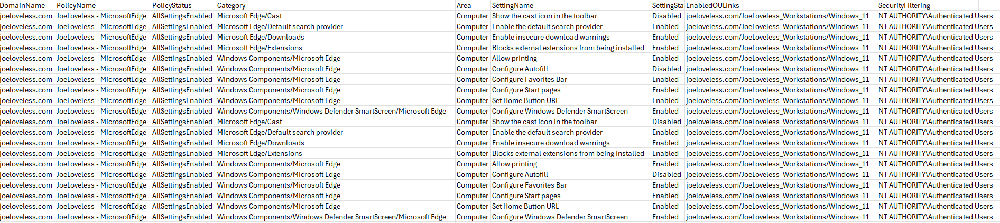

# Finding Group Policy settings by category

A helpful PowerShell script to search for group policy settings by category.

<!-- truncate -->

Greetings everyone. I wanted to share some of our functions that we've been using on our migration path from Group Policy to Microsoft Intune. This is a new one I just wrote this week, and think it will be very helpful. In our environment, we have multiple forests (27+). We've been migrating our standard workstation policies, but with 27 forests, we're discovering we still have a lot of cleanup to do. 

While the push is for pure Entra join, many organizations aren't ready to commit to that (not for lack of trying to convince management otherwise), and will be in the hybrid scenario for quite a while. I'm always quite interested when I go to MMS and see the amount of hands that are either co-managed with Configuration Manager, or using Hybrid Join with Active Directory. Despite the marketing push from Microsoft, and all the new technology going into Azure/Entra/Intune, I don't think Active Directory or Configuration Manager are going anywhere anytime soon. 

## Search-GPOCategory

I'm not going to go into a step by step breakdown of the script like I have done in previous posts. I'm not sure how much value there is in that, but will give a slight breakdown of it here. If you have any questions on it, please feel free to reach out to me and I can answer any questions on it. The function can be found on my [GitHub](https://github.com/Pacers31Colts18/GroupPolicy/blob/master/Search-GPOCategory.ps1)

### Summary

```powershell
[CmdletBinding()]
    Param(
        [Parameter(Mandatory = $False)]
        [array]$Domains,
        [Parameter(Mandatory = $True, HelpMessage = "Category to search for")]
        [array]$Category,
        [ValidateSet('All', 'Computer', 'User')]
        [string]$PolicyScope = 'All'
    )

    #region Parameter Logic
    if ($Domains.Count -eq 0) { $Domains = (Import-CSV -path $global:DomainsFile | Out-GridView -PassThru).Title }
    #endregion
```

- $Domains
  - As with most of our functions, we're asking for an array (or single) domain. If you do not list a domain, we'll attempt to load a CSV file containing our domains. If using a CSV title, the header should contain Title for the list of domains.
- $Category
  - This is the category (or multiple categories) that you're searching for. In my example, I will use "Microsoft Edge". This is looking for anything *like* Microsoft Edge. That means it will pull Windows Components\Microsoft Edge, Microsoft Edge\Downloads, Microsoft Edge, etc.
- $PolicyScope
  - This allows you to narrow it down a little bit more, so you're able to search the Computer or User side of the policy, or just search all of the policy.

### Data Returned

The following will be returned in the CSV file:
- DomainName
  - The domain the policy is on.
- PolicyName
  - The name of the GPO.
- PolicyStatus
  - 
- Category
  - The category found. Example: Windows Components/Microsoft Edge
- Area
  - Computer or User
- Setting Name
  - The name of the settings found
- Setting State
  - Enabled/Disabled/whichever else. Will not return Not Configured.
- Enabled OU Links
  - All the OU links for the GPO, separated by a ";"
- Security Filtering
  - The security filtering applied to the policy.



## Background

A little bit of history from the org I work in (and previous orgs up to Step 5). If you work in Education or Government, you're probably all too familiar with this process.

1. **Centralization**
    - Higher ups decide to centralize IT services.
    - All local teams to start using central enterprise IT. Education and Government just love doing this.
2. **Policies managed by other teams**
    - Here is this random structure of GPOs and OUs, have at it, not our problem anymore.
3. **OU Migration (Workstations)**
    - We then migrate all the workstations to an enterprise managed OU.
    - While trying not to break things too much, some legacy policies will move over also.
    - Process can take 3 months to 3 years (yay politics!)
4. **OU Migration (Users)**
    - Haven't even touched these yet, legacy policies and structure still hangs out there.
    - **Why does User policies always fall on the Endpoint teams? A question I've been pondering**
5. **Let's use Intune!**
    - We're well underway migrating our core policies that we have applied in all forests to Microsoft Intune.
    - We've reviewed policies, determining if they still make sense to move.
    - Inconsistencies from 1-4
      - User policies
        - Some previous teams did more configuration on the user side rather than workstation side. Can see duplicate settings on the user side vs. Intune policy, or settings doing the opposite of what we want
      - Legacy policies
        - Duplication
        - Frankstein policies
      - One off policies
        - Some department needed x setting and is filtered down a bit. Not a high priority, but would rather see all of that Category managed from a central spot and not a mixture.

## The Next Step

Now that we have our core policies moved into Intune, and being managed under the great central pane of glass, we're looking into stopping the inconsistencies, and really level setting the policies. My goal is to look at our core policies, and break these out by category. We then have some functions in our module that can help with this process. A previous one we get great use out of is Search-GPOString, this allows us to search GPO objects in all our forests by a query and get the GPO objects back, along with their status, security filtering, and linked OUs. This is great for finding single settings.

This week, I came up with the idea to search by category. By category, I mean I am looking specifically for this:


From there, we are then returning the settings associated with that category, along with details on the policy.

## What do we do with that data?

From there, we can really breakdown our policy structure even more, and make more determinations.

- Do these policies make sense in 2025? 
- Are these policies better (more secure) than what we currently have in place? 
- Do we want to simplify and do away with these policies? 
  - What will be the impact if we do that?

## Piloting

No matter what decision that is made, we're then going to pilot this out. Daniel Ratliff had a great blog post [Managing Endpoint Policies for the Enterprise](https://potentengineer.com/2025/07/02/managing-endpoint-policies-for-the-enterprise.html), that serves as a great reminder. For us, we like to use the randomized process, but as we develop pilot groups more, might revisit the idea. See [here](https://joeloveless.com/2025/04/entra-grouprandomization/) for details on our randomization process if interested.

While we all want to move a little quicker, and get done with migrating policies, we will never truly be done. There will always be some other policy to create, tweak, or get rid of. There is no finish line to this, so take your time and try to fly under the radar as much as possible when doing policy migrations.

## Conclusion

I'll be publishing some more Group Policy related scripts to help people on their migration from GPO to Intune. I'm curious to know what other people are doing in their environments, whether doing a complete overhaul, migrating to new OUs through attrition (new builds), a mixture, or totally scrapping AD and going Entra only.