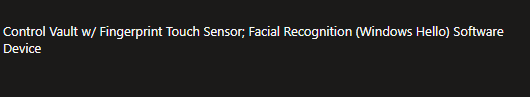

<!-- truncate -->

Hello there! It's been a couple weeks since my last post. I've been slammed at work with various projects (Azure Virtual Desktop, Windows Hello for Business, etc, etc), studying for the AZ-104 certification (trying to meet my employee goal before the end of the year), various things around the house (still working on flooring, painting, gardening), and the usual business of summer. My son got his first stripe in jiujitsu. He's been doing this since about February/March, trying to improve his mental health and getting more active. While he certainly has his days where he doesn't want to go, he's been pretty great about going two times a week. When he leaves class, he's always smiling and happy. Seeing his improvement both with his overall attitude and how he's improving with jiujitsu has been awesome to see. I'm pretty proud of him for sticking with it, and getting his first stripe!

I am trying to be more consistent with this, but struggling to either find the time, or just having general writer's block. I need to get out of the mindset of not writing something because someone else has already written it, and just try to write something from my perspective. One of the projects we are working on at work is Windows Hello for Business. While there are plenty of guides out there on how to implement, we've gotten some random questions regarding shared workstations, different models and their supported biometrics, and how we can have a successful rollout. The goal of this post is to provide some helpful scripts to start the journey for Windows Hello.

The solutions I am posting below are designed for Intune Remediation Scripts (using a Detection method), this can probably be achieved in other ways (Configuration Items/Baselines), but we're starting to shift away from that and focus on Intune more and more.

##  What types of biometrics are on our devices?

With any large organization, you probably have multiple makes and models spanning multiple years (hopefully four or less years) and are wondering how users will be able to login with Windows Hello for Business?

Windows Hello supports three types of biometric sign in (Source: https://learn.microsoft.com/en-us/windows/security/identity-protection/hello-for-business/#biometric-sign-in)
- Facial Recognition
- Fingerprint
- Iris recognition
  - Note: I'm yet to see a device that can do this. I didn't even know it was a thing until writing this!

As we are starting to write knowledge base articles for our end users, we want to provide them with the correct instructions. If they don't have Facial and Fingerprint, we are most likely going to only provide instructions for one or the other.

[Intune Detection Script - Biometrics](https://github.com/Pacers31Colts18/Intune/blob/main/RemediationScripts/Detection-WindowsHelloForBusiness-BiometricDevices.ps1)

I've linked the script to detect the different biometrics above. This should be configured as a Detection Script in Microsoft Intune, with the default configurations. Once configured and the script has ran for enough time, you can add the **Pre-remediation detection output** column, and should see results similiar to below:

The output can also be exported to a CSV file for further review.

## How many user profiles are on our devices?

Another gotcha to look out for is how many user profiles are on your workstations. Windows Hello for Business supports a maximum of ten enrollments on a single device. This is Face or Fingerprint.

Source: https://learn.microsoft.com/en-us/windows/security/identity-protection/hello-for-business/faq#how-many-users-can-enroll-for-windows-hello-for-business-on-a-single-windows-device

The initial group we are exploring rolling this out for has a large footprint of shared devices, with multiple people rotating in and out daily and even hourly, so we either need to exclude those devices, or look at other options (Yubikey, etc)

[Intune Detection Script - Profile Count](https://github.com/Pacers31Colts18/Intune/blob/main/RemediationScripts/Detection-WindowsHelloForBusiness-ProfileCount.ps1)

The detection script for this is also above, with the $excludedProfiles variable allowing you to exclude any profile you want. In my case, I'm excluding Administrator, Guest, Public, Default, and defaultuser0. I'm also looking for sign-ins for the last 90 days, hoping to capture accurate stats and not just devices with really stale profiles (that probably need to be remediated at some point)

If the script finds more than 10 profiles, this will return non-compliant. Less than 10 profiles, the script will return compliant.

This should also be ran as a Detection Script only in Microsoft Intune with the default configurations.

