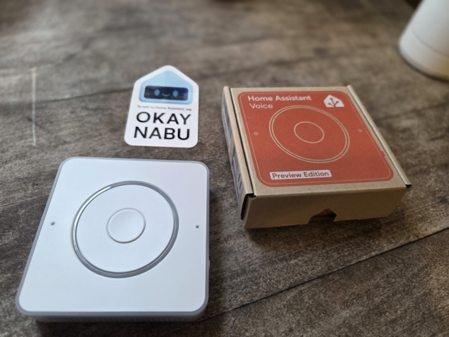

import React from 'react'
import ReactPlayer from 'react-player'

# Making Dexcom better with Home Assistant Voice

Integrating Dexcom data with Home Assistant Voice.

<!-- truncate -->

Hi everyone. I recently ordered a couple of the somewhat recently released [Home Assistant Voice Preview Edition's](https://www.home-assistant.io/voice-pe/), for a very specific need for my Type 1 Diabetic wife. She currently uses Dexcom G6, and while helpful, does have a laundry list of complaints with the product.

- Sensors disconnecting randomly. She does not know of the disconnect until she pulls her phone out to look at the app to check her glucose level. This can be quite problematic for a diabetic, and pretty dangerous.
- Having to constantly pull her phone out to check. While quite an improvement over the technology of yesteryear, can be a distraction for people, especially if they have ADHD.

Like any technologist, I got thinking of how I could help solve this. Selfishly, like any technologist, when you get the chance to play with new devices, you have to take advantage of that opportunity. 

I'm a big fan of Home Assistant. Unfortunately, getting the Wife Approval Factor in place has been a challenge. Mainly because she doesn't care for technology all that much, and finds my tinkering to be a waste of money. I'll show her I said!

## Researching Options

### Digging for the Solution

Before I started ordering these, I had to brainstorm a little bit, and think how I could accomplish what I **think** she wanted. I had possible ideas in mind.

At MMS 2025, [Matt Zaske](https://mattzaske.com/blog/2025-07/configuringusing-awtrix-3-ulanzi-tc001-through-home-assistant) had a demo on the Awtrix 3. This was the inital rabbit hole I started to go down, an always on display showing what was needed.

- Diabetic Specific Solutions
  - [Sugar Pixels](https://customtypeone.com/products/sugarpixel)
  - [Glowcose](https://glowcose.com/)
- DIY Solutions
  - Awtrix 3
    - Not a fan of the pixelated interface in my living room.
  - ESP32 Displays
    - Doable, but do I want to and will I do the tinkering? My fear is this would be a Raspberry Pi that I order and then never look at.
  - Tablets
    - Not sure I want to buy a tablet just for this purpose.

I liked the idea of the Glowcose, but I didn't like that it was limited to a single use case. I could have gone the more DIY route, but factoring in time and cost, I'm not sure how much I'd be on board. There is also the wife acceptance factor, I didn't want a frankenstein of wires throughout the house.

While in the [WinAdmins](https://winadmins.io) discord, someone was talking about the Home Assistant Voice that they recently ordered. From there, my curiosity (or ADHD) sparked my interest and I got going down the rabbit hole.

### Why I chose Home Assistant Voice

Home Assistant Voice gave me multiple options. I didn't want to have a device that only solved one use case, I wanted to solve (or tinker) multiple solutions.

- ✅️Multiple use cases
  - This can be used for other automations, not just Dexcom. Win for me!
- ✅️Ability to ask questions
  - "Hey Jarvis, what's my wife's glucose level?
- ✅️Ability to glance over and get a sense of the status
  - Home Assistant Voice has a ring LED light you can program.
- ✅️Local and not cloud based.
  - I've had enough issues with Google Home getting worse and worse over the years, I didn't want to invest in a cloud based product.
- ✅️ BONUS: A programmable button that you can automate
  - 4 button combos are available:
    - Long Press
    - Double Press
    - Triple Press
    - Easter Egg Press

## Unboxing and Setup

### Unboxing the Device

My only complaint so far, the device did not come with something to power the device. I'm not a fan of manufacturers doing this. For some reason

- I found 8 extra USB-C cables in 8 different locations in either my office, garage, or bedroom. Why are they in the garage? Not sure. Surprisingly, none were in my junk drawer in the kitchen.
  - For those curious:
    - 5 USB-C to USB-C.
    - 3 USB-A to USB-C.
    - A gazillion Micro USB cables.

 For some reason, I do not have 8 extra USB-C power bricks. For the time being, I took a brick off my Pixel dock to use.

 

 ### Setting up the Device

 There are some requirements before setting up the device for this use case.

 - Must already be running Home Assistant
 - Must have the Dexcom Integration added

Once those parts are done, device setup was pretty straight forward. I followed the instructions given in the box, and in less than 5 minutes, I had my device setup. I found the process to be much smoother and straight forward than Google Home or Amazon Alexa. I didn't have a ton of screens to opt in and out of "features" that I don't want.

One last step to note, you then will need to expose the Dexcom entities to your Voice Assistants.

## Automations

### Where do I begin?

Back to the original use cases, I wanted to do the following:

- Give her the ability to glance over, get a sense of what her glucose level is.
  - LED Ring
- Be able to know if her glucose level is rapidly rising or falling.
  - LED Ring
- Be able to check her glucose level without pulling her phone out.
  - Button press
  - Talking to the device and getting a response

*Before going further, you can find my automations on my [GitHub](https://github.com/Pacers31Colts18/HomeAssistant/tree/main/Automations). I've omitted the username, replace the USERNAME with your username. You will also need to tweak to match the entity ID of your voice assistant.*

### LED Ring Automation

Thinking further through the use cases, I came up with the following:

- LED Light: Red
  - glucose level is below 80
  - glucose level is above 150
- LED Light: Blue
  - Status is Unavailable or Unknown. Dexcom, for whatever reason in the past 6 months or so has been awful about the sensor not communicating properly with the transmitter. There are plenty of Reddit threads on the issue, but Dexcom doesn't seem to be addressing the issue. I wanted to provide a light that would make her aware when the sensor was not communicating.
- LED Light: Green
  - I had trouble getting the light automation to go from the off state back to the on state. I didn't necessarily want a bright green light all the time. Instead what I did for this one was to set it to Green, but turn the brightness down to 0 percent. That way, if she does decide that she would like the light on, we can just increase the percentage.
- LED Light: Yellow
  - Dexcom provides trend statuses to tell the user how quickly their glucose level is either increasing or decreasing. With the light being yellow, means the trend is either:
    - Rising Quickly
    - Falling Quickly

This gives me 7 total branches in my automation.

- Option 1: glucose level is either above 150 AND below 80
- Option 2: glucose level is below 80
- Option 3: glucose level is above 150
- Option 4: glucose level is rising quickly
- Option 5: glucose level is falling quickly
- Option 6: glucose level is unknown
- Option 7: glucose level is unavailable

*Note: I do not know what the difference is between Unknown and Unavailable, Home Assistant gave me both of those options. My theory is Unavailable is when it stops communicating completely, Unknown is when it just can't read the value yet*

### Button Press Automation

The next automation to do was to configure the button press. This one was much simpler, as I'm just wanting the glucose level announced when doubling pressing the button.

I love how there are multiple button combinations you can do. My yaml file is just stripped down to the basics of this automation for simplicity.

*Future enhancement idea: Let me Morse code to the other Home Assistant Voice through taps and have it translate to speech*

<ReactPlayer src='https://www.youtube.com/watch?v=uwgj1jshMsY' />

### Voice Announcement

Of course, you can also talk to the device to get the current glucose level. I love the different options that are available on this thing!

<ReactPlayer src='https://www.youtube.com/watch?v=gGs5SkUV9n0' />

## Conclusion

A little bit different of a post, but hopefully helpful to others out there! Let me know if you have any questions or comments, I've added a shiny new GitHub commenting system.