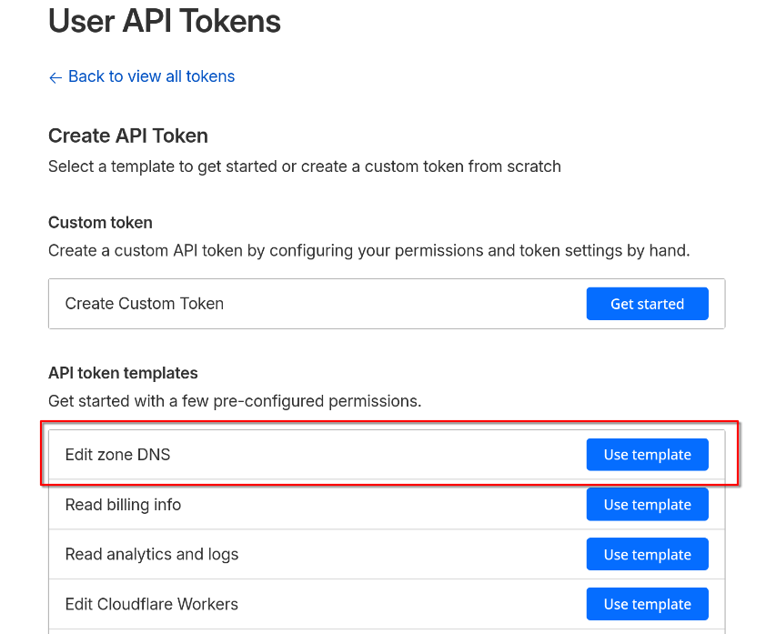
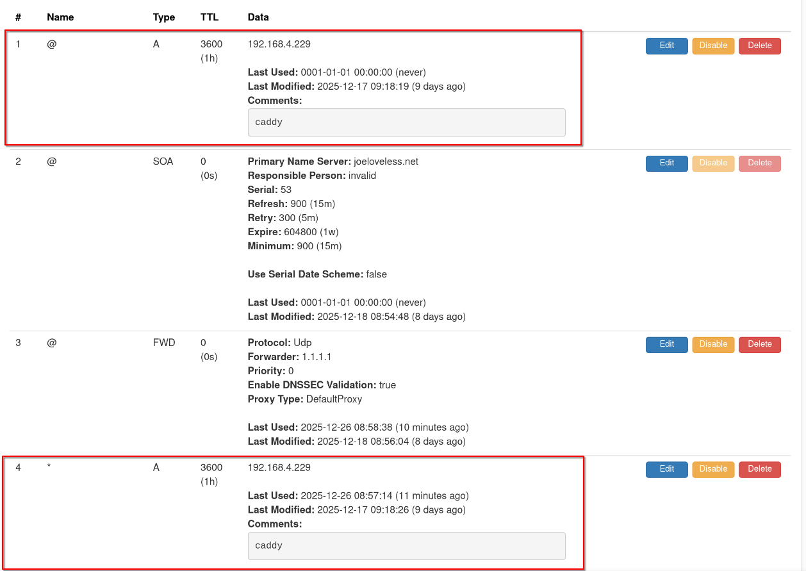
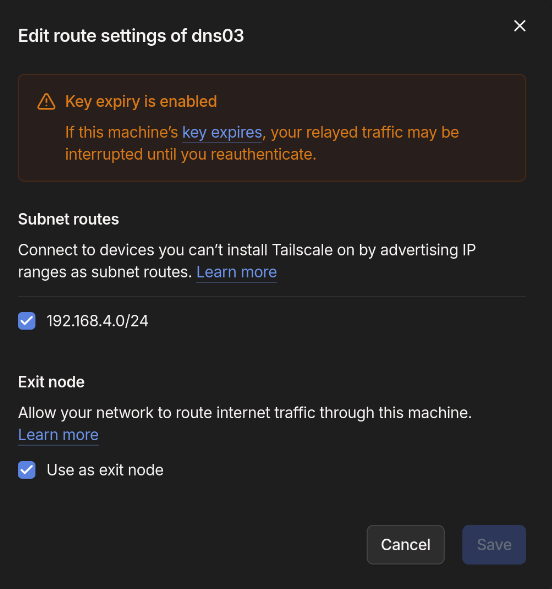
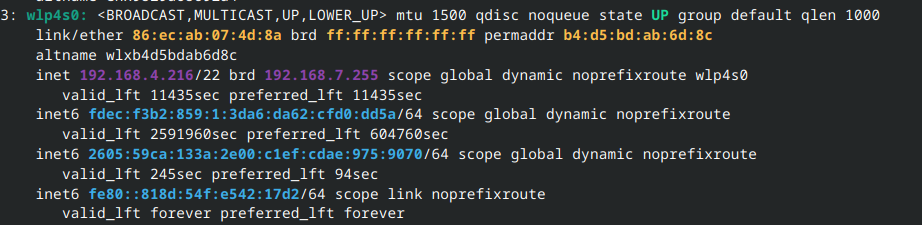
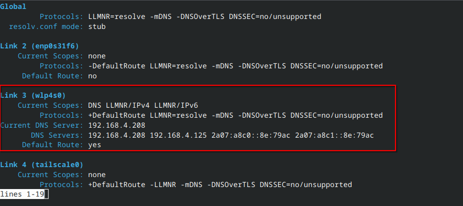
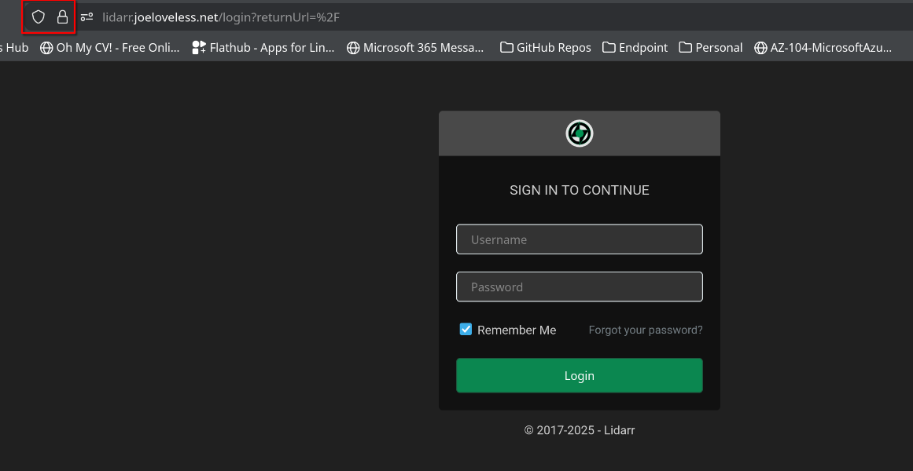
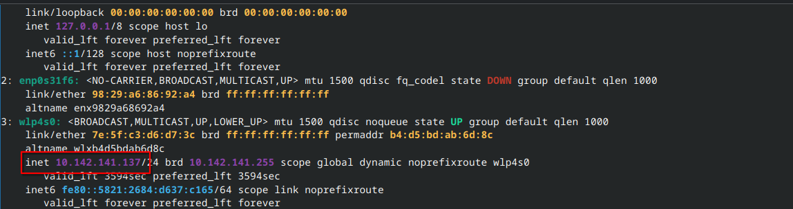
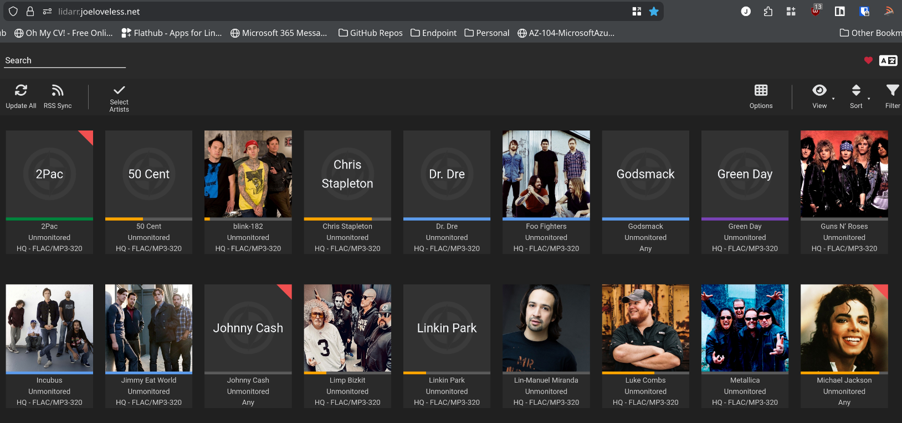

<!-- truncate -->

2025 is almost to a close. We recently went back to Indiana to visit our family and had a good time. The weather was unseasonably warm, especially compared to Minnesota standards. We visited the Indianapolis Zoo, as the kids have been wanting to see the chimps since we last lived there and they did a summer camp at the zoo. We saw some super active orangutans, and other animals that are normally not active. I love visiting zoos on winter days. No crowds, some animals being more active than they normally are. Christmas was nice, my cousin came up to visit who I don't see all that often and I was able to catch up a bit with my dad and brother. Family gatherings are usually a little awkward for me, I'm more laid back and reserved while my family when all together are pretty loud and talk over each other (even if there is only 11 of us).

My goal for this blog going into the new year is to obviously try to write more consistently. I started out good in 2025, but tapered off at the end (as I do with most things.) This year I am hoping to write at least once a month, with posts having more content to them. I'm not exactly sure what I will write about, probably more things with endpoint management, but honestly I like to just write about whatever I feel like. Which sums up this post perfectly.

Before Christmas, I had been working on my home setup more and wanted to write a post before the end of the year. Recently I bought a new UGreen 4-bay NAS (my first NAS) and have been learning about Docker a lot. Before I had the NAS, I was running Proxmox off of a Intel NUC, using LXC Containers or VMs. I also had a Dell Optiplex in use, but that was more for Active Directory/ConfigMgr/Intune testing. With my new NAS, and expanded storage/memory and ideas, I decided to split up how I was doing things.

You can find more of my home lab setup [here](https://github.com/Pacers31Colts18/HomeLab) but I've migrated a few containers off of Proxmox and into Docker (using Portainer as my management tool for Docker). In this post, I plan to go into :

- How I've used an unused domain name on Cloudflare to get proper certificates.
- Technitium to manage my DNS and ad blocking.
- Caddy to reverse proxy my sites and retrieve the proper certificates.
- Tailscale to access my network remotely
- And probably some other things I'm forgetting

## The Before Times

Okay, I've had my NAS since the fall. I've migrated the following from Proxmox to Docker, rebuilding services and trying to standardize. These were previously on a singular Proxmox container, running with an 8TB external hard drive plugged into the NUC and passing through to the container. Running off crappy internet, there was always some sort of issue or slow loading time. It got by good enough, but needed to be fixed.

- Plex
- Prowlarr
- Radarr
- Sonarr
- Lidarr
- Bazarr

I initially configured these all to run in host mode, with 192.x.x.x IP addresses. This was done mainly out of laziness, but once I discovered Portainer, I then went back and reconfigured these to all be in bridged networking (on separate networks). I was able to get them to communicate with each other by adding the following line in each compose file:

```yml
    extra_hosts:
      - ultron.local:192.168.4.125
```

So now that I have everything migrated over, I finally decided it was time to get certificates and domain names working correctly on this. Obviously, I'm the owner of joeloveless.com. I'm also the owner of some other variations of joeloveless and other random domain names my ADHD brain decides to randomly purchase. For this, I decided not to use joeloveless.com and instead use joeloveless.net for the setup. Why? I don't really have a great reason...separation of services, sure?

## Let's play with Cloudflare!
Have I used Cloudflare before, nope. Is it a lot, you betcha. Compared to Square Space, there are about a million more options. In my initial design/messing around, I was looking at DDNS providers (DuckDNS, NoIP, etc). I registered joeloveless.net with NoIP, but couldn't get that working properly, I then discovered certificate challenging with Let's Encrypt. I used these sites as my starting points:

- https://techdecode.online/decode/build-your-homelab-nginx/
- https://blog.jamesbrooks.net/posts/technitium-dns-server-with-tailscale/

Once you have an account, the first thing you need to do is configure the NS records properly. Easier when you buy the domain through Cloudflare, as that work is already done for you. If bringing in from another registrar, there is the transfer process. I followed [Cloudflare's docs](https://developers.cloudflare.com/registrar/get-started/transfer-domain-to-cloudflare/) and was then ready for the next step.

### API Key

The next step is to generate an API key. Simple enough, make sure to copy it somewhere safe (not online) and actually do that. I can't tell you how many times I thought this was going to be a straightforward process, only to get stuck somewhere, not copy the API key somewhere I could reference it, starting over with a new try, and not having the API key. I think I generated about ten of them in total.

1. From the Cloudflare portal > Profile
2. Click API Tokens
3. Click Create Token
4. Choose Edit Zone DNS


- When using the template, it will pre-fill Edit zone for you. I went ahead and added **Read** also. Probably not needed, as you have to have Read to be able to Edit, but whatever.


- If you only have one domain, you could probably just choose All Zones, but I'm not sure what the future looks like, so I wanted to configure this only for joeloveless.net

**Again, copy the API key somewhere safe as you'll need it later**

For now, we are done in the Cloudflare portal, but will come back to this later.


## Setting up a Reverse Proxy - Caddy for the Win
Three things I'm not the greatest at.

1. Networking
2. Certificates
3. Linux

For a starting off point, I referenced this blog post to get started, but ended up modifying some of the steps:

- https://samedwardes.com/blog/2023-11-19-homelab-tls-with-caddy-and-cloudflare/
- https://akashrajpurohit.com/blog/setup-caddy-with-automatic-ssl-certificates-with-cloudflare/

Well, this is a home lab, here I am trying to learn. This is also a good place to document so the next dumb dumb (or me) can maybe stumble there way through it.

My goal initially was to run this all through Docker. I had issues getting anything to work properly, using NGINX ProxyManager, Caddy, or any other solution. What I landed on was:

- [Proxmox LXC for Caddy](https://community-scripts.github.io/ProxmoxVE/scripts?id=caddy)
  - Reason for Caddy:
    - I was able to get it working while I struggled with the others.
  - Reason for Proxmox:
    - Proxmox Helper Scripts are dumb dumb proof. I also know my way around Proxmox just a little bit better than Docker at this point. And by a little bit, it means I've had it setup for longer. I'm no expert by any means.

Once the base setup is complete, ensure you have the [Cloudflare DNS module](https://caddyserver.com/docs/modules/dns.providers.cloudflare) installed also.

```bash
xcaddy build --with github.com/caddy-dns/cloudflare
```

### Port Forwarding/IP Reservation

Once your Caddy LXC is up and running, we'll want to go into it through the Web UI.

#### Getting your IP Address
LXC containers are pretty bare bones. Turns out, ifconfig is not even an option.

```bash
root@caddy01:/# ifconfig
-bash: ifconfig: command not found
```

```bash
ip addr
```


**An important step to do is to reserve the IP address for your Caddy container. You will also want to port forward 80/443. All of this is router dependent. I was able to do this through the Eero Android App, but your mileage may vary.**

### Cloudflare A Record

Back to the Cloudflare portal, we will want to add an A record for our **internal** IP address.


More information on what this is doing exactly can be found on [Cloudflare's documentation](https://developers.cloudflare.com/dns/proxy-status/#proxied-records)

### Back to Caddy

#### Running Caddy as a Service

I followed this blog post to configure Caddy to run automatically or as a service.

- https://akashrajpurohit.com/blog/setup-caddy-with-automatic-ssl-certificates-with-cloudflare/

#### .env File

Now that we have all that configured, we can hop back into the Caddy LXC and start configuring it.

```bash
cd /etc/caddy
```

**/etc/caddy** is where the config files for Caddy lives.

Let's start by making the .env file:

```bash
sudo nano .env
```

This is where the Cloudflare API token comes into play:

```bash
CF_API_TOKEN=REPLACE WITH YOUR API TOKEN
```

**CTRL+X and CTRL+S will then save the file.**

#### Caddyfile

Now we will need to make the Caddyfile. Case sensitivity matters in Linux.

```bash
cd /etc/caddy
```

The [Caddyfile](https://caddyserver.com/docs/caddyfile) is where all the configuration for our sites lives.

```bash
sudo nano Caddyfile
```

I struggled with this on the Docker side of things, mainly because Docker created a folder and was conflicting with my actual file.

Example configuration:

```bash

        email joe@joeloveless.net
}

# Public HTTPS subdomains
radarr.joeloveless.net {
        reverse_proxy 192.168.4.208:7878
        tls {
                dns cloudflare {env.CF_API_TOKEN}
        }
}

sonarr.joeloveless.net {
        reverse_proxy 192.168.4.125:8989
        tls {
                dns cloudflare {env.CF_API_TOKEN}
        }
}

lidarr.joeloveless.net {
        reverse_proxy 192.168.4.219:8686
        tls {
                dns cloudflare {env.CF_API_TOKEN}
        }
}
```

Once configured, we will want to reload the service:

```bash
systemctl reload caddy.service
```

Going to **lidarr.joeloveless.net** takes me to a black screen through Firefox.

```bash
 curl -v lidarr.joeloveless.net
* Could not resolve host: lidarr.joeloveless.net
* shutting down connection #0
curl: (6) Could not resolve host: lidarr.joeloveless.net
```

We're almost there, we just need to configure Technitium properly.

## Next up, Technitium

To start, I live in the middle of nowhere Minnesota. My best and only internet provider is Starlink (booooo). I also have an Eero 6 router. Last year, I tried to configure Pi-hole again to block ads. What I found was my Pi-hole configuration (basically the default config) was balooning in size daily and recreating the hosts over and over again. In a limiited space Proxmox VM, this was no bueno, so I had to find alternatives.

This is where I found [Technitium](https://technitium.com/dns/), and honestly, found it much better than Pi-hole. While the UI isn't as clean, the options provided are so much better than Pi-Hole. It's an Adblocker, DNS server, DHCP server, and I'm sure some other servers all rolled into one.

In a recent update, Technitium introduced a clustering option, and that is where the ideas started spinning. I already had Technitium on an LXC container using [Proxmox Helper Scripts](https://tteck.github.io/Proxmox/#technitium-dns-lxc), but with clustering, I decided to go down the rabbit hole.

### Docker Configuration

[Docker Compose](https://github.com/Pacers31Colts18/HomeLab/blob/main/Docker/Compose/technitium-docker_compose.yml)

I'll be honest, I probably found the docker compose file somewhere, I'm just not sure where at this moment. I try to use the base Docker compose files when I can, and think this is what I used here. This is pretty straight forward, I try to use bridge mode for the networking whenever possible, but this is one that calls for the networking to be in host mode. Makes total sense to me and my Docker noobness.

### Router Configuration

You should now have two DNS servers. We'll want to copy the IP address from each, setup an IP reservation on your router, and set both of these as your primary and secondary DNS servers.

### Optional: Cluster Configuration

I now have two Technitium servers:
- dns01 - Proxmox LXC
- dns02 - Docker Container

*Note: This part might be a tad out of order, as I already had a running Technitium server*

I then logged into dns01 and followed [Technitium's guide to setting up clustering](https://blog.technitium.com/2025/11/understanding-clustering-and-how-to.html)


### Setting up Zones

Back to the issue at hand, we're now trying to hit the sites that we have in our Caddyfile by going to https://lidarr.joeloveless.net, https://sonarr.joeloveless.net, etc.

In Technitium:

1. Go to Zones > Add Zone
2. Create a new zone as a **Forwarder zone**


#### Adding Records
Now we need to add a few records to our newly created zone:

First, create an @ record and a * record for Caddy:



Then, for each service, add an A record. The IP address should be that of the Caddy server, not of the service itself. This tripped me up initially.


We should now be able to go to a site and view the page correctly:


```bash
curl -v lidarr.joeloveless.net
* Host lidarr.joeloveless.net:80 was resolved.
* IPv6: (none)
* IPv4: 192.168.4.229
*   Trying 192.168.4.229:80...
* Connected to lidarr.joeloveless.net (192.168.4.229) port 80
* using HTTP/1.x
> GET / HTTP/1.1
> Host: lidarr.joeloveless.net
> User-Agent: curl/8.15.0
> Accept: */*
> 
* Request completely sent off
< HTTP/1.1 308 Permanent Redirect
< Connection: close
< Location: https://lidarr.joeloveless.net/
< Server: Caddy
< Date: Fri, 26 Dec 2025 15:16:59 GMT
< Content-Length: 0
< 
* shutting down connection #0
```

We can also view the log files for Caddy by typing the following:
```bash
journalctl -u caddy.service --no-pager | less +G
```
## Where are we at?

A brief recap of what's been done so far.

- 1 domain name on Cloudflare
  - joeloveless.net
    - API token for DNS zones configured
    - A record for internal IP address
- 2 DNS Servers:
  - dns01 - Proxmox
  - dns02 - Docker
  - Servers are clustered together
  - 1 Forwarder zone (joeloveless.net)
    - @ and * records for 192.168.4.229 (caddy01)
    - A records for each service pointing to 192.168.4.229
- 1 Proxy Server:
  - caddy01 - Proxmox
    - Configured to run as a service
    - .env file storing the Cloudflare API token
    - Caddyfile containing the sites to be redirected
- Services
  - Lidarr, Sonarr, Radarr, whatever other service to configure.
  - Currently resolving **internally** to https://service.joeloveless.net with a HTTPS certificate.
  - Not resolving externally


## Solving the remote issue - Enter Tailscale

I'd like to be able to access my services remotely, without directly exposing ports to the Internet, setting up a full on VPN, or some other solution that I don't have too much time for. Enter [Tailscale](https://tailscale.com).

Tailscale allows you to install a client on devices/vms/whatever, and access those services from another Tailscale client. There are a multitude of options to configure, but I believe I landed on what works best for my use case.

### More issues, installing Tailscale on Docker/UGreen NAS/Proxmox

I ran into different issues trying to get all my clients talking correctly and accessible.

- Docker
  - All containers are being ran in bridged networking, getting them to communicate properly with the Tailscale docker container proved to be annoying.
- UGreen NAS
  - UGreen runs it's own Linux distro, I was running into errors trying to get it to install on the NAS. And that would only solve the problem for services running on the NAS directly had it worked.
- Proxmox
  - While I could have installed TailScale on all my Proxmox containers and VMs, I ran into different issues with different containers, and again, that would only solve the Proxmox side of things.

### Adding a new Container to control it all

After thinking about it for a bit, I landed on what I hope is a good decision. I decided rather than trying to get the Tailscale client installed on everything individually, I would instead spin up a 3rd Technitium DNS server (Proxmox LXC) and then install Tailscale on that host.

My thought process behind this:
- Gives me a third server, should one of my other DNS servers have issues. I could just update the DNS servers on my Eero router.
- Simple enough to setup. I don't need to worry about Docker configuration. I could just run the Proxmox Helper Script, then install the Tailscale client.
- I can cluster with the dns01 and dns02, so all the configuration will be there should I need to take any of the other two down. It's aware of all the zones, etc, so I can use this as a DNS server on the Tailscale side.

### Configuring the new server - dns03

This process was really straight forward.

[Proxmox Helper Script - Technitium](https://community-scripts.github.io/ProxmoxVE/scripts?id=technitiumdns)

Once this is finished, you then will run the Tailscale setup.

[Proxmox Helper Script - Tailscale](https://community-scripts.github.io/ProxmoxVE/scripts?id=add-tailscale-lxc&category=Proxmox+%26+Virtualization)

From here, we are going to configure Tailscale to act as a [subnet router](https://tailscale.com/kb/1019/subnets), which requires some extra configuration.

```bash
echo 'net.ipv4.ip_forward = 1' | sudo tee -a /etc/sysctl.d/99-tailscale.conf
echo 'net.ipv6.conf.all.forwarding = 1' | sudo tee -a /etc/sysctl.d/99-tailscale.conf
sudo sysctl -p /etc/sysctl.d/99-tailscale.conf
```
Now we can start Tailscale and advertise the routes:

```bash
tailscale up --advertise-routes=192.168.4.0/24 --advertise-exit-node
```
You should then get a message on your console with a URL to authenticate to, go ahead and do that portion (and setup the Tailscale account if you have not already done so)

Back in the LXC container:

```bash
tailscale set --accept-dns=false
```
TLDR: We're telling the host not to use Tailscale's DNS servers.

Now we are ready to configure some settings in the Tailscale portal, but first, do the following:

1. Capture the IP address and write it down

```bash
ip addr
```

2. Setup an IP reservation on your router for your new host so this will not change.

### Tailscale Portal Configuration

In the Tailscale portal, you should now see your host.

- Click on the three dots


- Ensure everything is checked correctly:



- Click Save, and then click on DNS in the top menu bar.
- Scroll down to **Nameservers**
- Enter your **Public IP Address**
  - To find your public IP on Linux:
```bash
curl -4 https://ipinfo.io/ip
```


- Click the three dots and toggle **Use with exit node**
- Remove any already configured Name Servers.
- Under search domains, add your domain name (see above screenshot)
- Disable MagicDNS.

## Testing out the configuration

So with this configuration, we should be able to do the following:
[x] Resolve https://**service**.joeloveless.net internally.
[x] Resolve https://**service**.joeloveless.net if connected via Tailscale.
[x] Not be able to connect if on any other setup.

### Internal
My home wifi is cleverly named "LovelessWIFI"

```bash
ip addr
```


```bash
resolvectl
```


192.168.4.216 IP address, connected to dns01 (192.168.4.208) as the primary DNS server.

```bash
curl -v lidarr.joeloveless.net
```

Curl results are successful!

```bash
Host lidarr.joeloveless.net:80 was resolved.
IPv6: (none)
IPv4: 192.168.4.229
Trying 192.168.4.229:80...
Connected to lidarr.joeloveless.net (192.168.4.229) port 80
using HTTP/1.x
GET / HTTP/1.1
Host: lidarr.joeloveless.net
User-Agent: curl/8.15.0
Accept: */*

Request completely sent off
HTTP/1.1 308 Permanent Redirect
Connection: close
Location: https://lidarr.joeloveless.net/
Server: Caddy
Date: Fri, 26 Dec 2025 19:06:19 GMT
Content-Length: 0
 
shutting down connection #0
```
I'm able to successfully connect to the service with valid certificates:



### External

I've now disconnected from my home wifi, configured and connected to my mobile hotspot.




10.142.141.137 IP address connected to 10.142.141.105 DNS server

Just to make sure there isn't anything lingering, let's flush DNS:

```bash
sudo resolvectl flush-caches
```


```bash
curl -v lidarr.joeloveless.net
* Could not resolve host: lidarr.joeloveless.net
* shutting down connection #0
curl: (6) Could not resolve host: lidarr.joeloveless.net
```

Failure = Success!


### Tailscale

So we've been able to connect internally, but not externally. Now let's see if Tailscale does it's job.

From a client that has Tailscale installed, make sure you configure the client to connect to the exit node:

```bash
sudo tailscale set --exit-node=dns03
```

Once configured, connect.

```bash
tailscale up
```
Let's make sure we're connected correctly:
```bash
tailscale status
```


```bash
curl -v lidarr.joeloveless.net
* Host lidarr.joeloveless.net:80 was resolved.
* IPv6: (none)
* IPv4: 192.168.4.229
*   Trying 192.168.4.229:80...
* Connected to lidarr.joeloveless.net (192.168.4.229) port 80
* using HTTP/1.x
> GET / HTTP/1.1
> Host: lidarr.joeloveless.net
> User-Agent: curl/8.15.0
> Accept: */*
> 
* Request completely sent off
< HTTP/1.1 308 Permanent Redirect
< Connection: close
< Location: https://lidarr.joeloveless.net/
< Server: Caddy
< Date: Fri, 26 Dec 2025 19:23:04 GMT
< Content-Length: 0
< 
* shutting down connection #0
```

Curl is successful!



Success! I can now see all my previously bought CDs and tapes from my younger days.

## Wrapping Up

This was a pretty fun process to figure out. It seems to work surprisingly well so far, I was able to connect back to my home Starlink network via Tailscale and listen to my music on the way to Indiana in a lovely 9 hour car ride through Iowa and Illinois with hardly any issues. I hope everyone has a wonderful New Year's and a great 2026. Until next time, take care.


