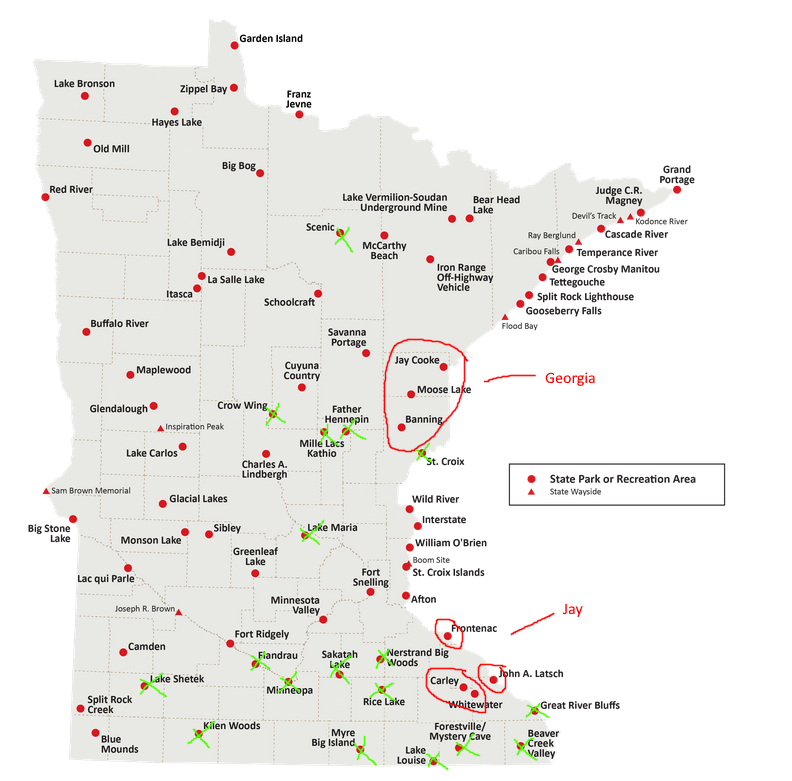

<!-- truncate -->

We're now 10 days in to 2026. It's already been a little hectic in the world, and in Minnesota. My goal for this space is to not only have technical content, but share some personal things to a degree also. At work, we have to fill out goals for the following year, three actionable items we want to accomplish, and details on how we want to accomplish them. This is apart of our yearly review process. Items like self-evaluation, and setting goals are difficult things for me to do, especially when I know there is a limited training budget, limited time, and limited ways to accomplish those things. But, I try to think about where I want to go with my career, and put real thought into that. At the end of the year, I do something similar at home, writing down both personal and professional goals I want to achieve. A lot of times that page of paper gets lost, I forget about it, I don't do it, or I do other things instead. There is always a balance of professional and personal goals, and I certainly do not want the professional goals to outweigh the personal goals.

I figured this website is a perfect place to write down those things, along with more detail on how I want to accomplish them.

## Overview of my Yearly Goals

- Professional goals
  - Artificial Intelligence/Model Context Protocol
  - Python
  - KQL
- Personal goals
  - Eat healthier
  - Exercise
  - Read a minimum of 12 books
  - Visit state/national parks
    - 6 state parks
    - 2 national parks
  - Learn photography
  
### Professional Goals

Each year I try to think about what I am interested in, what's upcoming, and what could help my career. My goals for the year are to try to learn AI, Python, and KQL. While I have mostly been in the Endpoint space in my career, I do wonder what the world is like in other areas of technology. At home, I enjoy playing around with open-source technology, trying new things, and seeing what's out there. I've thought about going down the Cloud Computing route, or maybe even trying to switch over to Linux Administration. Either way, all the things I am hoping to learn professionally can only help me in my current role, and maybe open up new opportunities for me.

#### AI/MCP

While I don't necessarily agree with everything about AI, I'd probably be a little silly to not try to learn all the capabilities, or even begin to learn. My plan at some point in the year is to go through Microsoft's MCP training, https://github.com/microsoft/mcp-for-beginners and see where that leads me.

#### Python

I've mostly been in the PowerShell world my entire professional career, not really deviating. I figured if I ever do want to head down the Linux/Cloud Computing path, it's probably best to start learning Python. I previously purchased **Python Crash Course, 2nd Edition**, but never opened it up. One of those goals that fell by the wayside. 

I've purchased [Python Crash Course, 3rd Edition](https://www.amazon.com/Python-Crash-Course-Eric-Matthes/dp/1718502702?crid=R5UAYQXWTEY5&dib=eyJ2IjoiMSJ9.W7y-I8wX4MSihtffDetIB9fT0FgqpfWUAK4Bl5H9VEiajJXl-Q1IgQR4WOjjd5bZmXAsZtwA_R5K3YN9vk6-ZLhnuCV8TMXC-kFC3YIHbeqxmCzbqjbyXcf-5U1IRjU_102LMGcRWa_ZW824tCgKTaGratOLeK2X_UzKkELmEh8tbWjs4j0dmgpVyMSsto2mE8r7LigVbqXWYxOXxif7PqIDHtHQrahvLq7kewnI2MU.rMD4hJmOlB71tMcNssyowsqLF3kz4GcGwrbOiyIVYwY&dib_tag=se&keywords=python+crash+course+3rd+edition&qid=1768071167&sprefix=python+crash+course+3rd+editio%2Caps%2C208&sr=8-1) to help me learn Python. I'll also find some YouTube videos and maybe some other online material to help me along the way.

I find books/labs to be my best method for learning new things. Online videos, I tend to lose focus more easily, and have to keep going back to the content.

#### KQL

I've messed around with KQL here and there, but nothing too extensive. A lot of copying and pasting of code from the community, and then tweaking to get things working how I want. I picked up [The Definitive Guide to KQL](https://www.amazon.com/Definitive-Guide-KQL-operations-defending/dp/0138293384?crid=2R6SN9PCDDMXC&dib=eyJ2IjoiMSJ9.UVhofC8WD77sHc0Lz2S32csjDTSUjyD-9BzJhENzCZRyXXfEniZg7SveXbNvtsca.P_HgUta6Ak_xNS_NrEvhc0RcFdgGoRLbfKn9lq85K0g&dib_tag=se&keywords=the+definitive+guide+to+kql&qid=1768071317&sprefix=the+definitive+guide+to+kql%2Caps%2C216&sr=8-1), and plan on jumping into that more after I go through the Python content.

I've been playing more with Log Analytics Dashboards in Azure, and seeing how I can get data from Microsoft Intune into there and setting up different reports. Lately I've been building out a change tracking dashboard for our team.

### Personal Goals

The professional goals are a little bit more open ended for me. I try not to sink too much time on the weekends, after work into professional goals that require me to be away from my family. I put more into the personal goals, and these are all things I 100% want to achieve, or start working towards.

#### Eat Healthier/Exercise Routine

Issue: I eat great in the summer, exercise in the summer. I live in Minnesota, where it's f'n cold a lot of the year.

My goal here is to try to eat healthier year round along with exercising regularly. I have back issues. Poor posture, shoulder pain, etc. Between my 7th and 8th grade year I grew a foot, which really messed with my back. No real injuries, just random issues here and there. I'm getting older, and need to take care of myself more.

I have been riding my bike a ton, but last year, I didn't get on it more than a handful of times. Living out in cornfield/gravel road country, it's hard to find the motivation to ride it, as the rides are straight, windy, and bumpy. I'm one of those people, when I do something, I like to do it all the way. It's why I don't gamble. My goal this year is to ride my bike more, but not that much more. I don't need to try for 100 miles, or probably even 50 miles. If I could do 10-20 miles 3 days a week, that would be fantastic for me. With that, I'd like to start lifting weights, or introduce a stretching routine. Stretching I have done in the past, but nothing consistent. Lifting weights is something I've never really done, as I don't see the joy in it. It might be one of those things (like cycling), where once I start doing that, I'll enjoy it more.

My other goal is to eat healthier. I love frozen pizza, candy, and cereal. I know it's not good for me. In the summertime, I eat a lot of veggies from my garden. Year round I eat a lot of fruit. I'd like to keep eating healthy year round, and prepare more meals.

#### Read a minimum of 12 books

My goal last year was 15 books. I made it about 7 books in before I lost momentum, and then didn't read another book all year. I made it through those 7 books probably by March. Another one of those things of being 100% in on something, I was reading daily, but then got burnt out on a series I was reading. I read 5 of the books in the series, but didn't even bother finishing the last one (Red Rising Series, I loved it, need to finish the last one.). I cut my goal back by 3 this year, down to 12. So that would be one book a month. I should be able to achieve this.

My daughter reads about 12 books a month, so there is 0 reason I shouldn't be reading more.

#### Visit State/National Parks

We didn't go on any national park trips last year, but I want to get back out to them this year. Rocky Mountains is my favorite park I've been to. I'd like to go back out there, and maybe visit another Colorado park. I love seeing all the wildlife. Last time in the Rockies, we saw moose, elk, and longhorn sheep. The moose we saw were standing on the trail we were walking on, very intimidating. No I did not try to hug one.

Every year I take each of my kids on a separate camping trip. I'm still working my way through the MNDNR Hiking Club, and hope to continue on with that. My goal is to visit 6 state parks (probably pretty low). The issue is, I've knocked off most of the parks in Southern MN within a 2 hour drive from me. So now I'll need to start traveling more.

I think I can do the above on some camping trips with each of the kids. Georgia seems to love the north more than Jay, where Jay like to play along the Mississippi and try to do fishing.

#### Learn Photography

Georgia took a photography class in high school, which had me buying a used camera off Facebook Marketplace. She didn't really care for the class all that much, but learning photography has been an interest of mine since I was a teenager. One of those things I never bothered learning. I feel like as a millennial, I'm starting to detach from my phone more and more. I'd like to slow down, learn photography, go back to an MP3 player, and start retro gaming.

How will I learn photography? That part I haven't quite figured out yet, but it's on my to do list.