<!-- truncate -->


Happy weekend everyone, I'm back with another post for the month. I'd like to say I've been busy and productive, but that's not really the case. I am trying to lay low and stay sane at the moment. To distract myself, I recently picked up a [TrimUI Brick](https://www.amazon.com/Handheld-3-2-inch-Trimui-Brick-Opensource-Protector/dp/B0DNQ5345P?th=1)....actually my mom got it for me for my birthday (yes my mom bought me a birthday present in my 40s). I've been burnt out recently on PS5 gaming, annoyed by the fact that there is not an end in sight to games anymore. There is always some expansion pack, open world, or micro transaction. As you can tell, I f'n love the 90's and early 2000's nostalgia from my childhood. It probably wasn't as great as I remember (hence my someone fragile mental state at times), but dammit, we had the best of both worlds. Life without the internet + life with the internet. Since I got the retro handheld, I've been playing a lot of Donkey Kong Country and NHL 94 to keep me distracted.


But enough about my personal updates, this blog post is more about getting back into what the original theme about this site was going to be, writing about endpoint management and capturing my thoughts on it. Last year, I setup a Hyper-V lab for ConfigMgr, Intune, and Active Directory. This post deviates a little bit from the ConfigMgr and AD side of things, and focuses more on the Intune side. I have a test tenant that has been sitting dormant for a while. I figured, why not start with the basics a little bit and configure Windows Autopilot in a Hyper-V scenario?

This post is not going to walk through setting up Hyper-V or Microsoft Intune, if you need help with that, [check out my post from last year](https://joeloveless.com/blog/intunelab-2025) on setting up an Intune lab.

## Preparation, downloading a Windows 11 ISO

The first thing we need to do is download a Windows 11 ISO. There are plenty of ways to do this, if you have access to [Visual Studio subscriptions](https://my.visualstudio.com/downloads), you can get it there. For me, I am just going to download the ISO from Microsoft directly. The link is below:

https://www.microsoft.com/en-us/software-download/windows11

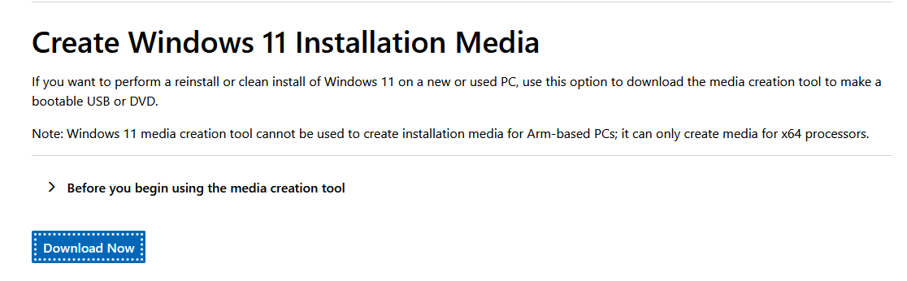

Once downloaded, open the file and you'll want to choose ISO file during the setup assistant.

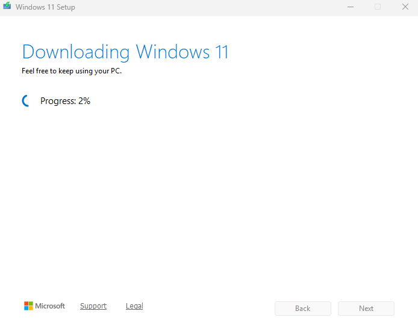

This might take a minute....

## Autopilot Configuration

To configure Autopilot, we basically have 3 things we need to do:

1. Import the hardware hash (will do this later during the VM creation)
2. Create and assign an Autopilot profile.
3. Create a device group for the Autopilot devices

Let's work backwards on this, makes total sense.

### Creating the device group for Autopilot devices

Let's go over to the [Entra portal](https://entra.microsoft.com), and go to Groups.

We're going to create a new group:

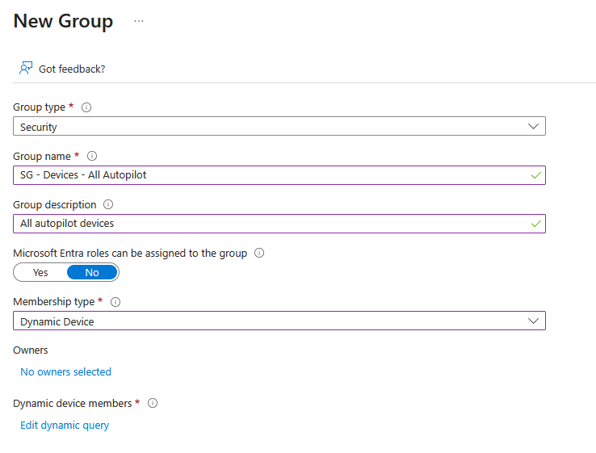

We want the group to be a Dynamic Device group.

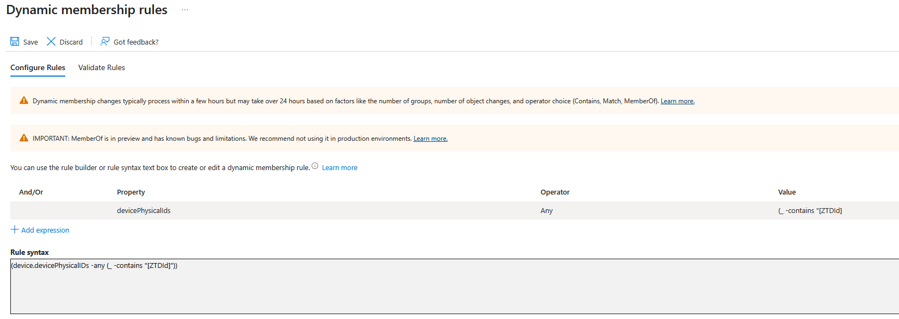

```powershell
(device.devicePhysicalIDs -any (_ -contains "[ZTDId]"))
```
This query retrieves any device that is **registered** with Windows Autopilot.

[Create device groups for Windows Autopilot](https://learn.microsoft.com/en-us/autopilot/enrollment-autopilot)

### Create and assign an Autopilot profile

Now we're going to head over to [Microsoft Intune](https://intune.microsoft.com), and create the Autopilot profile.

From the Intune portal:

Devices > Enrollment > Deployment Profiles

Create a new profile and give it a proper name:

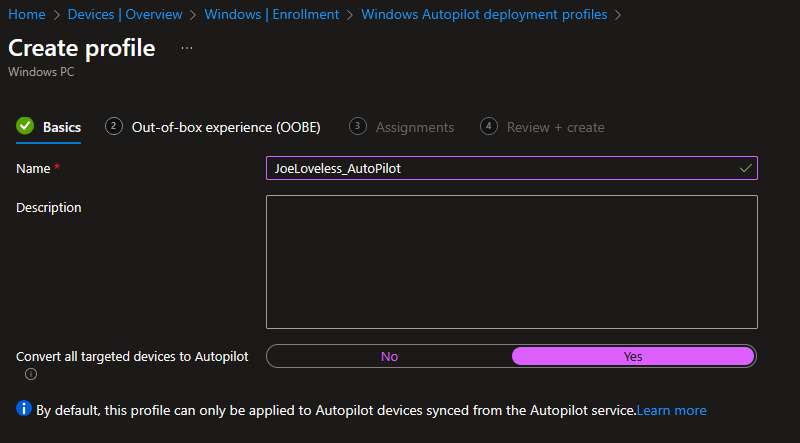

In this case, we're going to choose a User-Driven profile and give it a naming convention.

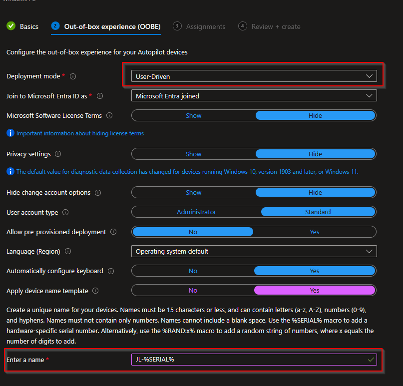

Final step, we're going to assign the profile to the Entra group we just created.

Once finished, your profile should look like this:

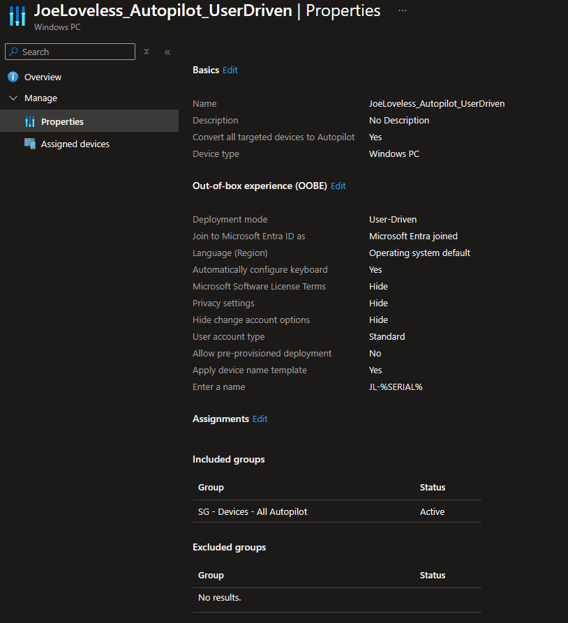

### Importing the hardware hash

Now that we have those steps done, we're at the point where we need to import the hardware hash. We can't do that step without creating a VM first, so let's open Hyper-V and get started on that.

#### Creating the VM

We can either do this through the GUI, or do it with PowerShell. I'm going to create it with PowerShell, and then I'll show you the configuration in Hyper-V

```powershell
New-VM -Name "W11_25H2_Autopilot" -MemoryStartupBytes 4GB -BootDevice VHD -NewVHDPath "C:\VMs\W11_25H2_Autopilot\W11_25H2_Autopilot.vhdx" -Path "C:\VMs\W11_25H2_Autopilot\VMData" -NewVHDSizeBytes 80GB -Generation 2 -Switch "JoeLoveless.com" -

Add-VMDvdDrive -Path "C:\VMs\W11.iso" -VMName "W11_25H2_AutoPilot"

Enable-VMTPM -VMName "W11_25H2_AutoPilot"
```
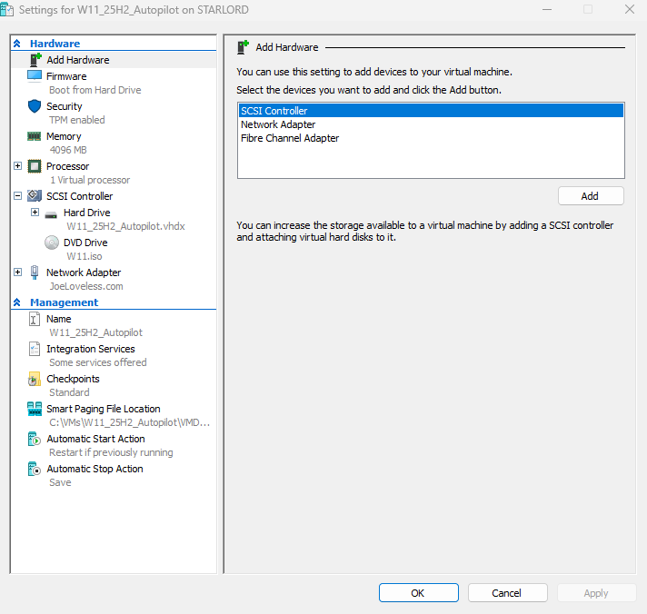

- Before we power it up, remove the network adapter and the hard disk. We'll come back to these later, first we want to capture a checkpoint.
- Go into settings for the VM and remove those, also add a 2nd processor and enable TPM.
- Now we're ready to power up the VM.
- At the first OOBE screen, create a checkpoint

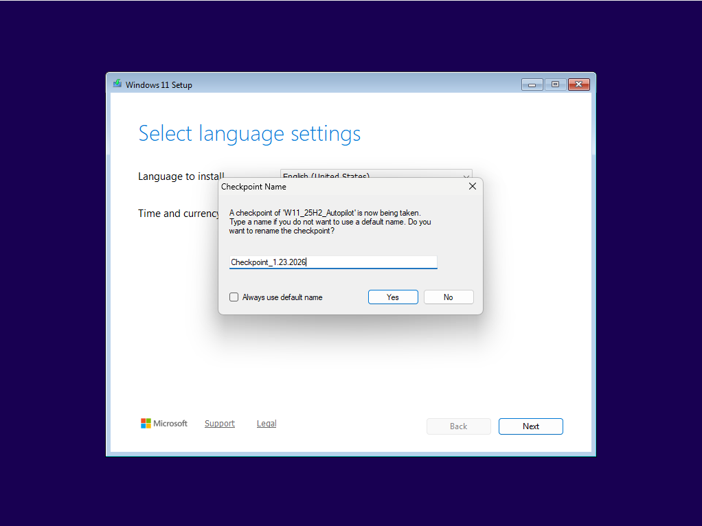

- Now, with the VM still up, add the network adapter back.
- Continue on through the setup process, allowing the computer to restart when necessary.


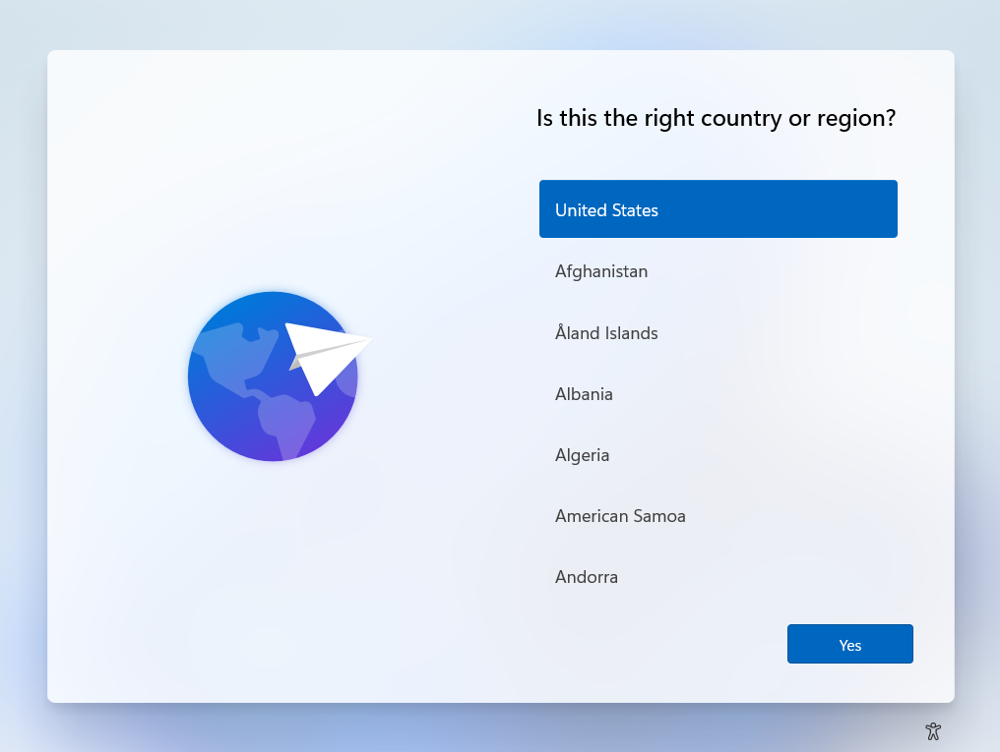

- Once at this screen, hit **Shift+F10** and open a command prompt.
- Type powershell.exe

```powershell
Set-ExecutionPolicy bypass

Install-Script get-windowsautopilotinfo

```
- Accept all the prompts, allowing the script to install.

```powershell
Get-WindowsAutoPilotInfo.ps1 -online
```

- Some Microsoft Graph modules will install.

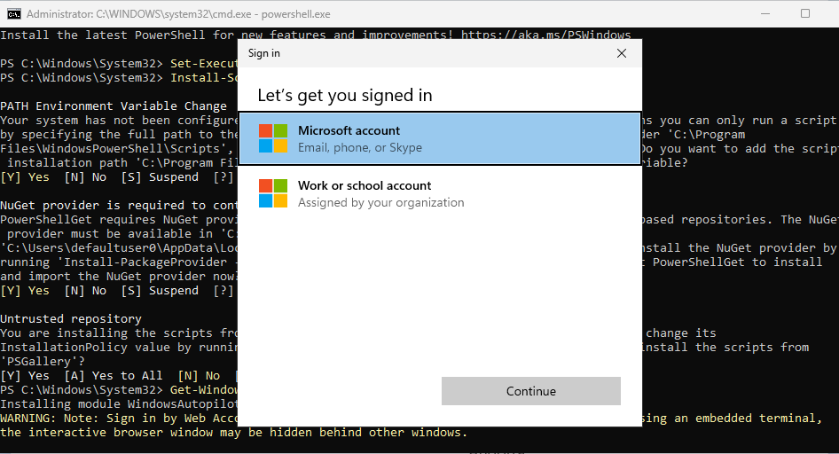

- Sign in with your Microsoft account (choose work or school)
- Accept all the prompts
- After the window closes, you should see the device being imported through the powershell window.
- Once finished, you should now see the serial number in the Entra group.

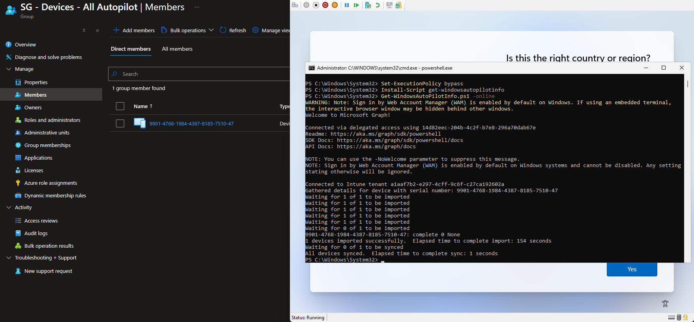

- Now that we are finished, let's revert to our checkpoint, and go through the full setup process.
  - Make sure you add the network adapter back!
- After a few minutes and clicking through, you should be at a sign-in screen.

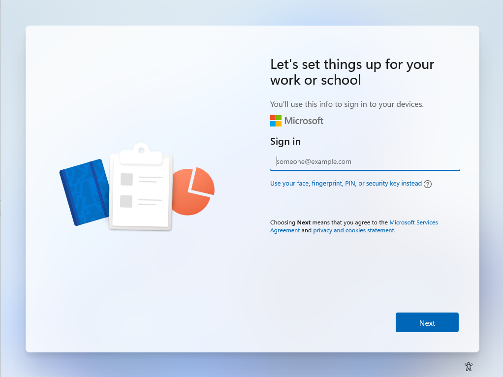

**Make sure you sign in with an account licensed for Intune**

- Depending on your tenant setup, you might see some different options from here on out (MFA, WHFB, etc)
- Eventually, you will find your way to the Windows logon screen


Checking Microsoft Intune, we now have the VM loaded in properly.

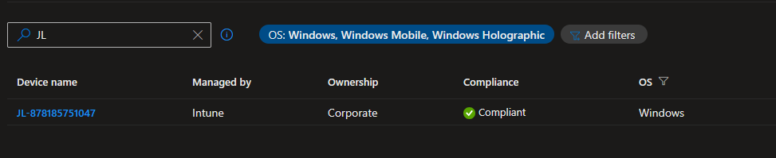

## Final Thoughts

I'd like to know how others are testing Autopilot and Intune in their lab environments. Is anyone still using AD/ConfigMgr for testing, or going solely to Intune/Entra joined devices? Is there a better way to provision VMs?


