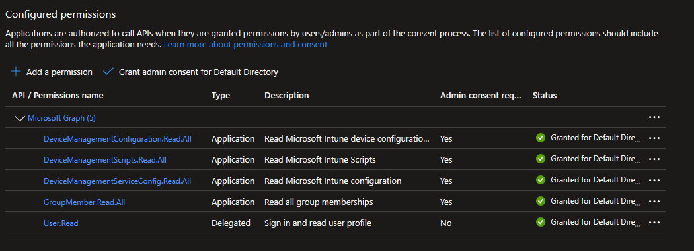
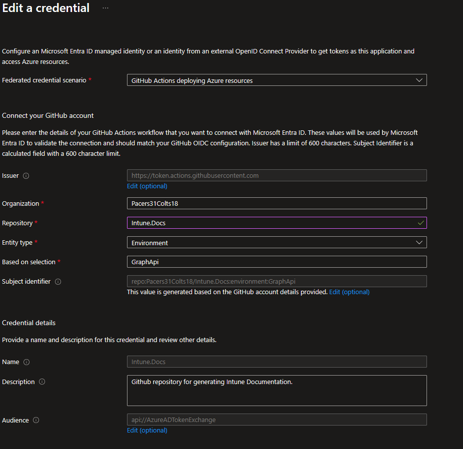
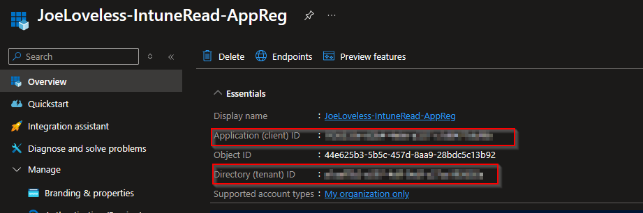
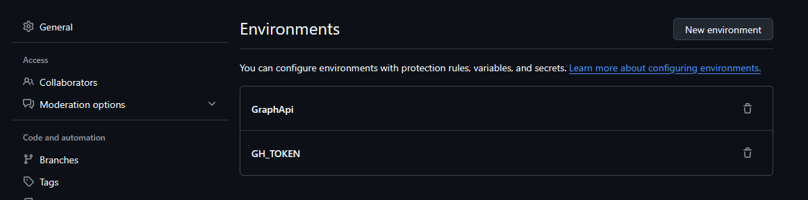
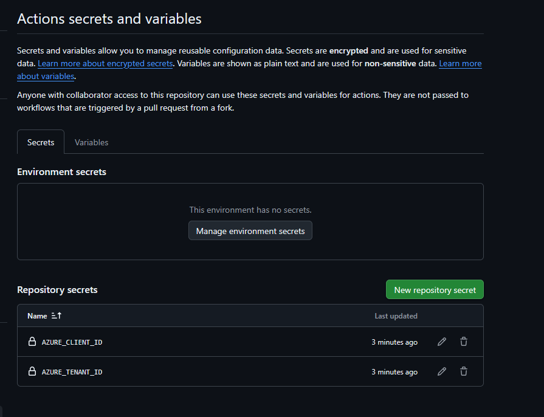
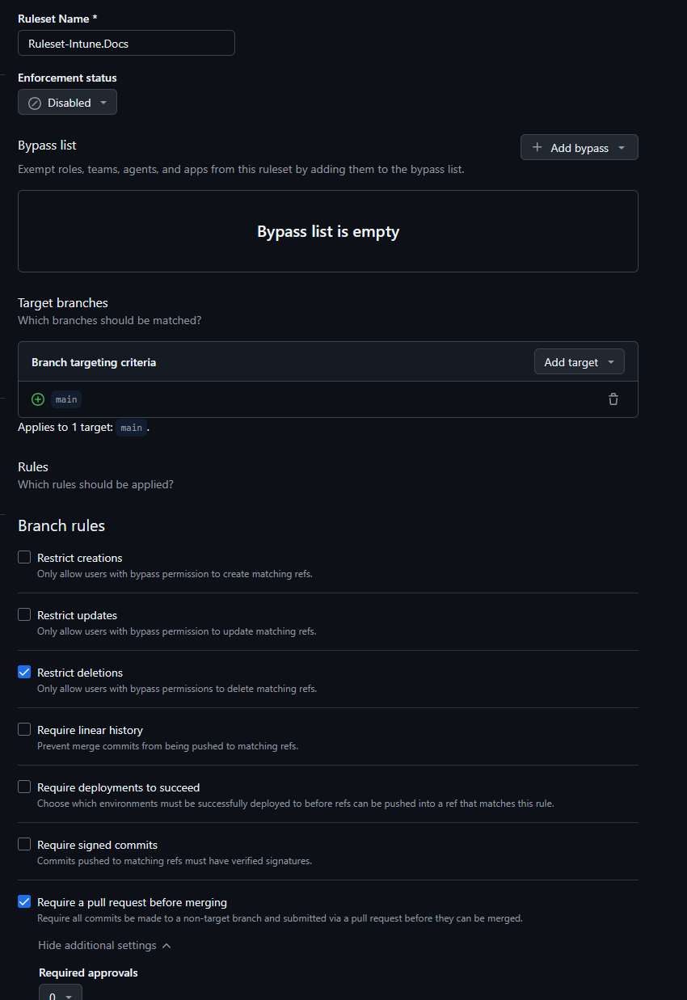
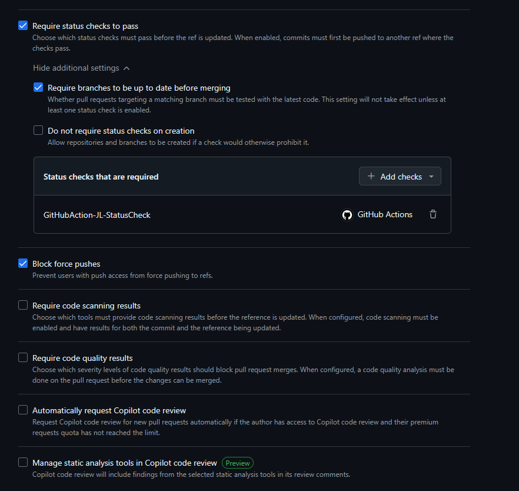
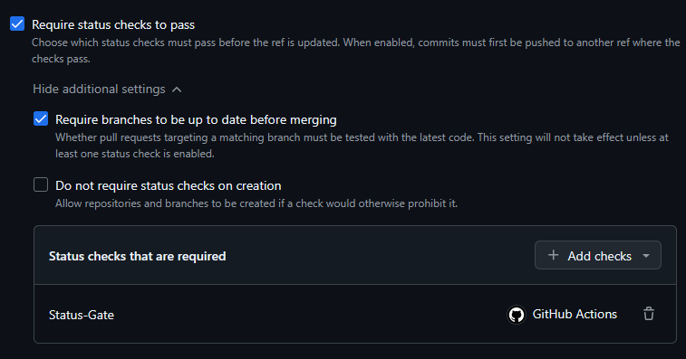
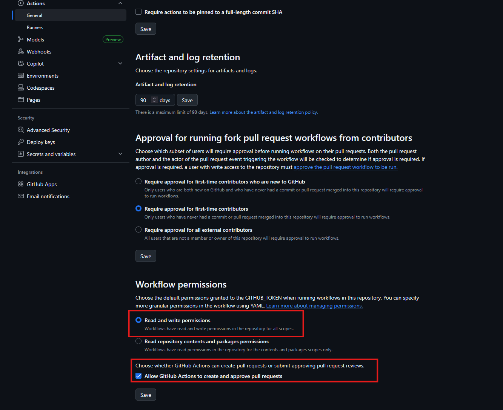

<!-- truncate -->


Greetings everyone! It's almost February, winter is still in full swing, and I'm getting cranky from the cold weather. I'm looking forward to spring, and possible new adventures, I'm wanting to ride my bike more and do some camping. I've been selling off old junk on Facebook Marketplace, and trying to de-clutter what I have (not the random box of cables of course, you never know when you will need the random power cables or bluetooth adapters). In the meantime, I've been working on a solution to document our Intune policies in an automated fashion using GitHub Actions on a daily (or weekly, not sure yet?) schedule. With that, I want to write about it, mainly because I am a little pumped about it and think it's going to be a pretty nice solution. There is a lot to it, so let's dive into it.

[Github Repository](https://github.com/Pacers31Colts18/Intune.Docs)

## Code Overview

Since I mainly work on the configuration side of things, and not much with application packaging, or the other parts of Intune, this backup solution is focused mainly on policies. I think I've made this to be pretty expandable though, as long as you are aware of the differences in different sections of the Graph API for Intune. For this, within each section of the [/deviceManagement](https://learn.microsoft.com/en-us/graph/api/resources/intune-device-mgt-conceptual?view=graph-rest-beta) area of Graph API, I have made the following:

- A function that exports the JSON configuration for the policy.
- A function that exports the JSON assignments for the policy.
- A function that converts the JSON configuration to Markdown format to make it pretty.
- A function that converts the JSON assignments to Markdown format to make it pretty.

This takes place for these sections within the API:

- **deviceManagement/configurationPolicies**
  - Settings Catalog
- **deviceManagement/deviceCompliancePolicies**
- **deviceManagement/deviceConfigurationPolicies**
  - Templates
- **deviceManagement/deviceEnrollmentConfigurations**
- **deviceManagement/deviceHealthScripts**
  - Proactive Remediations
- **deviceManagement/deviceManagementScripts**
  - Platform Scripts
- **deviceManagement/deviceShellScripts**
  - Mac Shell Scripts
- **deviceManagement/groupPolicyConfigurations**
  - Custom ADMX Templates
- **deviceManagemnt/windowsAutopilotDeploymentProfiles**

Within each function for the exports, it's using:

```powershell
Get-IntuneDeviceManagementPolicy
```

This is a helper function that allows the code to be repeatable, calling those API sections.

From there, the two main functions that do the majority of the work for the GitHub Actions are:

```powershell
Invoke-IntuneDocumentation
Invoke-IntuneAssignmentDocumentation
```

Both functions have two parameters, **docType** and **outputPath**

- docType
  - This defaults to All, which processes all the Export commands in the function.
  - Can be switched to specific endpoints, such as deviceManagementScripts, etc.
- outputPath
  - Where to export the files to.

Some of this could have probably been de-duplicated, but there were enough differences in the different sections that after a bit of time, to me it made a little more sense to just have the same set of functions for each section of the API. Made it easier for myself to follow, and hopefully easier for others to follow too.

## Pre-Requisites

There are some moving pieces to this setup, so some things to be aware of:

1. Need access to create an Azure App Registration
2. Need a GitHub Repository
3. Need an Intune tenant

With that said, this is also something that can be ran manually without the App Registration or using GitHub Actions, but this post will walk through mainly the GitHub Actions scenario. I'll call out the spots for a manual configuration.

## Azure App Registration

Within the [Azure Portal](https://portal.azure.com), go to App Registrations.

### API Permissions

1. Create a new App Registration, giving it a proper name.
2. Choose API permissions from the left hand side, and add the following permissions:
   1. DeviceManagementConfiguration.Read.All
   2. DeviceManagementScripts.Read.All 
   3. DeviceManagementServiceConfig.Read.All
   4. GroupMember.Read.All
3. All API permissions should be Application based permissions
    - **Note: If running manually, you can add Delegated permissions**
4. Don't forget to Grant admin consent



### Federated Credentials

1. Next go to Certificates & Secrets and choose **Federated Credentials**
2. Choose **GitHub Actions deploying Azure Resources** from the drop down menu.
3. Fill out the rest of the form, filling in the details of your GitHub Repository.



### Overview

1. Once finished, go to the Overview page of your Azure App Registration and take note of your Tenant ID and Application ID, you'll need this later on.



## GitHub Configuration

With the Azure portion configured, we can now configure GitHub. Start by cloning the repository [here](https://github.com/Pacers31Colts18/Intune.Docs), however you see fit to do.

### Environment Variables

In GitHub, go to Settings for your repository, and we're going to setup a couple of environment variables. Pay attention to the uppercase/lowercase, as this will matter. GraphApi should also match exactly to what you put in during the Azure App Registration process.



### Secrets

- Next under Settings, go to the Security section and choose **Secrets and variables** and then **Actions**.
- Create two new secrets:
  - AZURE_CLIENT_ID
  - AZURE_TENANT_ID
- For each, add the values from your Azure App Registration.



### Ruleset

- Now go to **Rules** and choose **Rulesets**
- Create a new ruleset, naming it whatever you like.
- The settings should be as follows (some are automatically checked):
  - Enforcement Status: Active
  - Target Branch > Include by Pattern > **main** (or whatever the name of your branch is, might be master).
  - Restrict deletions
  - Require a pull request before merging.
  - Require status checks to pass.
    - Require branches to be up to date before merging.
    - Status checks that are required:
      - Status-Gate
  - Block force pushes.
- Save the changes.





### GitHub Actions

Under the settings, click **Actions**, and go to General. Then go to Workflow permissions, and check the following:

- Read and Write Permissions
- Allow GitHub Actions to create and approve pull requests 



*Note: If you are working in an Enterprise tenant for GitHub, you might have to have these settings changed at the organizational or even Enterprise level, depending on your setup. For our environment, I was unable to change this until an admin changed the setting at the organization level*

#### GitHub Actions Files Overview

There are three GitHub Actions files, located at .github/workflows of the repo:

**GitHubAction-JL-IntuneDocs.yml**

   - This is the main file. In my file, I have this set to run at 9:00 p.m. CST every night. Once this kicks off, the following will happen:
     - All files at this folder will be removed.
```yaml
"${{ env.REPO_DIR }}/Docs"
```
   - Will login to Azure.
```yaml
      - name: DEV Azure Login
        uses: azure/login@v2
        with:
          client-id: ${{ secrets.AZURE_CLIENT_ID }}
          tenant-id: ${{ secrets.AZURE_TENANT_ID }}
          allow-no-subscriptions: true
          enable-AzPSSession: true
```
   - Will generate new markdown files:
```yaml
      - name: Generate Markdown Files
        shell: pwsh
        run: |
          $GraphTokenResponse = az account get-access-token --resource https://graph.microsoft.com
          $GraphToken = ($GraphTokenResponse | ConvertFrom-Json).accessToken
          $SecureToken = ConvertTo-SecureString $GraphToken -AsPlainText -Force
          Install-Module Microsoft.Graph.Authentication -Force -AllowClobber
          Install-Module Microsoft.Graph.Beta.DeviceManagement -Force -AllowClobber
          Connect-MgGraph -AccessToken $SecureToken
          Import-Module -Name "${{ env.REPO_DIR }}" -Force
          Invoke-IntuneDocumentation -docType all -outputPath "${{ env.REPO_DIR }}/Docs"
          Invoke-IntuneAssignmentDocumentation -doctype All -outputPath "${{ env.REPO_DIR }}/Docs"
```
- Configure Git
- Set the branch name
- Commit to the branch and do a push
- Then create a pull request

```yaml
 # CONFIGURE GIT
      - name: Configure Git
        run: |
          git config --global user.name "Joe Loveless"
          git config --global user.email "joe@joeloveless.com"

      # SET BRANCH NAME
      - name: Set branch name
        id: vars
        run: echo "branch_name=JL-IntuneDocs-$(date +'%Y-%m-%d')" >> $GITHUB_OUTPUT

      # COMMIT and PUSH
      - name: Commit changes
        run: |
          cd "${{ env.REPO_DIR }}"
          git checkout -b ${{ steps.vars.outputs.branch_name }}
          git add .
          git commit -m "Policies: $(date +'%Y-%m-%d')" || echo "No changes to commit"
          git push origin ${{ steps.vars.outputs.branch_name }}

      # CREATE PR
      - name: Create Pull Request via REST API
        id: pr
        run: |
          echo "Creating PR from branch: ${{ steps.vars.outputs.branch_name }}"

          RESPONSE=$(curl -w "%{http_code}" -o response.json -X POST \
            -H "Authorization: Bearer $GITHUB_TOKEN" \
            -H "Accept: application/vnd.github+json" \
            https://api.github.com/repos/${{ github.repository }}/pulls \
            -d @- <<EOF
          {
            "title": "Automated Intune Docs Update",
            "head": "${{ steps.vars.outputs.branch_name }}",
            "base": "main",
            "body": "Automated documentation update for $(date +'%Y-%m-%d')."
          }
          EOF
          )

          echo "HTTP status: $RESPONSE"
          echo "Response body:"
          cat response.json

          PR_NUMBER=$(jq -r '.number' response.json)
          echo "pr_number=$PR_NUMBER" >> $GITHUB_OUTPUT
        env:
          GITHUB_TOKEN: ${{ secrets.GITHUB_TOKEN }}
```

Once that is successful, a status check will run. This is basically ensuring that the first Action completed successfully, ensuring we don't have a messy merge process.

**GitHubAction-JL-StatusCheck.yml**

```yaml
 - name: Find PR created by JL-IntuneDocs workflow
        id: find_pr
        run: |
          echo "Searching for PR with branch prefix: JL-IntuneDocs-"

          PR=$(gh pr list --state open --json number,headRefName \
               --jq '.[] | select(.headRefName | startswith("JL-IntuneDocs-")) | .number')

          echo "PR: $PR"
          echo "pr_number=$PR" >> $GITHUB_OUTPUT
        env:
          GITHUB_TOKEN: ${{ secrets.GITHUB_TOKEN }}

      - name: Get PR commit SHA
        id: get_sha
        if: ${{ steps.find_pr.outputs.pr_number != '' }}
        run: |
          PR=${{ steps.find_pr.outputs.pr_number }}

          SHA=$(gh pr view "$PR" --json headRefOid --jq '.headRefOid')
          echo "PR commit SHA: $SHA"

          echo "sha=$SHA" >> $GITHUB_OUTPUT
        env:
          GITHUB_TOKEN: ${{ secrets.GITHUB_TOKEN }}

      - name: Set status check on PR commit
        if: ${{ steps.get_sha.outputs.sha != '' }}
        run: |
          SHA="${{ steps.get_sha.outputs.sha }}"
          echo "Setting status on PR commit: $SHA"

          gh api \
            repos/${{ github.repository }}/statuses/$SHA \
            -f state=success \
            -f context="Status-Gate" \
            -f description="All required jobs completed successfully."
        env:
          GITHUB_TOKEN: ${{ secrets.GITHUB_TOKEN }}
```

**GitHubAction-JL-AutoMerge.yml**

The last action, is to then merge the pull request into the main branch. After authentication, it's going to find the latest pull request, and then merge it into the main branch.

```yaml
steps:
      - uses: actions/checkout@v4

      - name: Install GitHub CLI
        run: sudo apt-get install -y gh

      - name: Authenticate GitHub CLI
        run: echo "${{ secrets.GITHUB_TOKEN }}" | gh auth login --with-token

      - name: Find PR created by JL-IntuneDocs workflow
        id: find_pr
        run: |
          PR=$(gh pr list --state open --json number,headRefName \
               --jq '.[] | select(.headRefName | startswith("JL-IntuneDocs-")) | .number')
          echo "pr_number=$PR" >> $GITHUB_OUTPUT
        env:
          GITHUB_TOKEN: ${{ secrets.GITHUB_TOKEN }}

      - name: Enable auto-merge (rebase)
        if: ${{ steps.find_pr.outputs.pr_number != '' }}
        run: gh pr merge ${{ steps.find_pr.outputs.pr_number }} --auto --squash --delete-branch
```

## Markdown Output

### Policy Documents

My initial goal for this project was to convert the entire JSON file to Markdown, using PSObjects. In attempting to do that, starting with the Settings Catalog section, I found so many different variables, that it became a battle I didn't want to fight anymore.

For Settings Catalog alone, there are the following different setting types:
- optionValue
- choiceSettingValue
- simpleSettingValue
- ConfigurationStringSettingValue
- choiceSettingCollectionValue
- groupSettingCollectionValue

Within the old Templates area, I ran into differences with OMA-URI, Certificates, templates, etc.

Similar with the Group Policy area too, which was more annoying because that is the least used section in our org....


And I think I am probably missing some. Within those, I then ran into child items...and then more child items....and more child items (and probably even more). It got to the point where every time I went back to this project, I'd confuse myself more on where I was at with it.

At some point, I ran across [Sandy Zeng's GitHub](https://github.com/sandytsang) and found the idea of outputting the JSON for each setting instead. With that, I then came up with what I wanted to run with on this.

I'm taking out the items I find most valuable within each setting:

- Name
- Description
- Full URI
- InfoURL

For certain configurations (Scripts, XML, Certificates), the conversion functions will decode the files so you can get the actual script content displayed. Here you can see the example output from one of the default Remedation scripts from Microsoft. [Update Stale Group Policies](https://github.com/Pacers31Colts18/Intune.Docs/blob/main/Docs/DeviceHealthScripts/Update_stale_Group_Policies.md)

The rest is the json file, split out for each setting. My [repo](https://github.com/Pacers31Colts18/Intune.Docs) has examples from my Intune test lab that you can check out.

### Assignment Documents

When the **Invoke-IntuneAssignmentDocumentation** runs, a subfolder is created under /Docs/Assignments. The JSON for the Policy documents will create an assignments link, based off the same name of the policy. From there you can click that link in the markdown file, and go into the Assignments page.

The assignments page will give you each group assigned to the policy. I have another [helper function](https://github.com/Pacers31Colts18/Intune.Docs/blob/main/Public/Helpers/Get-GroupClassification.ps1) within this that takes the GroupID, and looks up the actual Entra group display name. If the group Id is 'adadadad-808e-44e2-905a-0b7873a8a531', then the output will be All Devices, if the group ID is 'acacacac-9df4-4c7d-9d50-4ef0226f57a9', the output will be All Users.

The assignments page also gives you the JSON output, similar to what is being done with the policies, just on an assignment basis and not a setting basis.

## Final Thoughts

What I like about this configuration is the ability to have branches, so you can get a historical view of how your policies or assignments have changed over time. With GitHub, you have a nice repository you can search for keywords off of, something Intune is sorely lacking today. Publish this repository to an internal GitHub Pages setup, and then you have a nice documentation page you can give to your Service Desk or Desktop Support staff for easier troubleshooting.

Let me know what you think, would love to gather some feedback or potential issues that you see with this!


