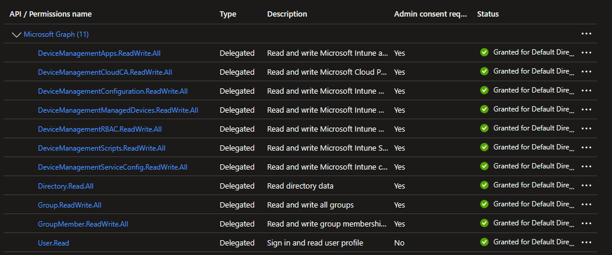
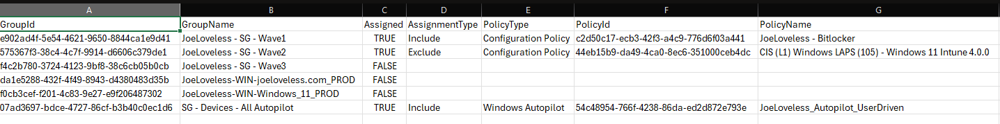

<!-- truncate -->


My motivation is high lately, and I am wanting to keep the momentum going. Life has been somewhat busy on the home front, 2nd semester is in full swing for the kids. My son is taking a 7th Grade Computer Science class using code.org, so I've been helping him the most with that. The interface seems to be Scratch based, which we've dabbled with in the past. He seems to be gaining interest in computers, using that and the Lego Studio app (which seems to be a really great introduction to CAD). My daughter has a pretty heavy load of science this semester with Physical Science and Astronomy classes. I'm currently decluttering the house, selling random items on Facebook Marketplace to gear up for a potential move. I feel like I've made a pretty good haul so far, but still have so many items I need to get rid of. It's amazing what you can gather, especially when you consider yourself to not have a ton of possessions anyways. Hopefully I have more at some point on a potential move, very excited about all the different possibilities. When not trying to sell off random items, I've been heavily playing retro games. I just beat Super Mario Bros for NES, thanks to being able to save games mainly. Not nearly as frustrating as on the original NES with only so many lives.


My post this week is about gathering Intune assignments for groups in an Administrative Unit. I've seen many solutions out there for either exporting all policy assignments, or individual group assignments. In our org, we have two administrative units.

1. One for the endpoint staff to create groups in that only we control.
2. Another to create groups in that gives Desktop Support/Service Desk the ability to add/remove membership.

As we're trying to have proper hygiene in our environment, it's important to be able to cleanup groups. It's especially important to cleanup groups and make sure we're not deleting anything that is currently in use.

## GitHub Scripts

The scripts used in this blog post can be found here:

[Export-IntuneGroupAssignmentsforAdministrativeUnit.ps1](https://github.com/Pacers31Colts18/Intune/blob/main/powershellscripts/Export-IntuneGroupAssignmentsForAdministrativeUnit.ps1)

[Invoke-MgGraphBatchRequest.ps1](https://github.com/Pacers31Colts18/Intune/blob/main/powershellscripts/Invoke-MgGraphBatchRequest.ps1)

## What is an Administrative Unit?

Microsoft can definitely explain this better than me, here is the [Microsoft Learn](https://learn.microsoft.com/en-us/entra/identity/role-based-access-control/administrative-units) documentation on it. In our scenario, it's a way to control and segment out groups for Intune use. That said, you can also segment out devices, users, or groups.

## Required Permissions

For this to work properly, you need proper Graph permissions. There are tons of ways to go about this, we run everything through delegated permissions both in my lab and at my org. Here is what I have setup with an App Registration:



*Note: Read permissions are needed in this scenario, although the screenshot shows Read/Write, I use the app for other purposes.*

## PowerShell Challenges

When you are talking at an enterprise level, we're talking thousands of groups. On top of that, we're looking at multiple different API calls to Microsoft Graph for all the different scenarios.

```powershell
    $resources = @(
        @{ Name = 'Configuration Policy'; Uri = 'deviceManagement/configurationPolicies'; AssignUri = 'deviceManagement/configurationPolicies/{id}/assignments' },
        @{ Name = 'Device Compliance Policy'; Uri = 'deviceManagement/deviceCompliancePolicies'; AssignUri = 'deviceManagement/deviceCompliancePolicies/{id}/assignments' },
        @{ Name = 'Device Configuration'; Uri = 'deviceManagement/deviceConfigurations'; AssignUri = 'deviceManagement/deviceConfigurations/{id}/assignments' },
        @{ Name = 'Device Health Script'; Uri = 'deviceManagement/deviceHealthScripts'; AssignUri = 'deviceManagement/deviceHealthScripts/{id}/assignments' },
        @{ Name = 'Group Policy Configuration'; Uri = 'deviceManagement/groupPolicyConfigurations'; AssignUri = 'deviceManagement/groupPolicyConfigurations/{id}/assignments' },
        @{ Name = 'Windows Autopilot'; Uri = 'deviceManagement/windowsAutopilotDeploymentProfiles'; AssignUri = 'deviceManagement/windowsAutopilotDeploymentProfiles/{id}/assignments' },
        @{ Name = 'Device Enrollment Configuration'; Uri = 'deviceManagement/deviceEnrollmentConfigurations'; AssignUri = 'deviceManagement/deviceEnrollmentConfigurations/{id}/assignments' },
        @{ Name = 'Device Shell Scripts'; Uri = 'deviceManagement/deviceShellScripts'; AssignUri = 'deviceManagement/deviceShellScripts/{id}/assignments' },
        @{ Name = 'Device Management Scripts'; Uri = 'deviceManagement/deviceManagementScripts'; AssignUri = 'deviceManagement/deviceManagementScripts/{id}/assignments' }
```

In my use case for this, I'm only looking at what's in the deviceManagement section of the Graph API. Yes, this needs to be expanded to include application assignments, app configuration policies, etc. But this is a starting point to build upon things. As you can see, we have 9 different sections of Microsoft graph to search through. With a normal ForEach loop for each group, this is going to take a long time. I initially started out that way, and quickly found out (well, quickly in hours) that I would need to find a different way.

## Graph API Batching

So then I went down the rabbit hole of Graph API batching. I don't consider myself an expert in this, and I am sure there are better ways of doing things. I **think** I got it going on best practices, but Microsoft's docs are a little confusing on how to accomplish this. It's also not natively built into the Graph commands, which is a little frustrating.I found other resources to be more helpful for starting out.

- [Microsoft Learn](https://learn.microsoft.com/en-us/graph/json-batching?tabs=http)
- [Supercharge Microsoft Graph API Data Retrieval with PowerShell Batch Requests](https://www.jorgeasaur.us/supercharge-microsoft-graph-api-data-retrieval-with-powershell-batch-requests/)
- [Microsoft Graph JSON batching using PowerShell](https://manima.de/2023/09/microsoft-graph-json-batching-using-powershell/)
  - This post contains a ton of great information in the Footnotes.

## Script Walkthrough

### Invoke-MgGraphBatchRequest

The first thing I needed was a helper function that would help me loop through multiple requests.

```powershell
function Invoke-MgGraphBatchRequest {
[CmdletBinding()]
param (
    [Parameter(Mandatory)]
    [array]$Requests
)

$batchUri = "https://graph.microsoft.com/beta/`$batch"

$body = @{
    requests = $Requests
} | ConvertTo-Json -Depth 10

(Invoke-MgGraphRequest -Method POST -Uri $batchUri -Body $body).responses
}
```

### Export-IntuneGroupAssignmentsforAdministrativeUnit

With the helper function above, I am now ready for the main script walkthrough. As with a lot of what we write, much of this is repeatable code.

```powershell
[CmdletBinding()]
param (
    [Parameter(Mandatory = $true)]
    [string]$AdministrativeUnit,
    [ValidateSet('All', 'Assigned', 'Unassigned')]
    [string]$Scope = 'All'
)

# Microsoft Graph Connection check
if (-not (Get-MgContext)) {
    Write-Error "Authentication needed. Please connect to Graph."
    return
}

#region Declarations
$FunctionName = $MyInvocation.MyCommand.Name.ToString()
$date = Get-Date -Format yyyyMMdd-HHmm
if ($outputdir.Length -eq 0) { $outputdir = $pwd }
$OutputFilePath = "$OutputDir\$FunctionName-$date.csv"
$results = @()
$graphApiversion = "beta"
#endregion

# Resources
$resources = @(
    @{ Name = 'Configuration Policy'; Uri = 'deviceManagement/configurationPolicies'; AssignUri = 'deviceManagement/configurationPolicies/{id}/assignments' },
    @{ Name = 'Device Compliance Policy'; Uri = 'deviceManagement/deviceCompliancePolicies'; AssignUri = 'deviceManagement/deviceCompliancePolicies/{id}/assignments' },
    @{ Name = 'Device Configuration'; Uri = 'deviceManagement/deviceConfigurations'; AssignUri = 'deviceManagement/deviceConfigurations/{id}/assignments' },
    @{ Name = 'Device Health Script'; Uri = 'deviceManagement/deviceHealthScripts'; AssignUri = 'deviceManagement/deviceHealthScripts/{id}/assignments' },
    @{ Name = 'Group Policy Configuration'; Uri = 'deviceManagement/groupPolicyConfigurations'; AssignUri = 'deviceManagement/groupPolicyConfigurations/{id}/assignments' },
    @{ Name = 'Windows Autopilot'; Uri = 'deviceManagement/windowsAutopilotDeploymentProfiles'; AssignUri = 'deviceManagement/windowsAutopilotDeploymentProfiles/{id}/assignments' },
    @{ Name = 'Device Enrollment Configuration'; Uri = 'deviceManagement/deviceEnrollmentConfigurations'; AssignUri = 'deviceManagement/deviceEnrollmentConfigurations/{id}/assignments' },
    @{ Name = 'Device Shell Scripts'; Uri = 'deviceManagement/deviceShellScripts'; AssignUri = 'deviceManagement/deviceShellScripts/{id}/assignments' },
    @{ Name = 'Device Management Scripts'; Uri = 'deviceManagement/deviceManagementScripts'; AssignUri = 'deviceManagement/deviceManagementScripts/{id}/assignments' }
)
```

- The Parameters:
  - $AdministrativeUnit
    - The AU we are going to search through.
  - $Scope
  - We get three options. All/Assigned/Unassigned. This will default to All unless chosen otherwise.

- The Resources mapping:
  - I used this as a way to combine the assignURI and regular URI along with a short name for the CSV export column.

#### Getting the Administrative Unit details

```powershell
    #region Get AU
    $uri = "https://graph.microsoft.com/$graphApiVersion/directory/administrativeUnits?`$filter=displayName eq '$AdministrativeUnit'"
    $au = (Invoke-MgGraphRequest -Method GET -Uri $uri).value
    if ($au) {
        Write-Output "Administrative Unit: $($au.displayName) found."
    }
    if (-not $au) {
        Write-Error "Administrative Unit '$AdministrativeUnit' not found."
        return
    }
    #endregion

    #region Get Groups in AU
    $groups = @()
    $uri = "https://graph.microsoft.com/$graphApiVersion/directory/administrativeUnits/$($au.id)/members"
    do {
        $response = Invoke-MgGraphRequest -Method GET -Uri $Uri

        if ($response.value -and $response.value.Count -gt 0) {
            $groups += $response.value
        }
        elseif ($response -and $response.PSObject.Properties.Name -ne '@odata.context') {
            $groups += $response
        }

        $Uri = $response.'@odata.nextLink'
    } while ($Uri)

    $groups = $groups | Where-Object { $_.'@odata.type' -eq '#microsoft.graph.group' }

    if ($groups) {
        Write-Output "Found $($groups.Count) groups in Administrative Unit."
    }

    if (-not $groups) {
        Write-Warning "No groups found in Administrative Unit."
        return
    }

    $groupMap = @{}
    foreach ($g in $groups) {
        $groupMap[$g.id] = @{
            GroupId   = $g.id
            GroupName = $g.displayName
            Assigned  = $false
            Items     = @()
        }
    }
    #endregion
```

- From here, we're going to ensure the AU actually exists.
- Next, we're going to get all the group members.
- Then we're going to make a mapping for the groups, this allows us to store the groups, putting the Assigned to $false by default.

#### Processing the Resources

```powershell
# Process each resource
foreach ($resource in $resources) {
    Write-Output "Scanning $($resource.Name)..."

    # Get objects
    $objects = @()
    $uri = "https://graph.microsoft.com/$graphApiVersion/$($resource.Uri)"
    do {
        $response = Invoke-MgGraphRequest -Method GET -Uri $Uri

        # Normalize response
        if ($response.value -and $response.value.Count -gt 0) {
            $objects += $response.value
        }
        elseif ($response -and $response.PSObject.Properties.Name -ne '@odata.context') {
            $objects += $response
        }

        $Uri = $response.'@odata.nextLink'
    } while ($Uri)

    if (-not $objects) { continue }

    # Normalize names
    foreach ($obj in $objects) {
        $name = $obj.displayName
        if (-not $name) { $name = $obj.name }
        if (-not $name) { $name = "" }

        $obj | Add-Member -NotePropertyName NormalizedName -NotePropertyValue $name -Force
    }
```

    Now that we have the groups stored, we can then process each resource from the $resources array from above. One of the joys of Microsoft Graph is the inconsistency in certain spots. Sometimes we get "name", sometimes we get "displayName". So we have to be aware that not everything is the same all the time. A fun challenge sometimes.

#### Batching

```powershell
    $batchSize = 20
    $chunks = for ($i = 0; $i -lt $objects.Count; $i += $batchSize) {
        , $objects[$i..([Math]::Min($i + $batchSize - 1, $objects.Count - 1))]
    }

    foreach ($chunk in $chunks) {

        $requests = @()
        $i = 1

        foreach ($obj in $chunk) {
            if (-not $obj) { continue }

            $assignUrl = $resource.AssignUri.Replace("{id}", $obj.id)
            $requests += @{
                id        = "$i"
                method    = 'GET'
                url       = "/$assignUrl"
                ObjectRef = $obj
            }
            $i++
        }

        if ($requests.Count -eq 0) { continue }

        $responses = Invoke-MgGraphBatchRequest -Requests $requests
```

- Graph has a limit of 20 requests per batch. What we are doing here is splitting this up into chunks of 20, and then looping through and getting the assignments, rather than one by one. We're also replacing the id from the resource mapping with the actual **$obj.id**
- We're then sending all that to the Invoke-MgGraphBatchRequest to then process.

#### Processing the Requests

```powershell
foreach ($req in $requests) {
                $response = $responses | Where-Object { $_.id -eq $req.id }
                if (-not $response) { continue }

                $obj = $req.ObjectRef
                if (-not $obj) { continue }

                if ($response.status -ne 200) {
                    continue
                }

                $assignments = $response.body.value
                if (-not $assignments) { continue }

                foreach ($assignment in $assignments) {
                    #Include Assignments
                    if ($assignment.target.'@odata.type' -eq '#microsoft.graph.groupAssignmentTarget') {
                        $gid = $assignment.target.groupId
                        if ($gid -and $groupMap.ContainsKey($gid)) {
                            $groupMap[$gid].Assigned = $true
                            $groupMap[$gid].AssignmentType = "Include"
                            $groupMap[$gid].Items += [pscustomobject]@{
                                PolicyType = $resource.Name
                                PolicyId   = $obj.id
                                PolicyName = $obj.NormalizedName
                            }
                        }
                    }
                    #Exclude Assignments
                    if ($assignment.target.'@odata.type' -eq '#microsoft.graph.exclusionGroupAssignmentTarget') {
                        $gid = $assignment.target.groupId
                        if ($gid -and $groupMap.ContainsKey($gid)) {
                            $groupMap[$gid].Assigned = $true
                            $groupMap[$gid].AssignmentType = "Exclude"
                            $groupMap[$gid].Items += [pscustomobject]@{
                                PolicyType = $resource.Name
                                PolicyId   = $obj.id
                                PolicyName = $obj.NormalizedName
                            }
                        }
                    }
                }
            }
        }
    }
```

- Now we're taking the requests and processing them for the assignments. Initially, I didn't factor in the exclusion assignments and had to figure that in.

#### Building and Exporting the Results

```powershell
# Build results
    foreach ($g in $groupMap.Values) {
        if ( $Scope -eq 'All' -or ($Scope -eq 'Assigned' -and $g.Assigned) -or ($Scope -eq 'Unassigned' -and -not $g.Assigned)) {
            #Assigned groups
            if ($g.Items.Count -gt 0) {
                foreach ($item in $g.Items) {
                    $results += [pscustomobject]@{
                        GroupId        = $g.GroupId
                        GroupName      = $g.GroupName
                        Assigned       = $true
                        AssignmentType = $g.AssignmentType
                        PolicyType     = $item.PolicyType
                        PolicyId       = $item.PolicyId
                        PolicyName     = $item.PolicyName
                    }
                }
            }
            else {
                #Unassigned groups
                $results += [pscustomobject]@{
                    GroupId    = $g.GroupId
                    GroupName  = $g.GroupName
                    Assigned   = $false
                    AssignmentType = ''
                    PolicyType = ''
                    PolicyId   = ''
                    PolicyName = ''
                }
            }
        }
    }

    #region Export results
    if ($results.Count -gt 0) {
        $results | Sort-Object GroupName | Export-Csv -Path $outputFilePath -NoTypeInformation
        Write-Output "Output file = $outputFilePath"
    }
    else {
        Write-Warning "No output file created."
    }
    #endregion
}
```

- I'm a sucker for a good CSV file. Some make pretty HTML reports, JSON files, whatever else. I prefer my data to be in a CSV, mainly for the ability to filter it all down.
- We're building arrays for both the Assigned and Unassigned groups.

## CSV Results

After running, we now have a CSV file:



- From here, we can take this CSV file, and build upon this with a function to remove the groups if not assigned.
