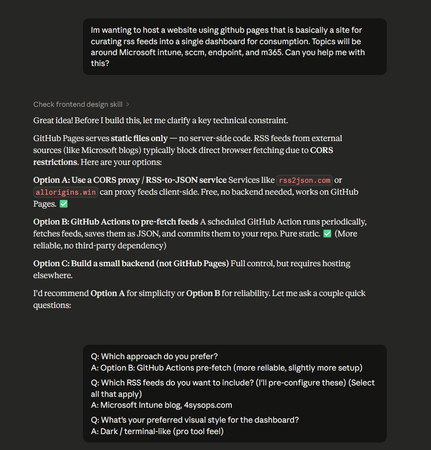

<!-- truncate -->

Happy March everyone! I don't have a ton of updates as far as life events goes. It's the middle of March, and where I am at, all the snow had melted away....and then we got dumped on overnight with a good amount of snow. Mother Nature has a fun way of torturing us in Minnesota, every time you think you are in the clear weatherwise, there are other plans in store. Last night the mrs. and I went out for a St. Patrick's Day event at a local bar we go to. A fun time was had, but the next day really hits me. I'm still on the hunt for something overseas, backed out of one position and didn't get another. Hoping something happens at some point, fingers still crossed! If anyone wants to sponsor me, reach out!

Other than that, hotel is officially booked for MMS. Radison Blu...too expensive, already booked. CountryInn, also already booked. I waited too long. I'm back at the Cambria for a short little walk or bus ride each morning. Also no continental breakfast....bummer. I'm really looking forward to going to MMS again, I think this is Year 6 for me, not all consecutive.

Recently, I've been exploring a little bit more in the AI space, mainly out of curiosity and not wanting to be left behind in technology. I've used CoPilot and ChatGPT here and there, nothing too extensive and didn't really find them to be all that valuable. They help yes, but  it can take a full day to get it to where you really want it to be. I haven't really explored the other models all that much, mainly just hearing about the latest on HackerNews, Reddit, or random YouTube videos and Podcasts. I have plenty of concerns with how they will work in a corporate environment, and if we are just heading backwards. I think back to the days of home grown applications, the developer leaving and nobody knowing how anything works. We've all been there as System Administrators. Now we are introducing applications with no developer ever being there, just fully AI coded applications? After years of cleaning up messes and trying to get everything standardized with vendor supported applications, here we are again.

/rant over

## Algorithm Frustration

Recently, I've became increasingly frustrated with the Internet and the constant barrage of the algorithms. The 90's-mid 2000's era of the Internet hold a special place in my heart. I miss the days of forums, random websites on Geocities/Angelfire, chat rooms, and Napster/Limewire/ShareBear/Kazaa, whatever other P2P music sites there were. While I am sure I look at that with rose colored glasses, and I am really just turning into an old man, I wish things could come back to that. Social media moderation is unachievable after you hit a certain user limit. I like the ActivityPub protocol, but don't love the Twitter style feed. Mastodon seems to have missed it's mark somewhat and there aren't the communities it needs (or I can't find them). BlueSky seems like Twitter but with just another layer on top, still being controlled by BlueSky itself.

Part of the reason I started this blog was because of the frustrations of leaving social media sites, and not having anything out there. I wanted a place of my own, whether people actually read it or not. I've always read other people's blogs, watched their YouTube videos, etc. At the same time, being able to keep up with it is a hard thing to achieve when there is so much out there.

## HomeLabbing with RSS

Wanting to get out of rabbit holes of YouTube, X, Reddit, BlueSky, etc. I started going back to RSS feeds. While there are plenty of free apps out there that will gladly give you some features as long as you provide you their e-mail address and data, they give you just enough to make you want to pay for the subscription. I am also fatigued with so many subscriptions these days. Of course, I've blogged about my homelab, and went down the rabbit hole of setting up a [FreshRSS](https://freshrss.org/index.html) instance. I can't recommend it enough, pretty great free backend for RSS. I then tied it in with FocusReader, which is an Android application for reading the sites you aggregate.

That said, to read articles on the go while out and about, I'd need to connect to my TailScale instance to then connect back to my house. With Starlink being hit and miss at times, it was just frustrating enough to annoy me.

## Why not a public RSS?

I then got an idea in my head, why do I need to have this just on my network, and just for my consumption. I looked around for a while, and couldn't really find a great setup that was easy and out of the box to achieve this. I wanted an RSS list on the backend, and a nice interface on the front end. I didn't care who could access it. If it is just myself that is accessing it, that's fine. If others get value out of it too, even better. There are plenty of free community tools for the endpoint management space, maybe someone will find value in mine?

## I'm not a developer, and am still learning GitHub Actions

Having the idea in my brain, I decided to use Claude to try to achieve this.

I went back and forth with Claude for about 25 different responses before I finally was satisfied with what I had. Most of that back and forth was trying to get the layout and theme to what I wanted it to be. While I could have done the CSS myself, having done this for a subreddit for my favorite NBA basketball team **[r/Pacers](https://old.reddit.com/r/pacers)**, and for my site.....it was a quicker win with Claude.

The gist of the backend for the website is this:
- /scripts/fetch-feeds.js
  - A node.js script that runs on a schedule (GitHub Action) that loops through hardcoded URLs in the script. These are all curated by me, and I'm adding to them overtime. I've asked fellow co-workers for help, gathering what RSS feeds they have. I'm not close enough to the Apple community to really know what's out there enough, so using their RSS feeds was helpful.
  - GitHub action runs every 4 hours.
  - What I had for the Microsoft Learn RSS that was working on my FreshRSS instance was choking here. Fellow co-workers RSS was working better.
  - Some feeds return an error. It seems to be an issue with the blogging platform Ghost. I use https://rssfinder.app to find RSS feeds when I can't find a link on the site.
  - YouTube feeds get the thumbnail and description extracted, podcasts get the audio URLs and duration.
  - This is done in batch jobs of 4 in parallel, trying for 8 seconds before moving onto the next feed.
- Once the GitHub action finishes, the action commits to /docs/feeds.json
- GitHub Pages then serves that to an index.html file.
  
For the frontend:
- A vanilla JS and CSS index.html site.

## The final product

With that, I now have [EndpointFeed.com](https://endpointfeed.com)

In one evening, I was able to get this stood up to show to my co-workers. From there, I added a New section, and have added websites here and there. If you see any sites that you think should be added, feel free to shoot me a message and I can get them added. Now I just need to duplicate this for all the other RSS categories I have on FreshRSS and stand up new sites.

