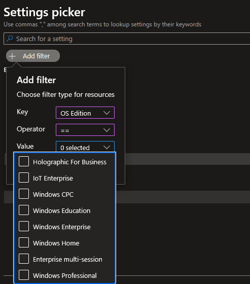
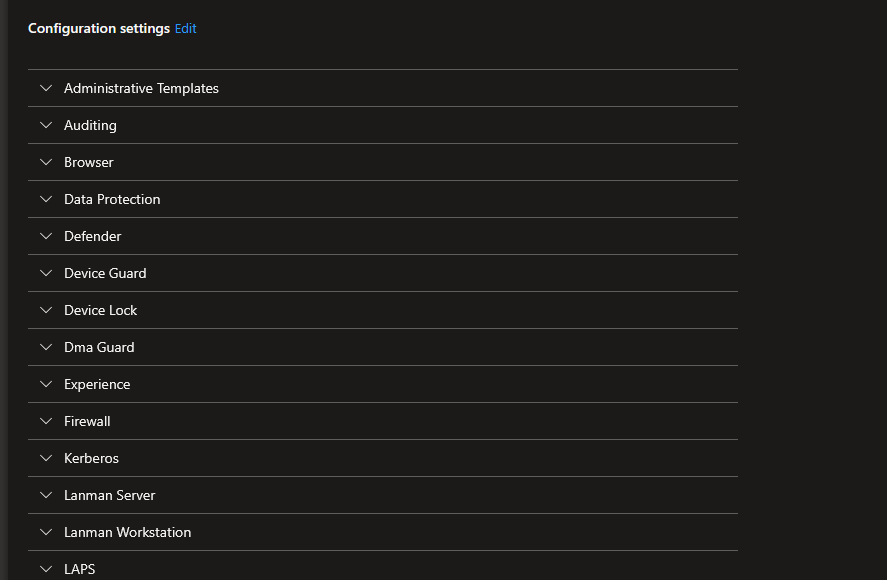
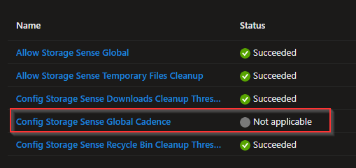
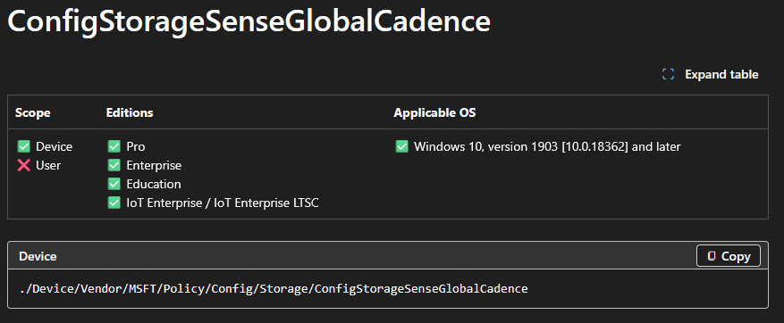
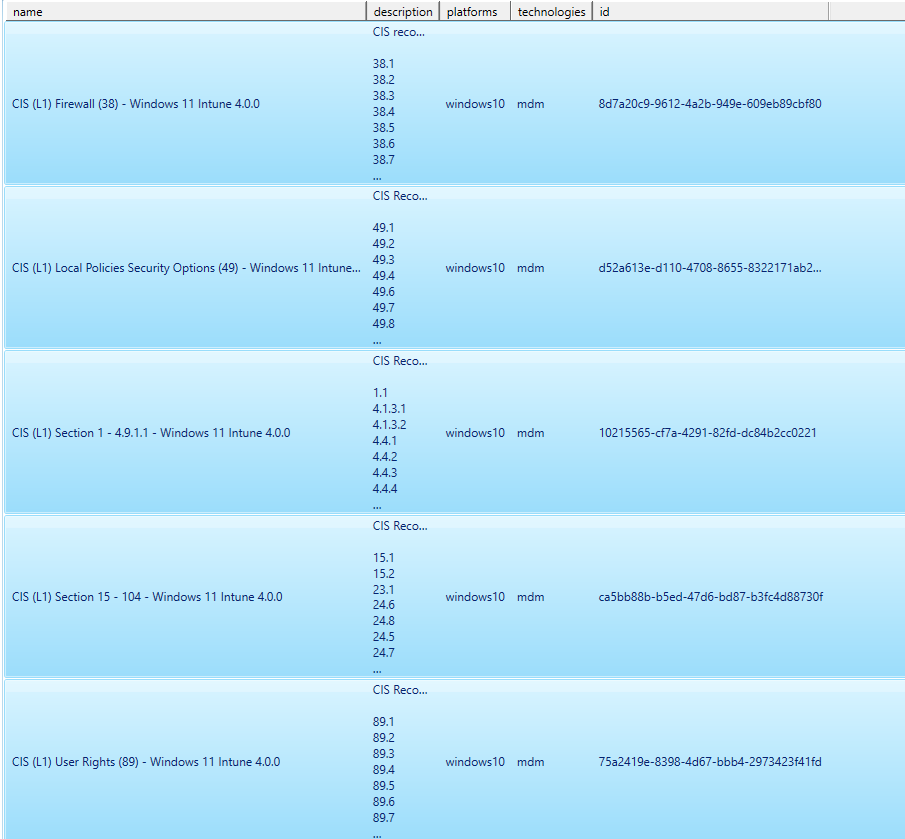
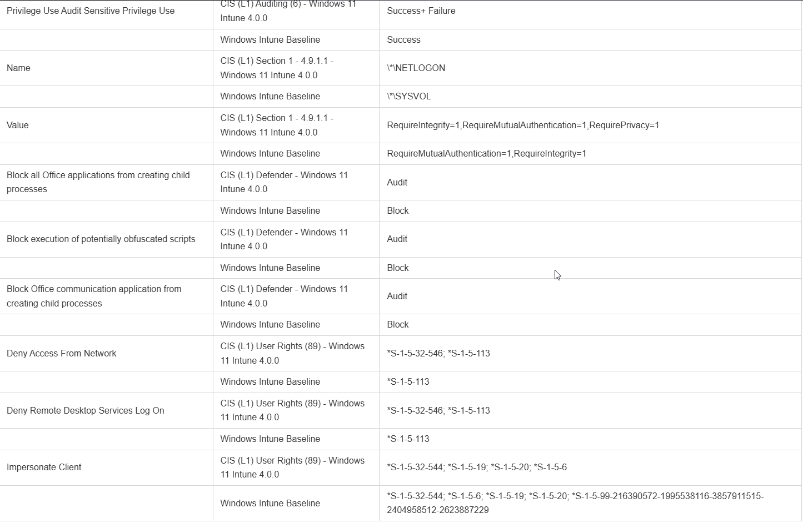

<!-- truncate -->


Happy April to everyone! Hard to believe that it is already spring-ish here in Minnesota. By spring in Minnesota, that means 70 degrees one day, 35 and sleeting the next. But the grass is starting to green up, which means more time outside for cleaning up the yard from winter. With 3 dogs that's a lot of fun. With 5 acres and wind, that's a lot of sticks and branches to pick up.

Last weekend we went to Omaha for the weekend, my daughter turned 15. Her and my wife went to see Six the Musical at the Orpheum Theatre. Omaha was fun. Not really what I expected it to be, but I mean that in a good way. My son and I ate some fried chicken and wandered around downtown for a bit while the musical was going on. Even just a 5 hour drive is exhausting these days.

We're well underway with more house projects. The upstairs flooring is finished, now we're working on remodeling the laundry room. The previous owners over engineered this DIY desk. It was a pain to take apart. I was finally able to use my Karate Kid 3 teachings of John Silver and kick some boards. Unlike Daniel LaRusso, I did not need to ice my foot after kicking said desk apart.

At work, I wanted a way to report on Intune Settings Catalog policies. I was looking to do the following:
- Report on 1 or multiple profiles
  - Report on the setting name + value (and any sub values)
- Find settings that are either duplicated/conflicting/unique.
  - I needed this for baseline comparison.
- Find what SKU is supported for these settings.
  - I need this for AVD Multi-Session fun.

## The Script

I've uploaded the script to my GitHub repo, direct link is here: [Export-IntuneSettingsCatalogPolicyReport.ps1](https://github.com/Pacers31Colts18/Intune/blob/main/powershellscripts/Export-IntuneSettingsCatalogPolicyReport.ps1)

### Script Rundown

Much of the script is a bit of combination of previous work done with the IntuneDocs, and other functions I've made from time to time to gather reporting data from the Graph API. I won't go through all of the script, but I'll give bits and pieces for context before explaining what all I was looking to do:

```powershell
    [CmdletBinding(DefaultParameterSetName = 'Interactive')]
    Param(
        [Parameter(Mandatory = $false, ParameterSetName = 'ByName')]
        [string[]]$PolicyName,
        [Parameter(Mandatory = $false, ParameterSetName = 'All')]
        [switch]$All,
        [string]$OutputDir,
        [ValidateSet('Markdown', 'Csv', 'All')]
        [string]$OutputFormat = 'Markdown'
    )
```

First with the parameters.

- PolicyName
  - Search by one or many policies, or choose All if you want to report on everything. If you choose nothing, and OutGrid-View will display and you'll be able to select which policies. I typically use the OutGrid-View, mainly because I don't always remember the exact policy names.
- OutputDir
  - Optional, will default to the $pwd if not used.
- OutputFormat
  - Defaults to Markdown. I originally built this for a markdown report, but then thought having a csv report would be useful also. We typically do a lot of our manipulation based off CSV files.

After that, we then gather the Policies, the settings and then the SettingsDefinitions for each policy.

```powershell
 #region Load all policies from Graph
    $uri = "https://graph.microsoft.com/beta/deviceManagement/configurationPolicies"
    $response = Invoke-MgGraphRequest -Uri $uri -Method GET
    $AllPolicies = $response.value

    while ($response.'@odata.nextLink') {
        $response = Invoke-MgGraphRequest -Uri $response.'@odata.nextLink' -Method GET
        $AllPolicies += $response.value
    }
    #endregion
```

Foreach policy, we're building a lookup table, and getting everything into the right format. Getting the sub values correct has always been tricky, this might not 100% gather all the down level data, but it should be enough for this report to get us "far enough".

```powershell
#region Select policies
    $Policies = @()
    switch ($PSCmdlet.ParameterSetName) {

        'ByName' {
            foreach ($name in $PolicyName) {
                $p = $AllPolicies | Where-Object { $_.name -eq $name }
                if ($p) { $Policies += $p }
                else { Write-Warning "Policy name '$name' not found." }
            }
        }

        'All' {
            $Policies = $AllPolicies
        }

        'Interactive' {
            $Policies = $AllPolicies |
            Select-Object name, description, platforms, technologies, id |
            Out-GridView -Title "Select one or more policies to include in the report" -PassThru
        }
    }

    if ($Policies.Count -eq 0) {
        Write-Warning "No policies selected."
        return
    }
    #endregion

    #region Collect settings for each policy
    $PolicyDataList = @()
    $SettingPolicyMap = @{}   # settingDefinitionId = List[policyName]
    $SettingValueMap = @{}   # "settingDefId||value" = List[policyName]

    foreach ($policy in $Policies) {

        Write-Output "Processing: $($policy.name)"

        # Get settings with definitions expanded
        $uri = "https://graph.microsoft.com/beta/deviceManagement/configurationPolicies('$($policy.id)')/settings?`$expand=settingDefinitions"
        $response = Invoke-MgGraphRequest -Uri $uri -Method GET
        $rawSettings = $response.value

        while ($response.'@odata.nextLink') {
            $response = Invoke-MgGraphRequest -Uri $response.'@odata.nextLink' -Method GET
            $rawSettings += $response.value
        }

        # Build definition lookup: settingDefinitionId = definition object
        $DefLookup = @{}
        foreach ($item in $rawSettings) {
            if ($item.settingDefinitions) {
                foreach ($def in $item.settingDefinitions) {
                    if (-not $DefLookup.ContainsKey($def.id)) {
                        $DefLookup[$def.id] = $def
                    }
                }
            }
        }

        # Flatten setting instances
        $PolicySettings = @()

        foreach ($item in $rawSettings) {
            $stack = [System.Collections.ArrayList]::new()
            [void]$stack.Add([PSCustomObject]@{ Instance = $item.settingInstance; Depth = 0 })

            while ($stack.Count -gt 0) {
                $frame = $stack[$stack.Count - 1]
                $stack.RemoveAt($stack.Count - 1)

                $inst = $frame.Instance
                $depth = $frame.Depth
                if (-not $inst) { continue }

                $defId = $inst.settingDefinitionId
                $odataType = $inst.'@odata.type'

                $def = if ($DefLookup.ContainsKey($defId)) { $DefLookup[$defId] } else { $null }
                $displayName = if ($def) { $def.displayName } else { $defId }

                $value = switch -Regex ($odataType) {

                    'choiceSettingInstance$' {
                        $raw = $inst.choiceSettingValue.value
                        if ($def -and $def.options) {
                            $opt = $def.options |
                            Where-Object { $_.itemId -eq $raw } |
                            Select-Object -First 1
                            if ($opt) { $opt.displayName } else { $raw }
                        }
                        else { $raw }
                    }

                    'simpleSettingInstance$' {
                        [string]$inst.simpleSettingValue.value
                    }

                    'simpleSettingCollectionInstance$' {
                        ($inst.simpleSettingCollectionValue | ForEach-Object { [string]$_.value }) -join '; '
                    }

                    'choiceSettingCollectionInstance$' {
                        $vals = foreach ($c in $inst.choiceSettingCollectionValue) {
                            $cv = $c.value
                            if ($def -and $def.options) {
                                $opt = $def.options |
                                Where-Object { $_.itemId -eq $cv } |
                                Select-Object -First 1
                                if ($opt) { $opt.displayName } else { $cv }
                            }
                            else { $cv }
                        }
                        $vals -join '; '
                    }

                    'groupSettingInstance$' { '' }
                    'groupSettingCollectionInstance$' { '' }
                    default { $odataType }
                }

                # Info URL — first entry from infoUrls
                $infoUrl = ''
                if ($def -and $def.infoUrls -and $def.infoUrls.Count -gt 0) {
                    $infoUrl = "[Docs]($($def.infoUrls[0]))"
                }

                # Platform from the definition applicability
                $defPlatform = if ($def -and $def.applicability -and $def.applicability.platform) {
                    $def.applicability.platform
                } else { '' }

                # Windows SKUs — $null means not a Windows setting (SKUs not applicable).
                # Empty array means Windows setting where all SKUs are supported.
                $isWindowsSetting = $defPlatform -match 'windows'
                $supportedSkus = if (-not $isWindowsSetting) {
                    $null
                } elseif ($def.applicability.windowsSkus) {
                    @($def.applicability.windowsSkus)
                } else { @() }

                $PolicySettings += [PSCustomObject]@{
                    SettingDefinitionId = $defId
                    DisplayName         = $displayName
                    Value               = $value
                    Depth               = $depth
                    InfoUrl             = $infoUrl
                    Platform            = $defPlatform
                    WindowsSkus         = $supportedSkus
                }

                # Push children in reverse so first child processes first
                $children = $null
                if ($odataType -match 'choiceSettingInstance$') {
                    $children = @($inst.choiceSettingValue.children)
                }
                elseif ($odataType -match 'groupSettingInstance$') {
                    $children = @($inst.groupSettingValue.children)
                }
                elseif ($odataType -match 'groupSettingCollectionInstance$') {
                    $children = @($inst.groupSettingCollectionValue | ForEach-Object { $_.children })
                }

                if ($children) {
                    for ($i = $children.Count - 1; $i -ge 0; $i--) {
                        [void]$stack.Add([PSCustomObject]@{ Instance = $children[$i]; Depth = $depth + 1 })
                    }
                }
            }
        }

        # Track settingDefinitionId = policies and settingDefId+value = policies
        foreach ($s in $PolicySettings) {
            if (-not $SettingPolicyMap.ContainsKey($s.SettingDefinitionId)) {
                $SettingPolicyMap[$s.SettingDefinitionId] = [System.Collections.Generic.List[string]]::new()
            }
            if ($SettingPolicyMap[$s.SettingDefinitionId] -notcontains $policy.name) {
                $SettingPolicyMap[$s.SettingDefinitionId].Add($policy.name)
            }

            $valueKey = "$($s.SettingDefinitionId)||$($s.Value)"
            if (-not $SettingValueMap.ContainsKey($valueKey)) {
                $SettingValueMap[$valueKey] = [System.Collections.Generic.List[string]]::new()
            }
            if ($SettingValueMap[$valueKey] -notcontains $policy.name) {
                $SettingValueMap[$valueKey].Add($policy.name)
            }
        }

        $PolicyDataList += [PSCustomObject]@{
            Name        = $policy.name
            Description = $policy.description
            Platform    = $policy.platforms
            Settings    = $PolicySettings
        }
    }

    # settingDefinitionId appears in multiple policies
    $DuplicateIds = $SettingPolicyMap.Keys | Where-Object { $SettingPolicyMap[$_].Count -gt 1 }
    # settingDefinitionId appears in exactly 1 policy
    $UniqueIds = $SettingPolicyMap.Keys | Where-Object { $SettingPolicyMap[$_].Count -eq 1 }
    # same settingDefinitionId + same value in multiple policies
    $DuplicateValueKeys = $SettingValueMap.Keys | Where-Object { $SettingValueMap[$_].Count -gt 1 }
    # settingDefinitionId in multiple policies with at least one differing value
    $ConflictIds = $DuplicateIds | Where-Object {
        $defId = $_
        ($SettingValueMap.Keys | Where-Object { ($_ -split '\|\|', 2)[0] -eq $defId }).Count -gt 1
    }
    #endregion
```

Here we are building the markdown report. A lot of this is just manipulating the output into the right markdown format and table format.

```powershell
#region Build Markdown
    $md = [System.Text.StringBuilder]::new()

    $null = $md.AppendLine("# Intune Settings Catalog Policy Report")
    $null = $md.AppendLine("")
    $null = $md.AppendLine("**Generated:** $(Get-Date -Format 'yyyy-MM-dd HH:mm')")
    $null = $md.AppendLine("")

    # Summary table
    $null = $md.AppendLine("## Policies")
    $null = $md.AppendLine("")
    $null = $md.AppendLine("| Policy Name | Platform | Top-Level Settings |")
    $null = $md.AppendLine("| --- | --- | --- |")
    foreach ($pd in $PolicyDataList) {
        $topCount = ($pd.Settings | Where-Object { $_.Depth -eq 0 }).Count
        $null = $md.AppendLine("| $($pd.Name) | $($pd.Platform) | $topCount |")
    }
    $null = $md.AppendLine("")

    if ($DuplicateIds.Count -gt 0) {
        $null = $md.AppendLine(">  **Bold** = same setting in multiple policies with the same value.")
        $null = $md.AppendLine("")
        $null = $md.AppendLine("> *Italic* = same setting in multiple policies with differing values.")
        $null = $md.AppendLine("")
    }

    # Per-policy sections
    foreach ($pd in $PolicyDataList) {
        $null = $md.AppendLine("---")
        $null = $md.AppendLine("")
        $null = $md.AppendLine("### $($pd.Name)")
        $null = $md.AppendLine("")
        if ($pd.Description) {
            $null = $md.AppendLine("*$($pd.Description)*")
            $null = $md.AppendLine("")
        }
        $null = $md.AppendLine("**Platform:** $($pd.Platform)")
        $null = $md.AppendLine("")
        $null = $md.AppendLine("| Setting | Sub-Setting | Value | Supported Platform | Supported SKUs | Unsupported SKUs |")
        $null = $md.AppendLine("| --- | --- | --- | --- | --- | --- |")

        $allSkus = @(
            'windowsHome', 'windowsProfessional', 'windowsEnterprise', 'windowsEducation', 'windowsMultiSession',
            'windowsCloudN', 'windowsCPC', 'windows11SE', 'iotEnterprise', 'iotEnterpriseSEval',
            'surfaceHub', 'hololens', 'hololensEnterprise', 'holographicForBusiness'
        )

        foreach ($s in $pd.Settings) {
            $isDupe     = $DuplicateIds -contains $s.SettingDefinitionId
            $valueKey   = "$($s.SettingDefinitionId)||$($s.Value)"
            $isConflict = $isDupe -and ($SettingValueMap[$valueKey].Count -lt $SettingPolicyMap[$s.SettingDefinitionId].Count)

            # Wrap display name in a doc link if one is available
            $linkedName = if ($s.InfoUrl) {
                $url = $s.InfoUrl -replace '^\[Docs\]\(|\)$', ''
                "[$($s.DisplayName)]($url)"
            } else { $s.DisplayName }

            $formatted = if ($isConflict) { "*$linkedName*" } elseif ($isDupe) { "**$linkedName**" } else { $linkedName }

            if ($s.Depth -eq 0) {
                $settingCell    = $formatted
                $subSettingCell = ""
            }
            else {
                $settingCell    = ""
                $subSettingCell = $formatted
            }

            if ($null -eq $s.WindowsSkus) {
                $supportedCell   = ''
                $unsupportedCell = ''
            } else {
                $supportedCell   = ($allSkus | Where-Object { $s.WindowsSkus.Count -eq 0 -or $s.WindowsSkus -contains $_ } | ForEach-Object { $_ -replace '^windows', '' }) -join '<br>'
                $unsupportedCell = ($allSkus | Where-Object { $s.WindowsSkus.Count -gt 0 -and $s.WindowsSkus -notcontains $_ } | ForEach-Object { $_ -replace '^windows', '' }) -join '<br>'
            }

            $null = $md.AppendLine("| $settingCell | $subSettingCell | $($s.Value) | $($s.Platform) | $supportedCell | $unsupportedCell |")
        }
        $null = $md.AppendLine("")
    }

    # Conflicting Settings
    $null = $md.AppendLine("---")
    $null = $md.AppendLine("")
    $null = $md.AppendLine("## Values")
    $null = $md.AppendLine("")
    $null = $md.AppendLine("### Conflicting Values")
    $null = $md.AppendLine("")

    if ($ConflictIds.Count -gt 0) {
        $null = $md.AppendLine("The following settings are configured in multiple policies with different values.")
        $null = $md.AppendLine("")
        $null = $md.AppendLine("| Setting | Policy | Value |")
        $null = $md.AppendLine("| --- | --- | --- |")

        foreach ($defId in ($ConflictIds | Sort-Object)) {
            $displayName = $defId
            foreach ($pd in $PolicyDataList) {
                $match = $pd.Settings | Where-Object { $_.SettingDefinitionId -eq $defId } | Select-Object -First 1
                if ($match) { $displayName = $match.DisplayName; break }
            }
            foreach ($policyName in ($SettingPolicyMap[$defId] | Sort-Object)) {
                $pd  = $PolicyDataList | Where-Object { $_.Name -eq $policyName }
                $val = ($pd.Settings | Where-Object { $_.SettingDefinitionId -eq $defId } | Select-Object -First 1).Value
                $null = $md.AppendLine("| $displayName | $policyName | $val |")
                $displayName = ""   # only show setting name on first row
            }
        }
    }
    else {
        $null = $md.AppendLine("No conflicting settings found.")
    }
    $null = $md.AppendLine("")

    # Duplicate Values
    $null = $md.AppendLine("---")
    $null = $md.AppendLine("")
    $null = $md.AppendLine("### Duplicate Values")
    $null = $md.AppendLine("")

    if ($DuplicateValueKeys.Count -gt 0) {
        $null = $md.AppendLine("The following settings have identical values configured in multiple policies.")
        $null = $md.AppendLine("")
        $null = $md.AppendLine("| Setting | Policy | Value |")
        $null = $md.AppendLine("| --- | --- | --- |")

        foreach ($key in ($DuplicateValueKeys | Sort-Object)) {
            $defId, $val = $key -split '\|\|', 2
            $displayName = $defId
            foreach ($pd in $PolicyDataList) {
                $match = $pd.Settings | Where-Object { $_.SettingDefinitionId -eq $defId } | Select-Object -First 1
                if ($match) { $displayName = $match.DisplayName; break }
            }
            foreach ($policyName in ($SettingValueMap[$key] | Sort-Object)) {
                $null = $md.AppendLine("| $displayName | $policyName | $val |")
                $displayName = ""
            }
        }
    }
    else {
        $null = $md.AppendLine("No duplicate values found.")
    }
    $null = $md.AppendLine("")

    # Unique Values
    $null = $md.AppendLine("---")
    $null = $md.AppendLine("")
    $null = $md.AppendLine("### Unique Values")
    $null = $md.AppendLine("")

    if ($UniqueIds.Count -gt 0) {
        $null = $md.AppendLine("The following settings are configured in only one policy.")
        $null = $md.AppendLine("")
        $null = $md.AppendLine("| Setting | Value | Policy |")
        $null = $md.AppendLine("| --- | --- | --- |")

        foreach ($defId in ($UniqueIds | Sort-Object)) {
            $policyName = $SettingPolicyMap[$defId][0]
            $pd = $PolicyDataList | Where-Object { $_.Name -eq $policyName }
            $match = $pd.Settings | Where-Object { $_.SettingDefinitionId -eq $defId } | Select-Object -First 1
            $displayName = if ($match) { $match.DisplayName } else { $defId }
            $val = if ($match) { $match.Value } else { "" }
            $null = $md.AppendLine("| $displayName | $val | $policyName |")
        }
    }
    else {
        $null = $md.AppendLine("No unique values found.")
    }
    $null = $md.AppendLine("")
    #endregion

    #region Write output
    if ($OutputFormat -in 'Markdown', 'All') {
        $md.ToString() | Out-File -FilePath $OutputFilePath -Encoding UTF8

        if (Test-Path $OutputFilePath) {
            Write-Output "Markdown file = $OutputFilePath."
        }
        else {
            Write-Warning "No Markdown file created."
        }
    }
```

And finally, the CSV format. For the CSV format, the only difference really is needing to add columns for the Unique, Duplicate, or Conflicting settings.

```powershell
if ($OutputFormat -in 'Csv', 'All') {
        $csvAllSkus = @(
            'windowsHome', 'windowsProfessional', 'windowsEnterprise', 'windowsEducation', 'windowsMultiSession',
            'windowsCloudN', 'windowsCPC', 'windows11SE', 'iotEnterprise', 'iotEnterpriseSEval',
            'surfaceHub', 'hololens', 'hololensEnterprise', 'holographicForBusiness'
        )

        $csvRows = foreach ($pd in $PolicyDataList) {
            foreach ($s in $pd.Settings) {
                $supported   = if ($null -eq $s.WindowsSkus) { '' } else { ($csvAllSkus | Where-Object { $s.WindowsSkus.Count -eq 0 -or $s.WindowsSkus -contains $_ } | ForEach-Object { $_ -replace '^windows', '' }) -join '; ' }
                $unsupported = if ($null -eq $s.WindowsSkus) { '' } else { ($csvAllSkus | Where-Object { $s.WindowsSkus.Count -gt 0 -and $s.WindowsSkus -notcontains $_ } | ForEach-Object { $_ -replace '^windows', '' }) -join '; ' }
                $valueKey    = "$($s.SettingDefinitionId)||$($s.Value)"
                [PSCustomObject]@{
                    Policy             = $pd.Name
                    Setting            = if ($s.Depth -eq 0) { $s.DisplayName } else { '' }
                    SubSetting         = if ($s.Depth -gt 0) { $s.DisplayName } else { '' }
                    Value              = $s.Value
                    InfoUrl            = $s.InfoUrl -replace '^\[Docs\]\(|\)$', ''
                    SupportedPlatform  = $s.Platform
                    SupportedSKUs      = $supported
                    UnsupportedSKUs    = $unsupported
                    Unique             = if ($UniqueIds -contains $s.SettingDefinitionId) { 'x' } else { '' }
                    Duplicate          = if ($DuplicateValueKeys -contains $valueKey) { 'x' } else { '' }
                    Conflicting        = if ($ConflictIds -contains $s.SettingDefinitionId) { 'x' } else { '' }
                }
            }
        }

        $csvRows | Export-Csv -Path $CsvOutputFilePath -NoTypeInformation -Encoding UTF8

        if (Test-Path $CsvOutputFilePath) {
            Write-Output "CSV file = $CsvOutputFilePath."
        }
        else {
            Write-Warning "No CSV file created."
        }
    }
    #endregion
```

## Reasoning

Why is all this needed? Well, I have multiple reasons.

### Reason #1: Operating System SKU

Once a policy is created, there isn't really a great way to tell within Intune if a policy is actually applicable to the device you are applying it to.

When you create a new policy, it's somewhat easier, but not the most intuitive either. You have to ensure you are filtering before creating the policy, or choosing the setting:



After the profile is created, there is no way to filter from this view to the supported OS.



At that point, to really know what is applying correctly is to do the following steps:

1. Go to the device
2. Click Device Configuration
3. Open a policy
4. Look at all the settings, find ones that say Not Applicable.



Now do that for each profile you create. We've mainly ran into that with Azure Virtual Desktop Multi-Session hosts.

#### Policy CSP Documentation

To make matters even worse, when you go to the CSP page in the Microsoft Learn documentation, there is 0 reference to that SKU (or all the SKUs)

[Storage Sense CSP](https://learn.microsoft.com/en-us/windows/client-management/mdm/policy-csp-storage#configstoragesenseglobalcadence)



If you go by the CSP documentation, Intune supports the following:

- Pro
- Enterprise
- Education
- IoT Enterprise / IoT Enterprise LTSC

After doing a dump from the Graph API, I found references to the following SKUs:

- WindowsHome
- WindowsProfessional
- WindowsEnterprise
- WindowsEducation
- WindowsMultiSession
- WindowsCloudN
- WindowsCPC
- Windows11SE
- iotEnterprise
- iotEnterpriseSEval
- surfaceHub
- hololens
- hololensenterprise
- holographicForBusiness

Maybe the Holo/Surface settings are referenced directly on policies that are supported, but for the most part, this seems to be pretty inaccurate. With the Learn documentation not referencing MultiSession, it would seem that none of the settings are supported (when in fact they are). Until you get into it, you don't really see what is applying and not applying.

### Reason #2: Reporting on One or Multiple Profiles

Another reason for this, is wanting to compare multiple profiles. In the Group Policy days, we had PolicyAnalyzer, which allowed us to compare multiple GPOs and there settings, allowing for easy de-duping of policies when doing migrations. There really isn't a great way to do that in Intune. I believe I've seen some sites out there that allow you to connect your tenant to their site and compare policies. Personally, not too fond of that idea. I wanted something that I had more control over, and can just run on an ad-hoc basis.

Currently, we're running the enterprise flavor of the CIS benchmark, but have been talking of switching over to the Intune flavor. There is also the Windows Baseline that is in Intune that comes from Microsoft. Using this, I can download the .json files from CIS' Build Kit, import them into my tenant and then compare to the Microsoft baseline.



Here I am selecting multiple profiles (and then the Microsoft benchmark).

I now have this beautiful report here:

Looking at the report, I can now see the conflicts between what Microsoft recommends vs. CIS recommendation.



If we wanted, we could compare ALL the policies in our tenant and easily find what is being set in multiple places. Intune will show you if there is a policy conflict (although not always accurate), but that's only if the setting is applied to the same group multiple times. What if there are two policies going out to two different groups? We'd want to consolidate that and have less policies.

## Wrap-Up

Well that's it, I might have another post here before MMS in May, but we'll see. Yard work, hikes, camping, all that fun stuff is on the horizon. Hopefully this post (and script) is useful for others. Let me know if you run into any issues or see anything that could be of value for additions.