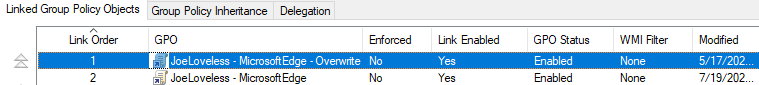
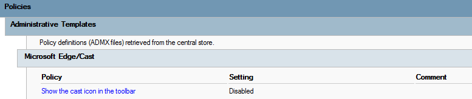
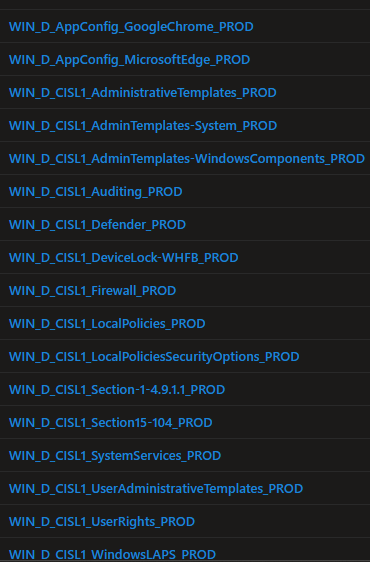
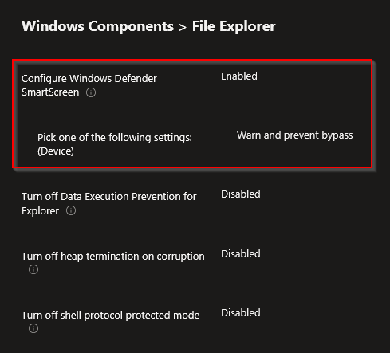
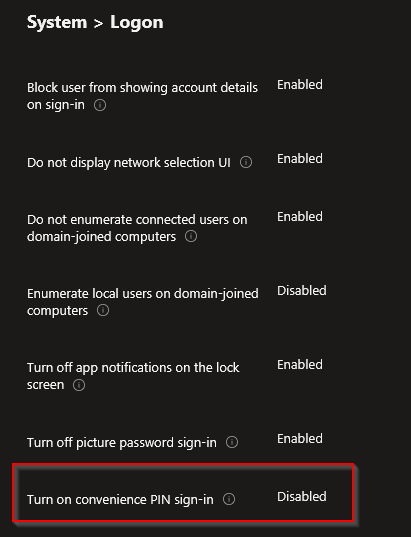
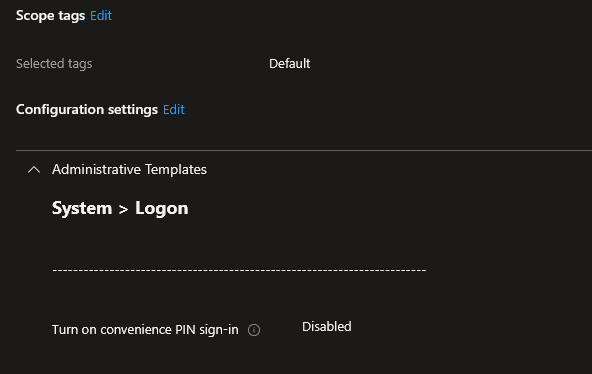
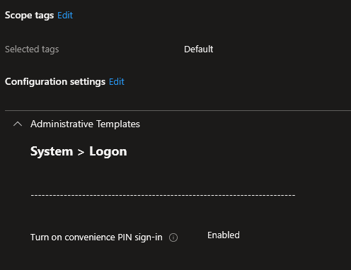

<!-- truncate -->

Good day everyone. It's now been over a week since MMS MOA 2026, my brain is still drowning from all the information that was given (and fun that was had). It was great to catch up with co-workers, meet some new co-workers, and meet new people from around the world at MMS. I came away with all sorts of ideas on how we can improve our setup. It's interesting to see the Microsoft stance on things (cloud only, Intune only, blah blah blah), and then see what is actually happening out in the real world. I always have this feeling we are really behind, but then I see so many other people still running Configuration Manager and still have devices bound to Active Directory. I know MMS MOA has a little bit of bias, being historically a Configuration Manager conference, but I consider the people speaking and going to this event to be the best of the best when it comes to device management. To see people struggle with the same issues that we deal with daily....I guess that's refreshing?? It would be nice to see said issues get addressed at some point by Microsoft.

While I didn't get to do a fishing session at MMS, since I've been back home, I went on a fishing session with my son.

Look at this massive fish I reeled in Saturday! Was quite the fight to reel it in. Before I got side tracked showing off my fish, I was talking about the issues we deal with regarding Microsoft Intune. That's my inspiration for this post.

## What Group Policy Did Right?

A little bit of history, for those that have never dealt with Group Policy. With Group Policy, we had an order to how GPO's were processed. GPO's were processed in the following order:

- Group Policy Objects (GPO) are processed in the following order:
  - The local GPO is applied.
  - GPOs linked to sites are applied.
  - GPOs linked to domains are applied.
  - GPOs linked to organizational units (OUs) are applied. In a nested OU structure, GPOs linked to parent OUs are applied first, followed by GPOs linked to the child OUs.

*Source: [Group Policy Processing](https://learn.microsoft.com/en-us/windows-server/identity/ad-ds/manage/group-policy/group-policy-processing)*

Also with GPO, we had the concept of link order.

*The GPO link with the lowest link order in the Group Policy Object Links list has precedence by default.*

Lowest link order = lowest number

In this example, the GPO **JoeLoveless - MicrosoftEdge - Overwrite** would win out over **JoeLoveless - MicrosoftEdge**

In the policy **JoeLoveless - Microsoft Edge**, I have this configured:

In my overwrite policy, I am changing that setting to be **Enabled**. Then I would apply that to a targeted security group. Any workstation in that security group would then have the cast icon on the toolbar.

## How Does Intune handle this?

With Intune, this isn't the case. While other Microsoft cloud products have the concept of link order (Office Admin Center, Edge Admin Center, and I think Defender...), Intune doesn't follow this novel concept. Intune will just tell you there is a conflict in the policies, and leave it at that.

## Our Attempts

Anyone familiar with security benchmarks probably know the pain some of this can cause. You try your best to harden the workstations, then you find Group A needs this for some legacy workflow, Group B needs another of this for another legacy workflow, then you have devices that need to be in Kiosk mode so they have their own workflow. Fun times.

### Attempt 1: Monolithic Profile

Our first attempt, and this was a of a figure it out on the fly type project. We created a monolithic profile that contained all of our baseline settings. We did this with Group Policy with our core security settings, worked okay there, should work okay here too? Right? Wrong. 

Denying profiles in GP is pretty consistent, if you know where the policies are, there is a good chance they'll fall off correctly. With Intune, settings are a bit all over the place and how they apply. Some write to the former GP registry values, some don't. Some write to the PolicyManager section, some don't. Some tattoo, some don't. Awfulness.

So we had a profile set this way, we would then duplicate the profile with all the settings still in and then change the settings we needed to change...this kinda worked. But we eventually decided the monolithic profile wasn't the best way. I'll explain what went wrong with Attempt 1 and Attempt 2 together.

### Attempt 2: Broken Down Profiles

I make fun of ITIL verbiage a lot. They say to "progress iteratively". Well that's what we did. Our next step was to break down the profiles into smaller chunks. Using the CIS baselines, we now broke the settings out by section.

*Note: CIS makes this a lot easier if you are a CIS SecureSuite member. You can now import the JSON files into Intune*

Following the same concept as Attempt #1, our process was to duplicate the profile, and modify any settings that would need to be changed:

## Where This Failed

The ultimate goal is not to have exceptions. That would be security working with whomever to make sure the processes follow the security standard...ideally. Or you just pull the settings that need exceptions and call it a day. The 2nd one probably isn't the best choice. Our goal is to continue to apply the settings no matter what, to as many devices as possible. Our process broke down when the following happened:

- Group A
  - COMP-1
  - COMP-2
  - COMP-3
  - COMP-4
  - COMP-5
- Group B
  - COMP-6
  - COMP-7
  - COMP-2
  - COMP-3
  - COMP-8

Group A needs this setting changed:

- Exclude Group A from WIN_D_CISL1_AdministrativeTemplates_PROD
- Add Group A to WIN_D_CISL1_AdministrativeTemplates-EXC_PROD

Group B needs this setting changed:

- Exclude Group B from WIN_D_CISL1_AdministrativeTemplates-WindowsComponents_PROD
- Add Group B to WIN_D_CISL1_AdministrativeTemplates-WindowsComponents-EXC_PROD

COMP-2 and COMP-3 are in both Group A and Group B. The rest of Group B does not need the exception that is applying to Group A. This is where we started to see the flaws in our logic.

## The Solution

What we have landed on, is this workflow. Note, this does create more Intune profiles, but to date, we haven't found a better way of doing this. I'm open to suggestions should anyone have any.

1. Exception needed
   1. Remove setting from main profile, create a "secondary profile" containing the default value.
   2. Duplicate the "secondary profile", create a new "exception profile" containing the changed value.

In final, the Intune profiles would look like this:

- WIN_D_CISL1_AdminTemplates-System_PROD
  - Removed the setting **Turn on convenience PIN sign-in**
- WIN_D_CISL1_AdminTemplates-System-ConveniencePINSignIn_PROD

- WIN_D_CISL1_AdminTemplates-System-ConveniencePINSignIn-EXC_PROD

