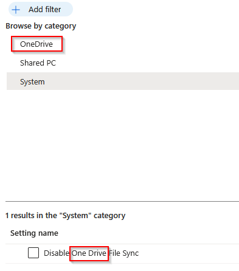
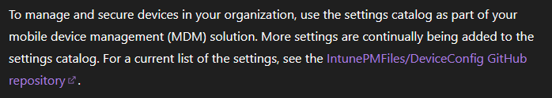

{/* truncate */}

I've basically taken the entire summer off from blogging, it wasn't necessarily a planned absence, but one I think I needed anyways. Summer was pretty hectic, I dealt with a bit of burnout, we listed our house for sale (offer pending!), and I used it as a break to recharge my batteries.

I didn't do anything overly exciting, did one camping trip, a trip to see family in Indiana, and then it seemed like summer was over before I knew it.

I've been meaning to get back into this, just haven't really had the time. Now that school is back in session for the kids, that seems to eat up a large portion of my time. My son is doing bowling this year through the local schools, so that has been fun to go to. I used to bowl a lot when I was younger, and loved it, but fell out of it once the kids started to take up my time. He seems to have some interest in it, and it's starting to make me want to get back into bowling also.

Microsoft made a post the other day, announcing that "Windows 11, version 26H2 is now available, and Microsoft Intune provides day zero support for validated Windows policy settings in the Settings Catalog."

Of course, no details were provided on what settings were added. For some reason, Microsoft is unable to provide us with details on the Windows side when new settings were added, or they do an awful job at being consistent about it.

With Windows 11 25H2, they managed to get it right. [Microsoft Intune Settings Catalog Updated to Support New Windows 11, version 25H2 Settings](https://techcommunity.microsoft.com/blog/intunecustomersuccess/microsoft-intune-settings-catalog-updated-to-support-new-windows-11-version-25h2/4462927). The settings were actually listed!

## What About for 26H2?

[Microsoft Intune Settings Catalog updated to support Windows 11, version 26H2](https://techcommunity.microsoft.com/blog/intunecustomersuccess/microsoft-intune-settings-catalog-updated-to-support-windows-11-version-26h2/4560815)

Basically no information is given. I've always had a problem with posts like these. It's inexcusable for a company like Microsoft to not be able to document when settings are added. We should not have to rely on 3rd party websites like [IntuneSettings.app](https://intunesettings.app) to find this information.

## So how do we find what settings are supported?

On Friday, I started looking at [IntuneSettings.app](https://intunesettings.app), and started to question Microsoft's post more. I let it stew for a little bit over the weekend, and here I am now on Sunday writing a blog post in annoyance.

First some facts:

- Windows 11 26H2 was released on September 29, 2026
  - The build number is 10.0.26300.
- Looking at IntuneSettings.app (which has a Changelog), I can see that there have been **13 new settings** added on October 2nd.
  - From those settings, none of the settings in the CSP documentation has a supported OS of 26H2+
- I then downloaded the latest [Group Policy Settings Reference Spreadsheet for Windows 11 2026 Update (26H2)](https://www.microsoft.com/en-us/download/details.aspx?id=108849) from Microsoft
  - There are **35 new settings** that are new with 26H2.

## Let's find those 35 new settings in Intune!

"As part of Windows 11, version 26H2 settings catalog support, the Settings Catalog now includes all newly released settings and updates to existing settings introduced with the latest Windows 11, version 26H2 release."

I believe I blogged about this function in the past, but you can find [Export-IntuneConfigurationSettings.ps1](https://github.com/Pacers31Colts18/Intune/blob/main/powershellscripts/Export-IntuneConfigurationSettings.ps1) on my GitHub page. This function will export all Intune Settings Catalog policies to a CSV file, allowing you to filter by SKU. This should return the relevant information I need, without having to use the Intune UI to find the information. (Or you can use IntuneSettings.app)

My first go round was to search by the Display Name, here are the results:

| New in Windows | File name                | Policy Setting Name                                                                   | Intune Settings Catalog Status |
| -------------- | ------------------------ | ------------------------------------------------------------------------------------- | ------------------------------ |
| 26H2           | appdeviceinventory.admx  | Turn off application inbox dependency component                                       | :x:                            |
| 26H2           | appprivacy.admx          | Let Windows apps access passkeys                                                      | :x:                            |
| 26H2           | appprivacy.admx          | Let Windows apps autofill passkeys                                                    | :x:                            |
| 26H2           | appprivacy.admx          | Let Windows apps access text content from foreground applications                     | :x:                            |
| 26H2           | camera.admx              | Configure Camera Options                                                              | :white_check_mark:             |
| 26H2           | cam_ai.admx              | Configure Agent Connectors                                                            | :x:                            |
| 26H2           | cam_ai.admx              | Agent Consent Duration                                                                | :x:                            |
| 26H2           | cam_ai.admx              | Agent Connector Access Policy                                                         | :x:                            |
| 26H2           | cloudcontent.admx        | Disable Get Started                                                                   | :white_check_mark:             |
| 26H2           | cloudcontent.admx        | Disable Copilot Pin Screen                                                            | :x:                            |
| 26H2           | credentialproviders.admx | Show NFC tap location indicator on logon screen                                       | :x:                            |
| 26H2           | explorer.admx            | Disable File Explorer feature to prelaunch a window in the background                 | :x:                            |
| 26H2           | explorer.admx            | Make Print Screen key yieldable                                                       | :x:                            |
| 26H2           | kerberos.admx            | Allow IP address-based SPNs during Kerberos authentication                            | :x:                            |
| 26H2           | networkconnections.admx  | Prohibit installation and configuration of Network Bridge on your network.            | :x:                            |
| 26H2           | ntlm.admx                | NTLM Enhanced Blocking                                                                | :x:                            |
| 26H2           | printing.admx            | Configure Windows Ready Print driver ranking                                          | :white_check_mark:             |
| 26H2           | reagent.admx             | Allow offline scan from trusted Windows Recovery Environment                          | :x:                            |
| 26H2           | refs.admx                | Control mounting ReFS volumes on USB and IEEE 1394 disks                              | :x:                            |
| 26H2           | refs.admx                | Control mounting ReFS volumes on hot-pluggable disks                                  | :x:                            |
| 26H2           | secureboot.admx          | Limit Secure Boot Required Service Data                                               | :x:                            |
| 26H2           | taskbar.admx             | Disable changing the taskbar position                                                 | :x:                            |
| 26H2           | taskbar.admx             | Disable changing the taskbar position                                                 | :x:                            |
| 26H2           | taskbar.admx             | Disable changing the taskbar size                                                     | :x:                            |
| 26H2           | taskbar.admx             | Disable changing the taskbar size                                                     | :x:                            |
| 26H2           | terminalserver.admx      | Specify thumbprints of certificates representing trusted .rdp publishers              | :x:                            |
| 26H2           | terminalserver.admx      | Specify thumbprints of certificates representing trusted .rdp publishers              | :x:                            |
| 26H2           | userprofiles.admx        | Allow user profile registry hives and AppData from non-standard paths                 | :x:                            |
| 26H2           | volumeencryption.admx    | Disable BitLocker trust of Windows Recovery Environment (WinRE)                       | :x:                            |
| 26H2           | windowscopilot.admx      | On-Device Registry Logging Level                                                      | :x:                            |
| 26H2           | windowsdefender.admx     | Select the channel for Microsoft Defender monthly platform updates [to be deprecated] | :x:                            |
| 26H2           | windowsdefender.admx     | Select the channel for Microsoft Defender monthly engine updates [to be deprecated]   | :x:                            |
| 26H2           | windowsdefender.admx     | Select the Microsoft Defender safe deployment channel                                 | :x:                            |
| 26H2           | windowsexplorer.admx     | Allow file group descriptor operations to write to any destination path               | :x:                            |
| 26H2           | windowsupdate.admx       | Configure the maximum number of days that updates can be paused                       | :x:                            |

3/35.....uh that's not too good.

I'm not sure what constitutes *all newly released settings and updates to existing settings introduced with the latest Windows 11, version 26H2 release.*, but I'm pretty sure this isn't it.

## Double Checking My Work with Microsoft Learn

I can't just bash Microsoft the whole time here. I'm a big proponent of the [Microsoft Learn MCP](https://learn.microsoft.com/en-us/training/support/mcp). Rather than having to sift through the [Policy CSP](https://learn.microsoft.com/en-us/windows/client-management/mdm/policy-configuration-service-provider) on Microsoft Learn, I can just ask Claude Code to analyze this for me.

My initial search is also based on the display name of the setting. Microsoft loves to name settings differently, such as OneDrive.



### My prompt to Claude Code

```powershell
Alright, search Microsoft Learn documentation for the settings in this spreadsheet that are new for 26H2, tell me which ones are in Intune and which ones aren't.

  "C:\Users\jlove\Downloads\Windows11andWindowsServer2019PolicySettings--26H2.xlsx"
```

Here is what was found:

#### In the Settings Catalog

| # | GP Setting Name | Catalog Path | Notes |
|---|---|---|---|
| 1 | Let Windows apps access text content from foreground applications | `Privacy/LetAppsAccessForegroundText` | Min build 22000; 3 per-app list variants also in catalog |
| 2 | Configure Camera Options | `Camera/ConfigureCameraOptions` | Min build 26100 |
| 3 | Disable Get Started | `Experience/DisableGetStarted` | Min build 26100.8524 |
| 4 | Prohibit installation and configuration of Network Bridge | `Connectivity/ProhibitInstallationAndConfigurationOfNetworkBridge` | Min build 16299 |
| 5 | Configure Windows Ready Print driver ranking | `Printers/ConfigureWindowsReadyPrintDriverRanking` | Min build 26100.8737 |
| 6 | Configure the maximum number of days that updates can be paused | `Update/SetMaxPauseDays` | Min build 26100.8973 |
| 7 | Select the channel for Defender monthly platform updates | `Defender/Configuration/PlatformUpdatesChannel` | ADMX version marked [to be deprecated]; use CSP name, not `PlatformRing` |
| 8 | Select the channel for Defender monthly engine updates | `Defender/Configuration/EngineUpdatesChannel` | ADMX version marked [to be deprecated]; use CSP name, not `EngineRing` |

#### Partial Support

Reachable via a Defender template/baseline, or an ADMX-backed policy whose parent exists but whose new 26H2 element doesn't.

| # | GP Setting Name | CSP Path | Notes |
|---|---|---|---|
| 9 | Select the Microsoft Defender safe deployment channel | `Defender/Configuration/DeploymentChannel` | `template`-only visibility — not in the Settings Catalog UI |
| 10 | Specify SHA1 thumbprints of trusted .rdp publishers (Machine) | `ADMX_TerminalServer/TS_CLIENT_TRUSTED_CERTIFICATE_THUMBPRINTS_1` | Parent policy is in catalog; the new 26H2 `DisableSHA1CertThumbprints` element is not |
| 11 | Specify SHA1 thumbprints of trusted .rdp publishers (User) | `ADMX_TerminalServer/TS_CLIENT_TRUSTED_CERTIFICATE_THUMBPRINTS_2` | Same as above, User scope |

#### Custom OMA-URI

| # | GP Setting Name | CSP Path | Notes |
|---|---|---|---|
| 12 | Let Windows apps access passkeys | `Privacy/LetAppsAccessPasskeys` | Insider |
| 13 | Let Windows apps autofill passkeys | `Privacy/LetAppsAccessPasskeysEnumeration` | Insider |
| 14 | Configure Agent Connectors | `WindowsAI/ConfigureAgentConnectors` | Insider; catalog has an older/renamed generation (`DisableAgentConnectors` etc.) — not equivalent |
| 15 | Agent Consent Duration | `WindowsAI/AgentConsentDuration` | Insider |
| 16 | Agent Connector Access Policy | `WindowsAI/AgentConnectorAccessPolicy` | Insider |
| 17 | On-Device Registry Logging Level | `WindowsAI/OnDeviceRegistryLoggingLevel` | Insider |
| 18 | Disable Copilot Pin Screen | `Experience/DisableCopilotPinScreen` | Insider |
| 19 | Disable changing the taskbar position (Machine) | `Start/DisableTaskbarPosition` | Insider |
| 20 | Disable changing the taskbar position (User) | `Start/DisableTaskbarPosition` | Insider |
| 21 | Disable changing the taskbar size (Machine) | `Start/DisableTaskbarSize` | Insider |
| 22 | Disable changing the taskbar size (User) | `Start/DisableTaskbarSize` | Insider |
| 23 | NTLM Enhanced Blocking | `NTLM/BlockAll`, `BlockDomainAccountSSO`, `EnforceMachineBinding`, `EnhancedMachineBlockingAllowList` | Shipped, min build 26100 — full policy family missing from catalog |
| 24 | Show NFC tap location indicator on logon screen | `CredentialProviders/EnableNFCTapLocationIndicator` | Shipped, min build 26100.8927 |
| 25 | Disable File Explorer feature to prelaunch a window in background | `FileExplorer/DisableFileExplorerPrelaunch` | Shipped, min build 26100.8099 |
| 26 | Allow user profile registry hives/AppData from non-standard paths | `System/AllowNonStandardUserProfilePaths` | Shipped, min build 26100.950 |
| 27 | Allow file group descriptor operations to write to any destination path | `FileExplorer/AllowAllCopyFGDDestinations` | Shipped, min build 26100.33296 |

#### Not Supported

| # | GP Setting Name | Notes |
|---|---|---|
| 28 | Turn off application inbox dependency component | No CSP node found at all |
| 29 | Make Print Screen key yieldable | No CSP found |
| 30 | Allow IP address-based SPNs during Kerberos authentication | No CSP found |
| 31 | Allow offline scan from trusted Windows Recovery Environment | No CSP found |
| 32 | Control mounting ReFS volumes on USB and IEEE 1394 disks | No CSP found |
| 33 | Control mounting ReFS volumes on hot-pluggable disks | No CSP found |
| 34 | Limit Secure Boot Required Service Data | Security-relevant; no CSP found |
| 35 | Disable BitLocker trust of Windows Recovery Environment (WinRE) | Security-relevant; no CSP found |

#### Results:


- 35 total policies

- Full Settings Catalog support: 8
- Template support: 3
- OMA-URI support: 16
  - 11 only being available to Insiders
- Not supported: 8
  - Only available in GPO or Registry configuration

## Why this matters?

Microsoft Intune is supposed to be the modern solution for managing endpoints. Group Policy is legacy, yet Group Policy gets full support for new settings almost instantly, while Microsoft Intune can lag behind for years on settings. This makes us rely on remediation scripts and other methods to configure settings that should just be available to configure, causing policy sprawl.

[Microsoft recently announced they were going to deprecate community contributions for Microsoft Learn documentation](https://techcommunity.microsoft.com/blog/skills-hub-blog/changes-to-microsoft-learn%e2%80%99s-public-documentation-repositories/4554909).

If they are going to be closing off contributions, I believe the documentation is really going to suffer. I've came across too many "Intune-adjacent" areas that are really lacking on their documentation. Microsoft Edge, Entra, Azure Self-Service Password Reset, Windows Hello....I've seen so many outdated screenshots being referenced in Microsoft Learn. Even within Intune itself, the documentation is lacking.

More and more documentation is being written with AI, and then as you can see even in this blog post, MCP Servers and the like are reliant on that documentation. Microsoft needs to provide admins with better documentation and tools to allow us to do our jobs accurately. Vague posts that say 26H2 settings are available in the Settings Catalog, and not giving us any information on what is available is pretty poor on their part.

Not providing details on when new settings are available has been a problem for years now that was supposed to be addressed. Microsoft Learn even references a GitHub repo for Mike Danoski that has not been updated in over a year:



[Use the Intune settings catalog to configure settings](https://learn.microsoft.com/en-us/intune/device-configuration/settings-catalog/?tabs=ios%2Csc-search-filter%2Csc-reporting)

I hope someone gets needed information out of this post about what settings are available in Intune for 26H2. Let me know if you have any questions.


