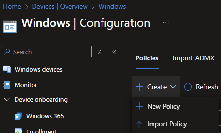
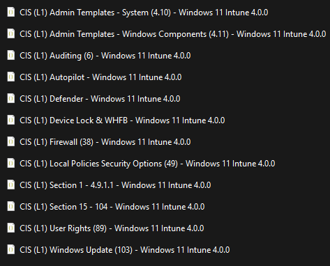
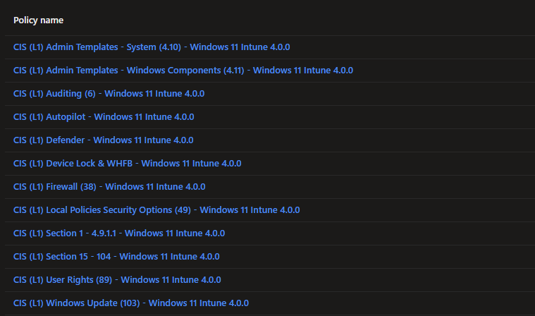
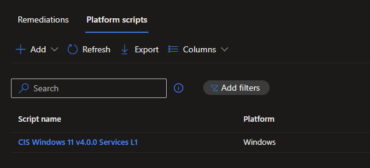
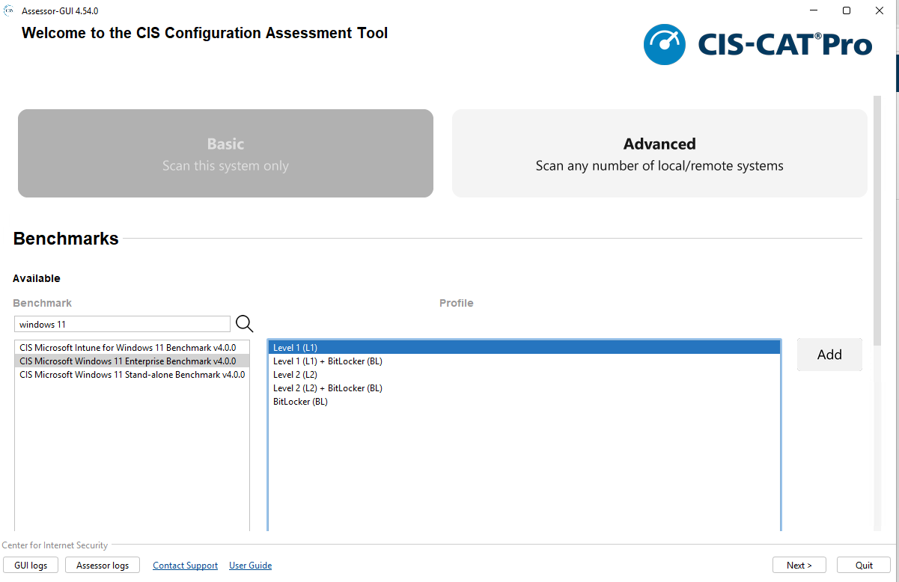
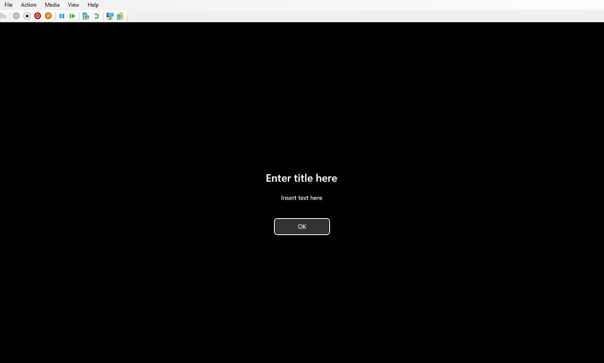
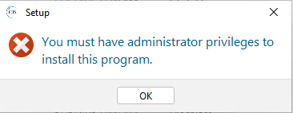
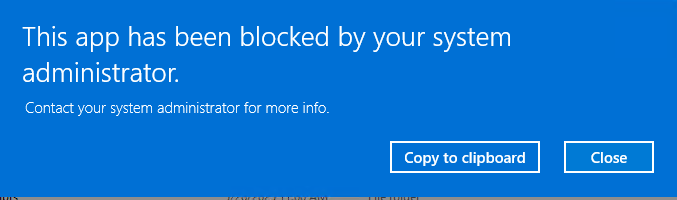
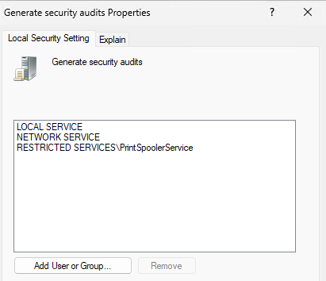
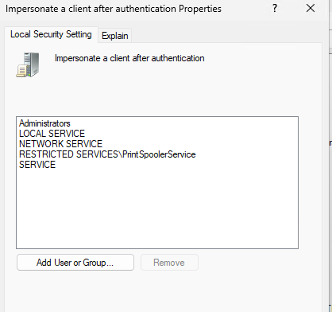

# CIS L1 Benchmarks in Intune with AVD Multi-Session Hosts

## Intro

It's been a few weeks now since I've made a post. The nice weather has kept me busy with yard work, taking my son camping, working on my garden, and trying to keep the weeds at bay. 

Last weekend I took my son camping at Beaver Creek Valley State Park in Minnesota and had a blast with him. Beaver Creek is a fairly small campground, with an odd one road layout. For me, that's awesome. I don't want to be around too many people, and the park itself was amazing. The Hiking Club Trail was 6.2 miles long, and split up into two legs. The first leg, was really hilly, and I ended up slipping twice and landing on my butt on the trek down. The second leg, was fairly flat, but in this awesome valley with really great scenery. We did the first leg on Friday afternoon after arriving to our site, and then did the second leg in the morning. From there we did some fishing in Brownsville along the Mississippi River. I'm now 40 years old, and am yet to catch a fish that doesn't involve deep sea fishing, or trout fishing. Granted, I'm not a fisherman, and I don't do it all that often, but you would think I'd be able to catch one once? Nope, not me. Jay has though, which really doesn't make me feel any better, but good for him. Saturday afternoon we did some more hiking at Great River Bluffs State Park, which was around 2 miles on the hike. We're now over 40 miles on the hiking club trails, well on our way to getting our 50 mile badge.


My garden is also coming along. Last year, I didn't plant anything. My first year here, it was trying to get it all ready, but weeds took over the area and won the battle. Weeds took over the area even more last year. My plan this year was to go back to raised beds. A trip to Menards put that all in shock when I found the price of lumber for a 1x8x8 was around 15 dollars for the crappiest piece of pine you could buy. I thought about giving up again, but then realized the barn we have had a bunch of old lumber still in it. I've now built five raised beds using that lumber. To date, I've planted:

- Bed 1:
    - Green Beans
- Bed 2:
    - Tomatoes
    - Marigolds
- Bed 3
    - Peppers
    - Lettuce
- Bed 4
    - Corn
- Bed 5
    - Need more compost, might plant pumpkins.

Finally, my Pacers are in the NBA Finals. It's been 25 years since the last trip, which put me in I think my freshman year of high school. My brother was going into his senior year. We have good memories of sitting in the parking lot across the street from the Fieldhouse in Indianapolis and watching the Finals then. His kids are now going into their senior year of high school, which makes us feel really f'n old.

Since I've been out of the groove a little bit, I've had a little bit of a writers block about what to write about. My last post was about using the CIS Benchmarks with AVD Multi-Session hosts. I wanted to expand on the topic some more, and touch on configuring the CIS Microsoft Windows 11 Enterprise Benchmark using Microsoft Intune, what settings aren't supported, what settings are supported, how to configure, and any gotcha's that we have experienced.

## What is CIS?

Simply put, CIS Benchmarks are a baseline of settings that will give you a secure environment. They are a **guidance, and do not need to be configured 100% (despite what your security team says)**. Striving for 100% should be the goal, but honestly, isn't achievable in any organization I've been in. For more information on CIS, you can go to https://cissecurity.org

## What's the difference between the Enterprise and the Intune benchmark?

From CIS:

- Intune Benchmark:
    - The Microsoft Intune Windows Benchmarks are written for MDM-joined systems using Microsoft Intune device configuration profiles only. This benchmark is not intended for use on standalone or workgroup systems, systems joined to and receive policies from Active Directory, or systems created, maintained, or used in other Cloud offerings. This benchmark covers supported endpoint states for Entra Hybrid Joined and Entra Joined systems that receive policies from Microsoft Intune using Configuration Profiles only.
- Enterprise Benchmark:
    - The Microsoft Windows Benchmarks are written for Active Directory domain-joined systems using Active Directory’s Group Policy Manager only. This benchmark is not intended for use on standalone or workgroup systems, systems joined to a cloud offering, such as Entra ID, or systems created, maintained, or used in the Cloud. This benchmark covers supported endpoint states for Active Directory and Entra Hybrid joined systems that receive policies from Active Directory Group Policy Manager only.

### But what if our org is hybrid and has regulations to adhere to?

Too bad? Microsoft is pushing us to be modern managed, using Intune, and starting that journey by hybrid-joining your existing devices. Cool. Great. But what if I want to move away from Group Policy and use Intune configuration? You can do that. As you see, both benchmarks cover hybrid-join scenarios. The difference being is the amount of settings that are in each benchmark.

- If you have regulations to adhere to, you're probably going to be stuck with the Enterprise benchmark.
    - The decision should be made, use GPO even if you're hybrid joined?
        - That seems like a bad idea to me, as you want to avoid the conflicting configurations. Pick one or the other. You've already enrolled these in Intune, I would keep using Intune.
- If you don't have regulations to adhere to? Lucky you!
    - Use the Intune benchmark.
        - CIS does the hardwork for you, the .json files are already there.
        - WARNINGS:
            - Don't just import the settings and apply to All Devices. 
            - REVIEW THE SETTINGS, GET AN UNDERSTANDING OF THE POLICIES, AND GRADUALLY ROLL OUT THE POLICIES.
            - Push back on your security team if they say you need to implement all of these 100%. They're checking boxes, you have to deal with the support.

## Downloading the Benchmark

To download the kit to implement the benchmark, you need to have an account with CIS. That can be achieved by going to https://workbench.cisecurity.org/. I don't know the full ins and outs of the cost, as my organizations have always had the means one way or another.

To start, we're actually going to download the CIS Microsoft Intune for Windows 11 Benchmark v4.0.0. Why this over the enterprise flavor? We're going to use this as the starting point for our configuration, to see what works, and what doesn't work right out of the gate. The Enterprise baseline is group policy based, so that only has group policy templates. The Intune baseline has the proper .json files for importing into Intune.

- Once registered and signed-in, click on Benchmarks
- Search for **CIS Microsoft Intune for Windows 11 Benchmark**
- Click **Files** in the top right corner
- Click **CIS Microsoft Intune for Windows 11 Benchmark v4.0.0 - Build Kit**
- We're then going to download the .zip file
- Unzip the file

## Importing the Benchmark

Now that we have the benchmark downloaded and unzipped, we can then import into Intune.



The following is the .json files that are available to import, which makes this so much easier.



## Importing and Configuring the Baseline

Cool, now that we have them imported, we just select All Devices and away we go right? No. Don't do this. I can't stress that enough.

- Build a test VM or test device if you have one handy.

I won't walk you through that, as that's different for each org. Too many options to choose from. As Microsoft would say, do what fits your org.

I learned upon first import, the Windows LAPS configuration is missing. Looking at the folder structure under the L1 folder, I see these Settings Catalog profiles, and then a script to disable Services.




After reviewing the readme file, I noticed that the LAPS profile has to be configured manually. Importing profiles with the endpoint security blade is a tricky item in Intune, and really a pain.

From the ReadMe file:

For 100% benchmark compliance, perform the following steps: 
1. Import desired profile from ".\Settings Catalog" folder into Intune ex: “CIS (L1) 
Defender - Windows 11 Intune 3.0.0.json”. 
2. Run scripts in ".\System Service Scripts" folders either locally, via Intune script 
manager or your preferred method. 
3. Configure LAPS settings in the "Endpoint security > Account protection" section 
in Intune admin center as outlined in the benchmark.

What I haven't done at this point is assign the baseline to my group and test VM. What I want to do first is scan the system with a fresh build, and see what the configuration looks like out of the gate. Now, this will be different in every organization, as you might have some GPOs applying, settings applying during the build process, etc that will change the score slightly. Ideally, you'll have a pretty crappy score. If not, that means you have configurations in place already. As much as possible, you'll want to transition those policies out of wherever they are, and into Intune so you can manage the policies from a central location.

## CIS-CAT Assessor

To review what is being applied, CIS also has a tool called CIS-CAT Assessor. This can be downloaded at this site, https://workbench.cisecurity.org/download/cis-cat/assessor. You will also need a license file, which will go in the license folder of the extracted zip file. Download all of this on your freshly built VM, as we're only going to run this locally and not over a network.

## Fresh Build

When I run the CIS-CAT Assessor, I am going to choose both the CIS Microsoft Intune for Windows 11 Benchmark and the CIS Microsoft Windows 11 Enterprise Benchmark for assessment. Typically, I choose output to an HTML file also. This is just easier for my eyes to read, to each their own.



Out of the gate, with no policies applied, I achieved the following results:

- CIS Microsoft Intune for Windows 11 Benchmark
    - 337 settings
    - Pass: 57 settings
    - Fail: 273 settings
    - Score: 17%
- CIS Microsoft Windows 11 Enterprise Benchmark
    - 406 settings
    - Pass: 86 settings
    - Fail: 318 settings
    - Score: 21%

What this tells me is that some of the settings defined in the benchmarks are default settings that Microsoft sets. I've added CSV files of the scan results, so you'll be able to see what settings are already configured with a freshly imaged device. A debate could be had on whether you need to configure these or not, as it would take someone with administrative rights to change the policies anyways. Files can be found here: https://github.com/Pacers31Colts18/Intune/tree/main/CIS%20v4.0

## Applying Imported CIS Microsoft Intune for Windows 11 Benchmark

Now that we have the initial baseline established, we are ready to assign the policies we imported earlier into Intune. Typically when I am piloting, I will create a group, exclude from the previous policies, and apply to the new policies. Because this is in my lab, I don't really have any policies. If you do have policies, you'll want to have this configured before you run the scores on the fresh build, or you will have mixed results of policies already applying.

After some time, the policies should be applying, you can tell if the policy has applied, simply by rebooting the device. You should see this on the logon screen.



Remember how I said don't just apply this without any thought? This is what happens.

Attempting to run the CIS-CAT assessor again, I now get this error message.



And another error! The policies are doing their job



Instead of using a standard user account, I am going to login as my Administrator account now to run the CIS-CAT Assessor.

I'm now ready to run the CIS-CAT Assessor again, and have achieved the following results:

- CIS Microsoft Intune for Windows 11 Benchmark
    - 337 settings
    - Pass: 320 settings
    - Fail: 12 settings
    - Error: 5 settings
    - Score: 95%
- CIS Microsoft Windows 11 Enterprise Benchmark
    - 406 settings
    - Pass: 257 settings
    - Fail: 147 settings
    - Error: 0 settings
    - Score: 64%

### What didn't apply correctly?

#### CIS Microsoft Intune for Windows 11 Benchmark

- Errors:
    - (L1) Ensure 'Turn off toast notifications on the lock screen (User)' is set to 'Enabled'
    - (L1) Ensure 'Do not preserve zone information in file attachments (User)' is set to 'Disabled'
    - (L1) Ensure 'Notify antivirus programs when opening attachments (User)' is set to 'Enabled'
    - (L1) Ensure 'Prevent users from sharing files within their profile. (User)' is set to 'Enabled'
    - (L1) Ensure 'MSI Always install with elevated privileges (User)' is set to 'Disabled'
- Fails:
    - (L1) Ensure 'Allow Spotlight Collection (User)' is set to '0'
    - (L1) Ensure 'Remote Procedure Call (RPC) Locator (RpcLocator)' is set to 'Disabled'
    - (L1) Ensure 'SSDP Discovery (SSDPSRV)' is set to 'Disabled'
    - (L1) Ensure 'UPnP Device Host (upnphost)' is set to 'Disabled'
    - (L1) Ensure 'Windows Media Player Network Sharing Service (WMPNetworkSvc)' is set to 'Disabled' or 'Not Installed'
    - (L1) Ensure 'Windows Mobile Hotspot Service (icssvc)' is set to 'Disabled'
    - (L1) Ensure 'Xbox Accessory Management Service (XboxGipSvc)' is set to 'Disabled'
    - (L1) Ensure 'Xbox Live Auth Manager (XblAuthManager)' is set to 'Disabled'
    - (L1) Ensure 'Xbox Live Game Save (XblGameSave)' is set to 'Disabled'
    - (L1) Ensure 'Xbox Live Networking Service (XboxNetApiSvc)' is set to 'Disabled'
    - (L1) Ensure 'Generate Security Audits' is set to 'LOCAL SERVICE, NETWORK SERVICE'
    - (L1) Ensure 'Impersonate Client' is set to 'Administrators, LOCAL SERVICE, NETWORK SERVICE, SERVICE'

I see themes here:

1. User settings not applying properly. I've ran into this in the past. The CIS-CAT Assessor scans all user profiles, even if they are not sync'd to Entra. For example, if I had logged in with my local administrator account (which I had), CIS-CAT will then scan that path in the registry and report back a failure. For that, I'm not going to worry about these settings.
2. System Services. CIS has this configured as a Platform Script, rather than a remediation script with Write-Host being used. Logging is not being written locally on the device. Reading the comments on the script, I can see that it most likely will need to be modified:

    ```powershell
    The purpose of this script is to configure a system using the recommendations 
    provided in the Benchmark, section(s), and profile level listed above to a 
    hardened state consistent with a CIS Benchmark.
    
    The script can be tailored to the organization's needs such as by creating 
    exceptions or adding additional event logging.

    This script can be deployed through various means, including Intune script 
    manager, running it locally, or through any automation tool.
    ```
3. User Rights Assignment. This doesn't seem to be getting set correctly. Opening GPEdit and looking at the User Rights Assignments, I see this:





Looking in the registry at PolicyManager (HKLM:\Software\Microsoft\PolicyManager\providers\guid\default\Device\UserRights), I see that Intune says it's setting the policy correctly, but it's not actually setting. Fun times:


From here, I would be looking at re-writing the Services script, most likely to separate them out and run as Remediations instead with proper logging. This will allow me to be more granular, as we do have a lot of exceptions for developers and such in our environment. The user policies is an area we have just kind of accepted failure on, and just look for the users we are actually targeting for success/failure, not all the accounts as our administrative accounts are not being sync'd into Entra. The User Rights Assignment, that's a tricky one and most likely something Microsoft needs to look into.

#### CIS Microsoft Windows 11 Enterprise Benchmark

For the Enterprise benchmark, this is where it becomes more fun. Like I said earlier, the Enterprise benchmark is based off Group Policy, where the Intune benchmark is based off CSP. So we'll be running into some mapping issues, as Microsoft in all their wisdom, is not consistent in how settings are being applied. Some Intune settings map back to GP registry settings, some do not. No errors this time, so that's a win! I've gone through the list, pulled out all the Fails, and then have done a comparison between the Intune benchmark and the Enterprise benchmark. From there, I've documented what is supported in Intune, vs what is not supported. I've also found all the corresponding registry paths. It's a little bit confusing, but the way I describe it to people is like this (hopefully someone can correct me, or point me in a better direction):

- Look at the [Policy CSP documentation](https://learn.microsoft.com/en-us/windows/client-management/mdm/policy-configuration-service-provider)
  - Anything that begins with ADMX_ is considered ADMX backed
    - For the most part ADMX backed settings then write to the GPO based registry path
  - Anything that doesn't begin with ADMX_ is not ADMX backed
    - Some might write to the GPO registry location.
    - Some might not.
    - Some in even the same CSP area will have different results.


All the data from the failures can be found on my [Github](https://github.com/Pacers31Colts18/Intune/blob/main/CIS%20v4.0/CIS_Enterprise_Failures.xlsx). I initally tried to put everything in here, but gave myself more of a headache doing it that way. I've gone through about five iterations of this before just landing on an Excel spreadsheet.

## Supplementing/Remediating Failures

Confused yet? So am I. Okay, from here, the focus will be on the Enterprise benchmark from here on out.

Looking at the spreadsheet (Main tab), I see a few different themes:

- Intune supported, not in Intune benchmark
  - 22 settings
- Not Intune supported, not in Intune benchmark
  - 40 settings
- Intune supported, settings that write to different registry paths
  - 100 settings

Breaking it down by CIS Category:

- **Section 1: Account Policies**
  - 5 failures
    - 1 Intune supported, not in Intune benchmark 
    - 4 Not Intune supported, not in Intune benchmark
- **Section 2: Local Policies**
  - 8 failures
    - 2 Intune supported, not in Intune benchmark 
    - 6 Not Intune supported, not in Intune benchmark
- **Section 5: System Services**
  - 9 failures
    - 4 Intune supported, failing from the Platform Script (Xbox)
      - Created a supplemental Services policy (see below)
    - 5 not Intune supported, still failing from the Platform Script
  - **Section 9: Windows Defender Firewall with Advanced Security**
    - 23 failures
      - 23 Intune supported, settings that write to different registry paths
        - CSP writes to HKLM\SYSTEM\CurrentControlSet\Services\SharedAccess\Parameters\FirewallPolicy\MDM\*ProfileName* rather than HKLM\SYSTEM\CurrentControlSet\Services\SharedAccess\Parameters\FirewallPolicy\*ProfilesName*
  - **Section 18: Administrative Templates (Computer)**
    - 98 failures
      - 33 Not Intune supported, not in Intune benchmark
      - 17 Intune supported, not in Intune benchmark
      - 46 Intune supported, settings that write to different registry paths
  - **Section 19: Administrative Templates (User)**
    - 4 failures
      - 3 Intune supported, not in Intune benchmark
      - 1 Intune supported, settings that write to different registry paths
 

### Intune Supported, not in Intune benchmark

I've now created four new profiles:

- [CIS (L1) - Win11 Enterprise - Administrative Templates (Computer)](https://github.com/Pacers31Colts18/Intune/blob/main/CIS%20v4.0/CIS%20(L1)%20-%20Win11%20Enterprise%20-%20Administrative%20Templates%20(Computer).json)
- [CIS (L1) - Win11 Enterprise - Administrative Templates (User)](https://github.com/Pacers31Colts18/Intune/blob/main/CIS%20v4.0/CIS%20(L1)%20-%20Win11%20Enterprise%20-%20Administrative%20Templates%20(User).json)
- [CIS (L1) - Win11 Enterprise - Local Policies](https://github.com/Pacers31Colts18/Intune/blob/main/CIS%20v4.0/CIS%20(L1)%20-%20Win11%20Enterprise%20-%20Local%20Policies.json)
  - Note: Baseline calls for "Audit All or Higher", Audit All is not a setting in Intune despite the CSP documentation saying otherwise. Great job!
  - I didn't set this in the below results as it was either Allow All, or Deny.
  - See docs: https://learn.microsoft.com/en-us/windows/client-management/mdm/policy-csp-LocalPoliciesSecurityOptions?WT.mc_id=Portal-fx#networksecurity_restrictntlm_outgoingntlmtraffictoremoteservers
- [CIS (L1) - Win11 Enterprise - System Services](https://github.com/Pacers31Colts18/Intune/blob/main/CIS%20v4.0/CIS%20(L1)%20-%20Win11%20Enterprise%20-%20System%20Services.json)

These should cover the settings that are Intune supported, but not in the Intune benchmark.

### Not Intune Supported, not in Intune benchmark

For settings that are not configurable in Intune, there are multiple different ways the settings can still be configured

- **Custom OMA-URI**
  - What I consider "Supported" is in the Settings Catalog, I didn't look at what is configurable through Custom OMA-URI.
- **Remediation Scripts**
  - You could do a detection/remediation script through Intune
  - [Microsoft Learn](https://learn.microsoft.com/en-us/intune/intune-service/fundamentals/remediations)
- **SCCM Configuration Items/Baselines**
  - If you have SCCM or another tool, you could use Configuration Items to configure this.
  - [Microsoft Learn](https://learn.microsoft.com/en-us/intune/configmgr/compliance/deploy-use/create-configuration-items)
- **Group Policy**
  - If you're hybrid joined, which is what this post is covering, you could also revert back to using Group Policy.

My preference (just mine), I prefer to use Remediation Scripts or Configuration Items. We started with Configuration Items, and are now starting to push those towards Remediation Scripts to have everything in one tool.

### Settings that write to different registry paths

This is where you need to explain to your security team that Microsoft in all it's wisdom is writing values to different registry locations. There are options, if you're a member of the CIS Workbench, you can fork the benchmark and create you're own. Depending on your org structure though, I would say that should be something dependent on the security team to accomplish and not anyone on the endpoint team.

## Re-running the scans

After setting up the above policies, I re-ran the scans, and achieve the following for the Enterprise benchmark:

[Results file](https://github.com/Pacers31Colts18/Intune/blob/main/CIS%20v4.0/Post-SettingsCatalog_CIS_Microsoft_Windows_11_Enterprise_Benchmark.csv)

- CIS Microsoft Windows 11 Enterprise Benchmark
    - 406 settings
    - Pass: 273 settings (up from 257)
    - Fail: 131 settings
    - Error: 0 settings
    - Score: 68%

The rest of the results are mainly going to be from a registry path mis-match. One area I do want to call out is the Account Policies section, setting this through Intune can have undesirable affects. For that reason, we've typically left this out of Intune all together.


## Conclusion

As you can see, there is still work to be done, but most of the work from here on out is going to be talking with the security team. 

- The banner will need to be updated, have someone (legal?) come up with a banner that suits your org.
- If using Windows Hello, there are a handful of settings that can be tweaked to make a better experience (new blog post coming later)
- If using Configuration Manager, don't set the Windows Update settings, let the client take care of that.
    - Research Dual Scan issues.
- Find what does and doesn't work in your org, pilot everything for a while before rolling out.
  - Don't just take my word for it, I'm just a random guy on the internet.
- Explain the settings to your security team
  - Point them to this excel spreadsheet showing the registry differences.

 If you're not subject to regulatory requirements that rely on the Enterprise Benchmark, use the Intune benchmark. If you do rely on the Enterprise benchmark, you have decisions to make. We were already well on the way to Intune, and as more and more settings become configurable, we're only going to see our numbers (hopefully) increase. Still, there is a strong chance Microsoft will write to different registry locations. I would continue to push on the regulatory bodies (and possibly CIS) to include additional checks in the audit files.

Please reach out if you have any questions about this article, always happy to help out when I can.


