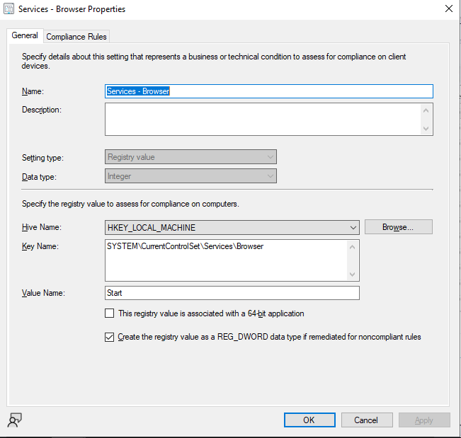
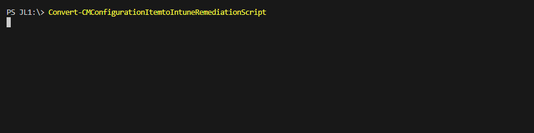
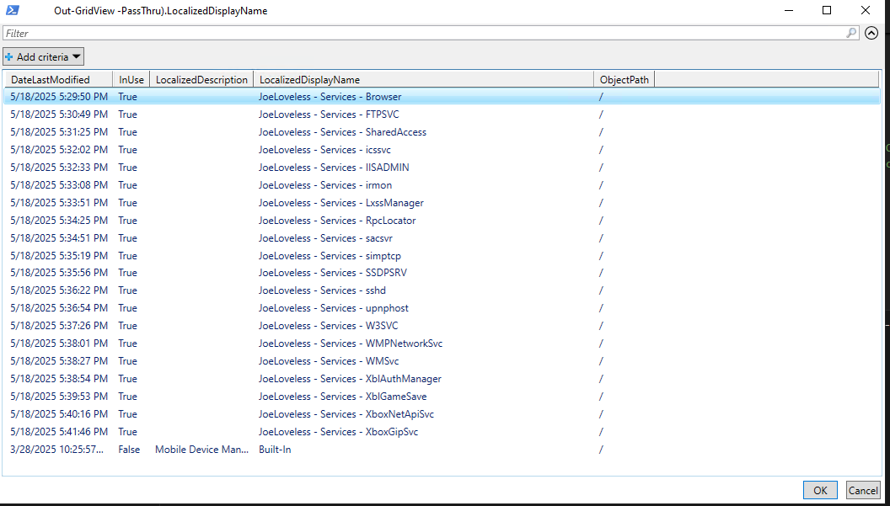
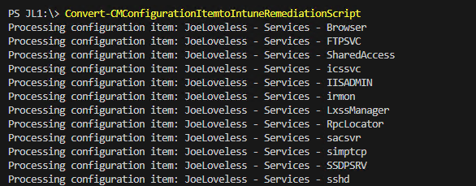
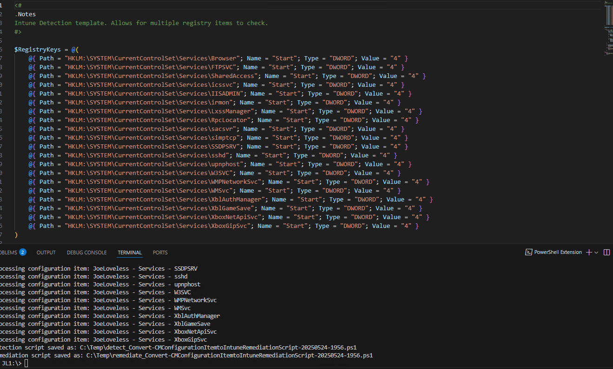
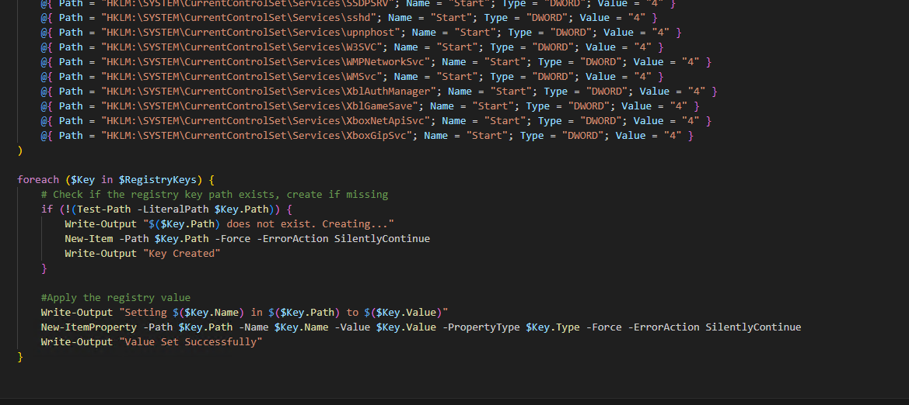

# Converting Registry Based SCCM Configuration Items to Intune Remediation Scripts

## Intro

It's Memorial Day Weekend here in the States, which means it's Indy 500 Weekend. It also means my Indiana Pacers are up 2-0 on the New York Knicks. If you know me, I'm a huge Pacers fan. With that comes a hatred for the Knicks, so right now I am giddy. Game 3 is tomorrow in Indianapolis, and the same day as the Indy 500. Back in Indy, we call that Racers and Pacers Weekend. I don't miss Indiana much for anything at all, but events like this, I do miss. Indianapolis knows how to do sporting weekends right. Without being back in Indy, my family and I will most likely be cooking some hot dogs, eating some s'mores, and burning all the downed sticks and brush from the recent storms. My daughter is also looking into getting into mountain biking, so I have been going down the internet rabbit hole looking for a decently priced mountain bike.

I've had this idea on my mind, and asked Steve Jesok the question at MMS during his session on Intune Remediation Scripts and SCCM Configuration Items. "Does anyone have a way to convert registry based configuration items to Intune Remedation Scripts? Steve was unaware of anything out there. I'm also not entirely sure how useful this would be for admins out there. If already using PowerShell based detection and remediation in SCCM, this isn't really applicable. If you're using the "GUI method" of looking for a registry key, and then remediating off of that, then this post might be for you.

## What is a Remediation Script?

[Intune Remediations - Microsoft Learn](https://learn.microsoft.com/en-us/intune/intune-service/fundamentals/remediations). Simply put, a Remediation Script is a "detection" and a "remediation". If the detection script detects the state is not correct (Non-Compliant), it will then go onto the Remediation portion.

With Intune, we do have a limit of 200 remediation scripts, which compared to SCCM, is quite small. I like to think of a Remediation Script as being equal to a Configuration Baseline. I don't think we should be doing single actions necessarily, but combining like actions together. In this post, I'll be combining Services together, where I'll want to set multiple Windows Services to a Disabled status.

## What do you mean by "GUI Method"?



Anything that's not script based using Powershell/VBScript/etc, but configurable through the GUI.

## Pre-Requisites

I've added all the files needed for this on my GitHub page.

- [Intune Detection Template](https://github.com/Pacers31Colts18/Intune/blob/main/Intune-Registry-Detect.ps1)
- [Intune Remediation Template](https://github.com/Pacers31Colts18/Intune/blob/main/Intune-Registry-Detect.ps1)
- [Convert Configuration Items to Remediation Script](https://github.com/Pacers31Colts18/Intune/blob/main/Convert-CMConfigurationItemtoIntuneRemediationScript.ps1)

# Walkthrough

Before getting too far into this, my method only works with the templates above for an Intune Detection and Remediation Script. What we're doing is taking these template files, and then doing some manipulation with PowerShell. Working on a team of 6 other engineers, we're trying our best to have repeatable practices, and make the code readable for everyone else. By having a template, this makes things much easier for us to know what is going on. The long-term goal is to also combine this with GitHub Actions and have a repository of code that requires code review and a more DevOps mindset. We're not 100% there yet, but we're working our way to that goal.

## Intune Detection and Remediation Template

I feel like these are pretty self explanatory. As I said earlier, we're thinking of this as more of a Configuration Baseline mindset, where you combine multiple Configuration Items into a Baseline. We're trying our best to not have a single script doing one single purpose (although there are use cases for that). With a large environment, we're trying to avoid the unknown of the future with a 200 script limit.

By having a PowerShell array for the registry key detection, we're able to achieve this with this method.

## Converting Configuration items to Remediation Scripts

I like to try to walk through what I am doing, mainly to kinda serve as a way to document my thoughts and what the heck I was doing. But hopefully people are finding this useful also. I don't consider myself to be the best at this by any means, so hopefully my stumbling explanations will serve somebody out there!

A couple thoughts before I go into the code:

- I've started using CoPilot to provide the comment-based help in my code. Freaking amazing. Such a time saver, highly recommended.
- I hate the name of this function. Any suggestions?

### Parameter Block

At the beginning of the function is the parameters. You can input multiple configuration items through an array, or you can provide no configuration item and get a Out-GridView that will allow you to multi-select Configuration Items. We also have a ValidateSet that will allow you to choose if you only want a Detection Method, or a Remediation, or both. I don't really know why you would just want a Remediation Script, but maybe you already have a Detection Method in place? By default, it's going to default to both a Detection and Remediation Script.

```powershell
    [CmdletBinding()]
    Param(
        [Parameter(Mandatory = $False)]
        [array]$configurationItem,
        [Parameter(Mandatory = $False)]
        [ValidateSet("Detection", "Remediation", "Detection/Remediation")]
        $scriptType = "Detection/Remediation"
    )
```

### Authentication, Declarations

I'm capturing the present working directory ($pwd) to put the location back to once the function is finished. We're also providing authentication to CM, as you will need access to CM to pull the Configuration Items. After that, my declarations are very repeatable, but the last 4 lines are customizable to fit your needs.

$templateDetectionScript and $templateRemediationScript should be the files on my GitHub, just change to the location that fits for you. $OutputDetectionScript and $OutputRemediationScript are where the files will be saved to, with the name of the function and the date ran.

```powershell
$StartingLocation = $pwd

    #region ConfigMgr Authentication
    $SiteCode = "JL1"
    Import-Module "$($ENV:SMS_ADMIN_UI_PATH)\..\ConfigurationManager.psd1"
    Set-Location "$SiteCode`:"
    #endregion

    #region Declarations
    $FunctionName = $MyInvocation.MyCommand.Name.ToString()
    $date = Get-Date -Format yyyyMMdd-HHmm
    if ($outputdir.Length -eq 0) { $outputdir = $pwd }
    $OutputFilePath = "$OutputDir\$FunctionName-$date.csv"
    $LogFilePath = "$OutputDir\$FunctionName-$date.log"
    $templateDetectionScript = "C:\Users\jlove\test\Intune-Registry-Detect.ps1"
    $templateRemediationScript = "C:\Users\jlove\test\Intune-Registry-Remediate.ps1"
    $OutputDetectionScript = "$OutputDir\detect_$FunctionName-$date.ps1"
    $OutputRemediationScript = "$OutputDir\remediate_$FunctionName-$date.ps1"
    $ResultsArray = @()
    #endregion
```

### Gathering the Configuration Items

In the first part, if you do not input a configuration item in the parameter block, you'll get a popup from Out-GridView allowing you to multi-select configuration items. I forget who I found this little trick through, but I've been trying to put the Out-GridView selection into everything I do since then. I find it to be so helpful. If you did input configuration items in the parameter block, then we are doing a search for those configuration items, and then adding them to an array.

```powershell
 #region Configuration Items
    if ($null -eq $configurationItem) {
        $resolvedConfigurationItems = (Get-CMConfigurationItem -Name * -Fast | 
            Select-Object DateLastModified, InUse, LocalizedDescription, LocalizedDisplayName, ObjectPath |
            Out-GridView -PassThru).LocalizedDisplayName
    }
    else {
        $resolvedConfigurationItems = @()
        foreach ($item in $configurationItem) {
            $resolvedItem = (Get-CMConfigurationItem -Name $item -Fast).LocalizedDisplayName
            if ($resolvedItem) {
                $resolvedConfigurationItems += $resolvedItem
            }
            else {
                Write-Warning "Could not resolve configuration item: $item"
            }
        }
    }
    #endregion
```

### Building the Configuration Items for Conversion

With how the data is stored in CM, I found I had to do some manipulation to then get it to work with PowerShell.

- For the $complianceRules section, in our environment we are looking for a "Value" and checking to make sure the item "Exists". Because of that, I only wanted to grab what is a value, so I put a Where-Object on this.
- Similar with $complianceSettings, I don't want to grab anything that's already a script, just anything where the sourceType = Registry. If it's not Registry-based, I'm simply skipping over all of that. There are other ways to export those scripts.
- Switch is somewhat new to me, and I've been trying to use that more also. CM stores the items as Int64, String, and StringArray (amongst some others), but using PowerShell, they need to be DWORD, STRING, MULTISTRING, so I am converting to that format.
- I also need to change HKEY_LOCAL_MACHINE to HKLM: and HKEY_CURRENT_USER to HKCU:.
- Once all the data is manipulated how I want, I'm adding everything to a PSCustomObject, and then storing in a $ResultsArray.

```powershell
#region Compliance Rules/Compliance Settings
    foreach ($item in $resolvedConfigurationItems) {
        Write-Output "Processing configuration item: $item"

        $complianceRules = Get-CMComplianceRule -Name $item -WarningAction Ignore | 
        Where-Object { $_.expression.operands.methodtype -eq "Value" }

        $complianceSettings = Get-CMComplianceSetting -Name $item -WarningAction Ignore | 
        Where-Object { $_.sourceType -eq "Registry" } | Select-Object -Unique

        if (!$complianceSettings) {
            Write-Warning "Configuration Item '$item' is not Registry-based. Skipping..."
            continue
        }

        foreach ($rule in $complianceRules) {
            foreach ($setting in $complianceSettings) {

                $settingdatatypeName = switch ($setting.settingdataType.Name) {
                    "Int64" { "DWORD" }
                    "String" { "STRING" }
                    "StringArray" { "MULTISTRING" }
                    default { $setting.settingdataType.Name }
                }

                $settingLocation = $setting.location -replace '^HKEY_LOCAL_MACHINE', 'HKLM:' -replace '^HKEY_CURRENT_USER', 'HKCU:'
                $result = New-Object -TypeName PSObject -Property @{
                    RuleValue       = $($rule.expression.operands.Value)
                    SettingDataType = $settingdatatypeName
                    SettingPath     = $settingLocation
                    SettingName     = $($setting.ValueName)
                }

                $ResultsArray += $result
            }
        }
    }

    if ($ResultsArray.Count -eq 0) {
        Write-Warning "No registry-based configuration settings found in any selected Configuration Items."
        return
    }
    #endregion
```

### Building the Registry Keys

In this region, we're simply taking the results from the $ResultsArray and converting to the format needed in the Detection and Remediation Scripts.

```powershell
#region Build RegistryKeys content
    $registryKeysContent = @()
    $registryKeysContent += "`$RegistryKeys = @("
    foreach ($result in $ResultsArray) {
        $registryKeysContent += "    @{ Path = `"$($result.SettingPath)`"; Name = `"$($result.SettingName)`"; Type = `"$($result.SettingDataType)`"; Value = `"$($result.RuleValue)`" }"
    }
    $registryKeysContent += ")"
    #endregion
```

### Modifying the templates, saving the new files.

- The IndexOf, we're looking for the correct lines in the detection and remediation script, and if not, we're leaving those sections as is. In simple terms, we're only looking to modify a certain block of text in the two template files, and add on to it with whatever is in the ResultsArray.
- Once all that is finished, we're then saving as a new PowerShell file, with the right encoding.
- We have checks from the parameter block looking for either Detection, Remediation, or both.

```powershell
 #region Detection Script
    if ($scriptType -eq "Detection" -or $scriptType -eq "Detection/Remediation") {
        $detectiontemplateLines = Get-Content $templateDetectionScript
        $detectionstartIndex = $detectiontemplateLines.IndexOf('$RegistryKeys = @(')
        $detectionendIndex = $detectiontemplateLines.IndexOf(')')

        if ($detectionstartIndex -eq -1 -or $detectionendIndex -eq -1) {
            Write-Warning "Could not find `$RegistryKeys block in the detection template. Check formatting."
        }
        else {
            $detectionnewContent = @()
            $detectionnewContent += $detectiontemplateLines[0..($detectionstartIndex - 1)]
            $detectionnewContent += $registryKeysContent
            $detectionnewContent += $detectiontemplateLines[($detectionendIndex + 1)..($detectiontemplateLines.Length - 1)]

            $detectionnewContent | Out-File $OutputDetectionScript -Encoding utf8
            Write-Output "Detection script saved as: $OutputDetectionScript"
        }
    }
    #endregion

    #region Remediation Script
    if ($scriptType -eq "Remediation" -or $scriptType -eq "Detection/Remediation") {
        $remediationtemplateLines = Get-Content $templateRemediationScript
        $remediationstartIndex = $remediationtemplateLines.IndexOf('$RegistryKeys = @(')
        $remediationendIndex = $remediationtemplateLines.IndexOf(')')

        if ($remediationstartIndex -eq -1 -or $remediationendIndex -eq -1) {
            Write-Warning "Could not find `$RegistryKeys block in the remediation template. Check formatting."
        }
        else {
            $remediationnewContent = @()
            $remediationnewContent += $remediationtemplateLines[0..($remediationstartIndex - 1)]
            $remediationnewContent += $registryKeysContent
            $remediationnewContent += $remediationtemplateLines[($remediationendIndex + 1)..($remediationtemplateLines.Length - 1)]

            $remediationnewContent | Out-File $OutputRemediationScript -Encoding utf8
            Write-Output "Remediation script saved as: $OutputRemediationScript"
        }
    }
    #endregion
    Set-Location $StartingLocation
}
```

## Script Example

In my example, I have a set of Configuration Items that are setting Windows Services to Disabled in the registry. I'm wanting to take those, and convert them to an Intune Remediation Script.

I ran the function without inputting any configuration items, or choosing what method I want. Who is to remember the names of these anyways?



I am now prompted to select what Configuration Items I want to include. I want all of them that are Services



I want some pretty output telling me what is happening



I now have both a Detection and Remediation Script!





# Conclusion

Next step would be to tie this all to a GitHub Action, and have this upload to Intune, following proper code review using branch protection. Again, maybe you already had PowerShell scripts in CM. You were more thoughtful than me (we are about 50/50). If not, you now have a way to convert those more easily.

Have a great weekend everyone! GO PACERS


