# An even better way to automate Entra Device Extension Attributes with Intune Remediation Scripts and Azure Automation

In my last post, I wrote about how we can use Intune Remediation Scripts, Azure Automation, and Enterprise App Registrations to automate the tagging of device extension attributes on an Entra ID device. From here we can create Entra groups that are dynamic, and constantly updated based on data that we are looking for on the device. I gave the example of adding the domain name to extensionAttribute1, and creating groups based off that for targeting. While what I showed worked, [Nathan McNulty](https://nathanmcnulty.com/), provided some feedback:

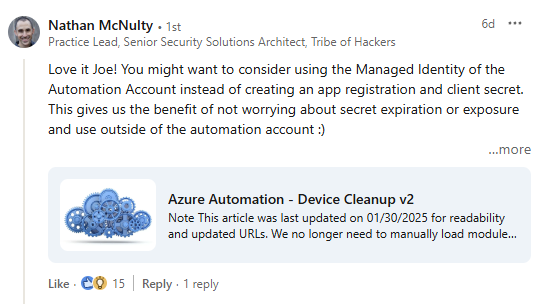

After reading through his post on automating [Entra device cleanup](https://nathanmcnulty.com/blog/2023/04/azure-automation-device-cleanup-v2/#grant-devicereadwriteall-permissions), I wanted to share an update along with another example on how to accomplish this. In this post, I'll walk through the new configuration, and also give a new example based on the OU the workstation resides in. Beware, some of this might be repetitive. 

## Intune Remediation Script

First we will setup the Intune Remediation Script. For this, we are only going to be using a Detection method, as we're just looking to read data on the device. In the detection script, I am looking to gather the CN of the device from the registry. From there, I am going to do some RegEx manipulation, to just pull the OU the device resides in. I'm not looking for the parent OUs, or the CN, just the direct OU.

[Intune Remediations - Microsoft Learn](https://learn.microsoft.com/en-us/intune/intune-service/fundamentals/remediations)

- In the Intune portal, click on Devices > Scripts and Remediations
- Go through the basics of creating the remediation script.

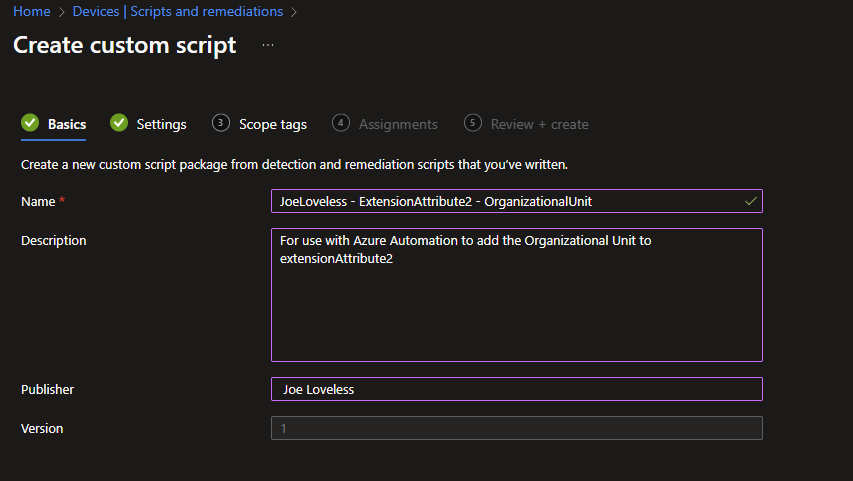

- Using the script below as an example, upload the script file as a Detection, and leave everything else as default. [Detection Script](https://github.com/Pacers31Colts18/Intune/blob/main/RemediationScripts/ExtensionAttributes/ExtensionAttribute2_Detection_OU.ps1)

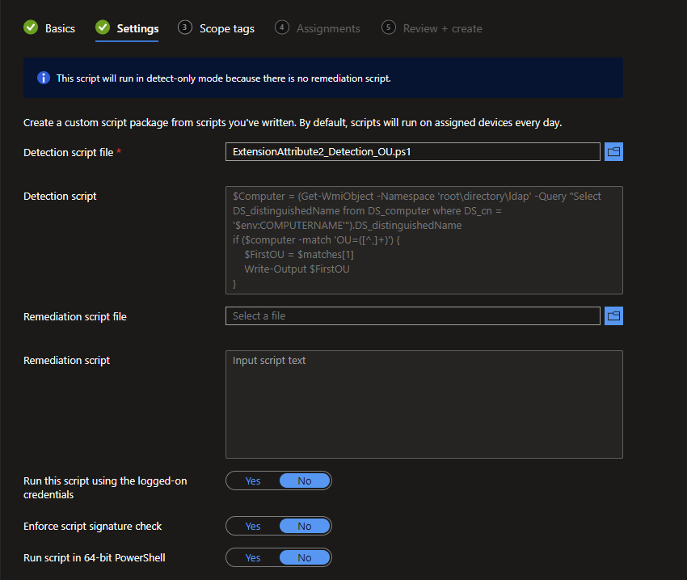

- Add the groups you want to target, along with the schedule you want. In this use case, I am choosing to run this daily, as the device could be moved to a different OU.. If there is a need for other schedules, adjust as you see fit. I would recommend for software detection, or other data that could change a different schedule.

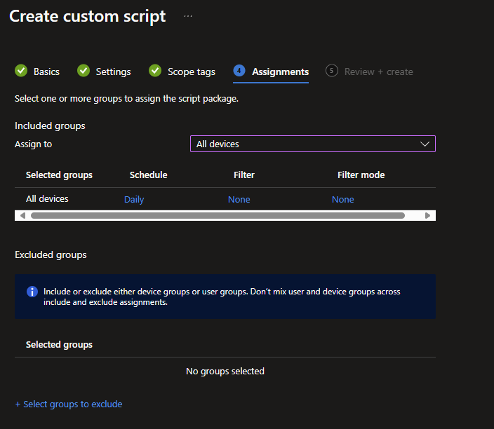

After the script runs (which thankfully you can also run manually now for testing purposes), let's do the following.

- From the Scripts and Remedations node, choose your script.
- Go to Monitor > Device Status
- Under the Column selection, add **Pre-Remediation detection output**
- Windows_11 is the OU that my device is joined to.

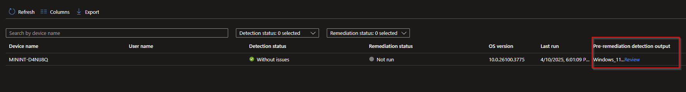

## ~~App Registration~~

~~We will also need to configure an App Registration for this process to work. ~~

~~- Go to your Azure Portal, and search for App Registration.~~
~~- Create a new App Registration with the following configuration:~~


~~- Create a new client secret under the **Secrets** node. Take note of the secret, as you will need it later.~~


~~- Go to Overview, and make note of the Directory (tenant) ID, and Application (client) ID. You will need this for the Azure Automation portion.~~

## Azure Automation

- From the Azure Portal, search for Automation Accounts
- Click Create
- If a Resource Group is not available, you will need to create one
- Once created, on the left hand pane, go to **Identity** under Account Settings

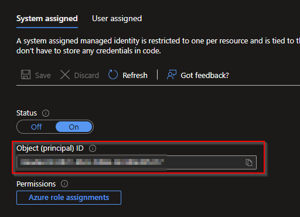

- Make note of the Object Id, we'll need it later.

~~- Here we are going to store the previous items that we made note of. Each item will have a Type of **String**~~
    ~~- ClientID~~
    ~~- ClientSecret~~
    ~~- TenantID~~
~~- Make sure they are named in the same format, or you will need to adjust the runbook.~~


### Modules

Learning more from Nathan, I too went with installing modules from the Powershell Gallery to help ease the management of this.

- Go to Modules under Shared Resources

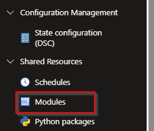

- Click Add a Module
- Choose Browse from Gallery
- We are going to install two modules:
    - Microsoft.Graph.Authentication

Is this module 100% necessary? No not really, but it does make the connection simpler in my opinion. The modules are also updated by Microsoft, so less management. If you wanted, a combination of the runbook from the initial post, and the runbook from this could be combined and eliminate the need for the module.

## Assigning Permissions

According to Nathan's post, the permissions are not configurable through the GUI. I found this to be accurate, both in my lab environment and at work. When running this in my production environment, I needed someone with GA permissions to configure this portion. Whether GA is actually the right permission needed or not, I'm not 100% sure. In my lab of course, I'm running GA, while at work, I have limited permissions. I probably shouldn't be running GA in my lab either, but I'm still setting it up and learning....one day. Using Nathan's script on his [blog post](https://nathanmcnulty.com/blog/2023/04/azure-automation-device-cleanup-v2/#grant-devicereadwriteall-permissions), we are going to add three permissions, and the objectId that we took note of above.

To Modify:
- $SP_ID
    - Add the object ID from your Azure Automation account.
- Permissions
    - DeviceManagementManagedDevices.Read.All
    - DeviceManagementConfiguration.Read.All
    - Device.ReadWrite.All
- We're then going to run this script each time for the permissions needed (3 total).

```powershell
#Variables to Modify
$SP_ID = 'Object (prinicpal) ID from above'
$AppId = (Get-MgServicePrincipal -ServicePrincipalId $SP_ID).AppId

# Connect with scopes requried to grant permissions
# May require admin consent for Graph PowerShell
Connect-MgGraph -Scopes appRoleAssignment.ReadWrite.All,Application.Read.All,Group.ReadWrite.All

# Grant Device.ReadWrite.All Graph Permissions
"Device.ReadWrite.All" | ForEach-Object {
   $PermissionName = $_
   $GraphSP = Get-MgServicePrincipal -Filter "startswith(DisplayName,'Microsoft Graph')" | Select-Object -first 1 #Graph App ID: 00000003-0000-0000-c000-000000000000
   $AppRole = $GraphSP.AppRoles | Where-Object {$_.Value -eq $PermissionName -and $_.AllowedMemberTypes -contains "Application"}
   New-MgServicePrincipalAppRoleAssignment -AppRoleId $AppRole.Id -ServicePrincipalId $SP_ID -ResourceId $GraphSP.Id -PrincipalId $SP_ID
}

```

## Enterprise Applications

In the previous post, we created the Enterprise Application and configured the permissions. Now with Nathan's script, this will configure the Enterprise Application, and tie the managed identity to the application. The Azure Automation account and the Enterprise Application will have the same name. We can go into the portal and verify everything is correct.

- From the Azure Portal, go to Enterprise Applications
- By default, the view will be Enterprise Applications, it took me a minute of stumbling around myself to find the application. We will want to change the view to Managed Identity.

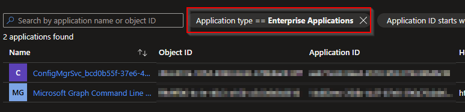

- Change this to **Managed Identites**

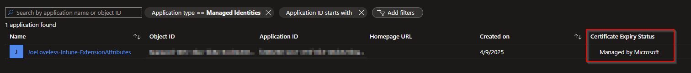

Do you see the Certificate Expiry Status being Managed by Microsoft. This will make the whole process so much easier. Nobody wants to deal with secrets/certificates expiring and things not working anymore. With the Managed Identity configuration, Microsoft manages this for us! We got better ~~shit~~ stuff to do!


### Runbook

Ok now we have the Azure Automation tied to the Enterprise Application, now we're ready to go back and create the Runbook.

- Go back to Azure Automation
    - Under Process Automation, choose Runbooks
    - Create a new Runbook
    - Make sure to choose Powershell 5.1

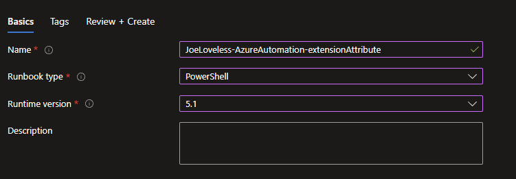

- Click Review and Create
- This should then take you to a terminal window
- Copy and paste the code here: [Runbook](https://github.com/Pacers31Colts18/Intune/blob/main/RemediationScripts/ExtensionAttributes/ExtensionAttribute2_Runbook_OU.ps1)
- The top three lines are all that should need to be modified to your liking
```powershell
#Variables to Modify
$scriptName = "JoeLoveless - ExtensionAttributes - OrganizationalUnit"
$appregistrationName = "JoeLoveless-Intune-ExtensionAttributes"
$extensionAttribute = "extensionAttribute2"
```
- The $scriptName variable should match the Intune Remediation Script.
- The $appregistrationName should match the name of the App Registration.
- The $extensionAttribute should be "extenstionAttribute" and the number you want to tag.
    - 1-15 are the allowed extension attributes [Microsoft Learn](https://learn.microsoft.com/en-us/graph/api/resources/device?view=graph-rest-1.0)
- Once configured, let's make sure it works properly before going any further. Click on Test Pane. If all succeeds, you should see a Succeeded message.
- Although it says succedeed, did it really? Go to a device in the Entra portal, and take a look at one.

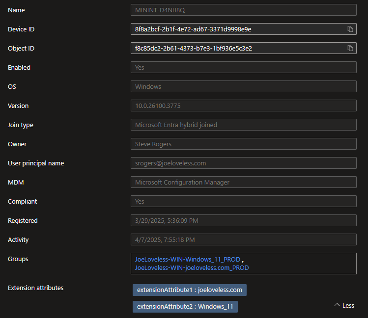

Success, we now have tagged a device with an Extension Attribute!!!


- First, let's go back to our Runbook, and we need to Publish the runbook.


- Now that we have published the runbook, we can now configure a schedule.
- Under Resources, select Schedules and then Add Schedule.
- Click Link a Schedule to your Runbook and then Add Schedule.
- In my case, I want this to run slightly after the Intune Remediation runs. I don't want it to run at the same time, or too close, as there could be a delay on the Microsoft side. 15 minutes seems like a good enough time for me.


## Groups

Now that everything is configured, we can then create Entra ID groups that can be used for targeting purposes within Intune. My initial thought on this method was going to be just adding directly to the groups. While that can be good for certain, more static scenarios, the method I have outlined makes this all dynamic. With the remediation scripts running daily, along with the Azure Automation, the devices can be added/removed from the groups. If adding directly to the groups, you would need a second runbook to remove from the groups. There could be unintended consequences.

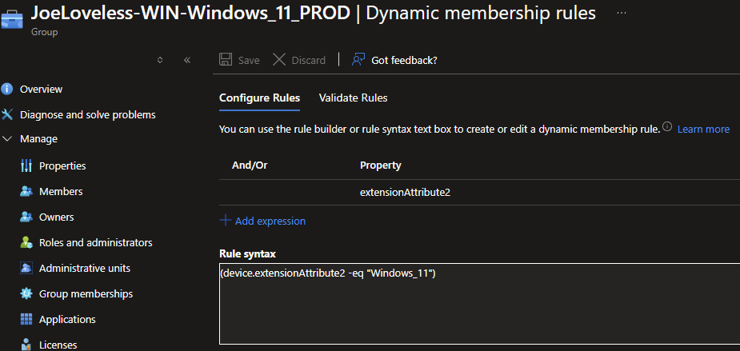

## Conclusion

Again, I have to thank Nathan for the feedback and advice on this. I really appreciate it and wanted to share this process. I feel like most of the automation I have seen has been with the ClientId, AppId, and ClientSecret method. While that works, I do feel like this is a better process without having to manage the secret expiration.

[Azure Automation - Device Cleanup v2](https://nathanmcnulty.com/blog/2023/04/azure-automation-device-cleanup-v2/#grant-devicereadwriteall-permissions)


