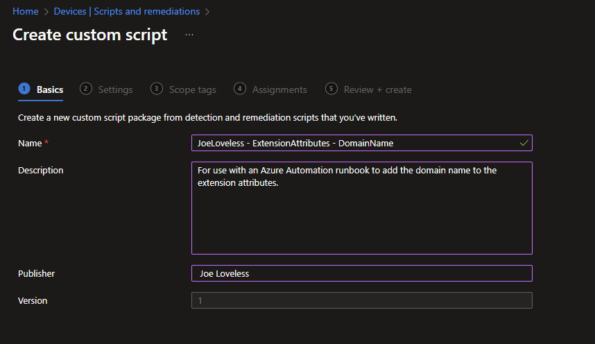
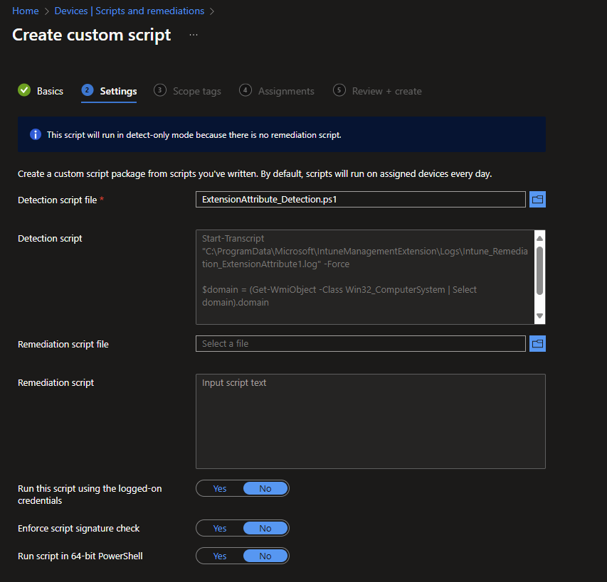
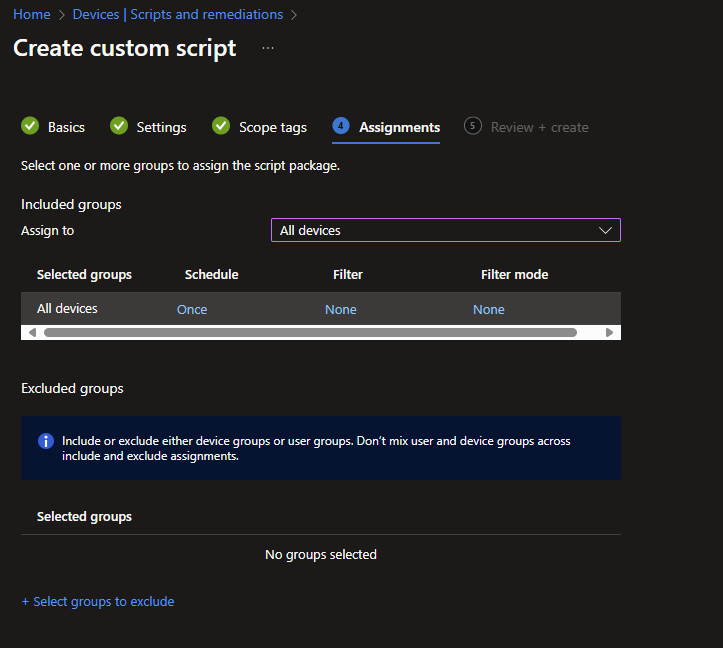
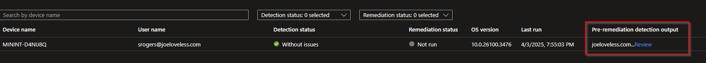
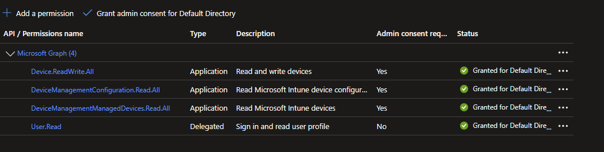
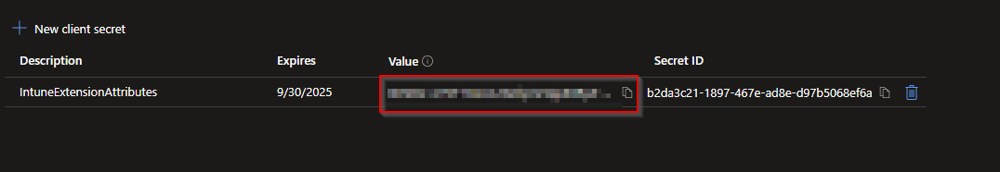
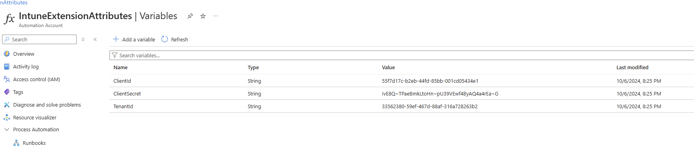
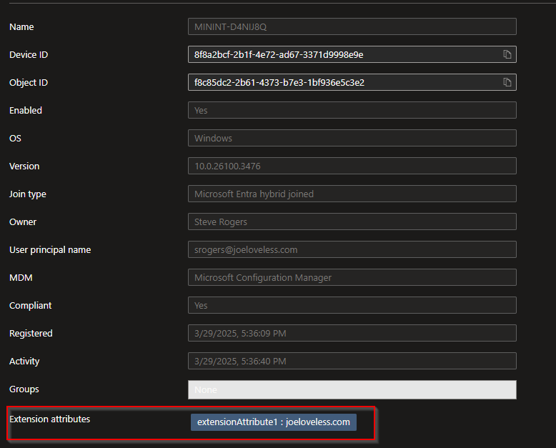
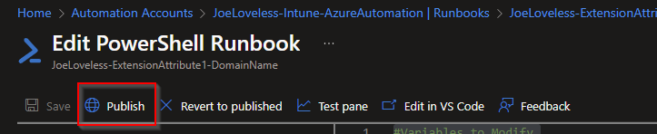
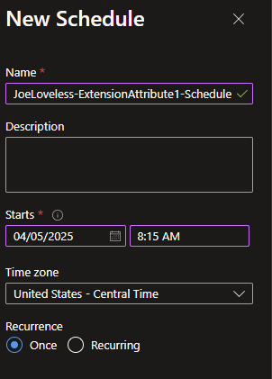

# Automating Entra Device Extension Attributes with Intune Remediation Scripts and Azure Automation

I have viewed a few posts in the community about how to add extension attributes for Entra ID devices, but everything that I have ran across has been for manually adding extension attributes.

- [Ugur Koc](https://ugurkoc.de/from-intune-to-entraid-add-custom-data-to-the-extension-attributes/#:~:text=The%20general%20workflow%20for%20writing%20data%20to%20Extension,update%20the%20Extension%20Attributes%20for%20the%20target%20devices.)

- [IntuneStuff](https://intunestuff.com/2023/11/28/how-to-add-extension-attributes-for-aad-devices/)

The question I kept asking myself, is how do you automate this? I wanted to share with everyone the process of using an Intune Remediation Script (Detection only), along with an App Registration, and Azure Automation Runbook. This guide will walk you through setting up everything, which is available on my [GitHub](https://github.com/Pacers31Colts18/Intune/tree/main/RemediationScripts/ExtensionAttributes).

## Intune Remediation Script

First we will setup the Intune Remediation Script. For this, we are only going to be using a Detection method, as we're just looking to read data on the device.

[Intune Remediations - Microsoft Learn](https://learn.microsoft.com/en-us/intune/intune-service/fundamentals/remediations)

- In the Intune portal, click on Devices > Scripts and Remediations
- Go through the basics of creating the remediation script.



- Using the script below as an example, upload the script file as a Detection, and leave everything else as default. [Detection Script](https://github.com/Pacers31Colts18/Intune/blob/main/RemediationScripts/ExtensionAttributes/ExtensionAttribute_Detection.ps1)



- Add the groups you want to target, along with the schedule you want. In this use case, I am choosing to run this detection once. If there is a need for other schedules, adjust as you see fit. I would recommend for software detection, or other data that could change a different schedule. In this case, I am only looking for the domain the workstation is joined to, which should not change at all.



After the script runs (which thankfully you can also run manually now for testing purposes), let's do the following.

- From the Scripts and Remedations node, choose your script.
- Go to Monitor > Device Status
- Under the Column selection, add **Pre-Remediation detection output**
- We should now see an output of the domain name the workstation is joined to.



## App Registration

We will also need to configure an App Registration for this process to work. 

- Go to your Azure Portal, and search for App Registration.
- Create a new App Registration with the following configuration:



- Create a new client secret under the **Secrets** node. Take note of the secret, as you will need it later.



- Go to Overview, and make note of the Directory (tenant) ID, and Application (client) ID. You will need this for the Azure Automation portion.

## Azure Automation

### Variables

This is where we automate the process, and tie it all together.

- From the Azure Portal, search for Automation Accounts
- Click Create
- If a Resource Group is not available, you will need to create one.
- Once created, on the left hand pane, go to Variables under Shared Resources


- Here we are going to store the previous items that we made note of. Each item will have a Type of **String**
    - ClientID
    - ClientSecret
    - TenantID
- Make sure they are named in the same format, or you will need to adjust the runbook.



### Runbook

- Under Process Automation, choose Runbooks
- Create a new Runbook
- Make sure to choose Powershell 5.1


- Click Review and Create
- This should then take you to a terminal window
- Copy and paste the code here: [Runbook](https://github.com/Pacers31Colts18/Intune/blob/main/RemediationScripts/ExtensionAttributes/ExtenstionAttribute_Runbook.ps1)
- The top three lines are all that should need to be modified to your liking
```powershell
#Variables to Modify
$scriptName = "JoeLoveless - ExtensionAttributes - DomainName"
$appregistrationName = "JoeLoveless - Azure Automation - Intune Extension Attributes"
$extensionAttribute = "extensionAttribute1"
```
- The $scriptName variable should match the Intune Remediation Script.
- The $appregistrationName should match the name of the App Registration.
- The $extensionAttribute should be "extenstionAttribute" and the number you want to tag.
    - 1-15 are the allowed extension attributes [Microsoft Learn](https://learn.microsoft.com/en-us/graph/api/resources/device?view=graph-rest-1.0)
- Once configured, let's make sure it works properly before going any further. Click on Test Pane. If all succeeds, you should see a Succeeded message.
- Although it says succedeed, did it really? Go to a device in the Entra portal, and take a look at one.



Success, we now have tagged a device with an Extension Attribute!!!


- First, let's go back to our Runbook, and we need to Publish the runbook.


- Now that we have published the runbook, we can now configure a schedule.
- Under Resources, select Schedules and then Add Schedule.
- Click Link a Schedule to your Runbook and then Add Schedule.
- In my case, I want this to run slightly after the Intune Remediation runs. I don't want it to run at the same time, or too close, as there could be a delay on the Microsoft side. 15 minutes seems like a good enough time for me.



## Conclusion

So that's it, we have now linked together an Intune Remediation Script, along with an App Registration and an Azure Automation. This will tag devices with an extensionAttribute, that can be modified to your liking. From there, we tied together the App Registration and Azure Automation, making sure we store the secrets, tenant id, and application id in a secure manner and not in the script itself.

From here, you can create Entra groups based off the extensionAttributes, or use this for reporting purposes.


