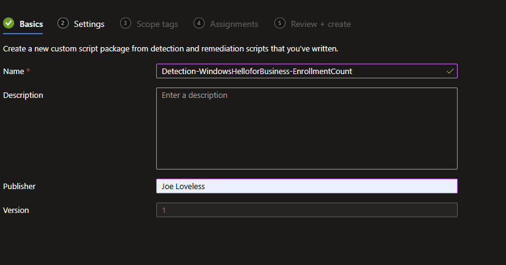
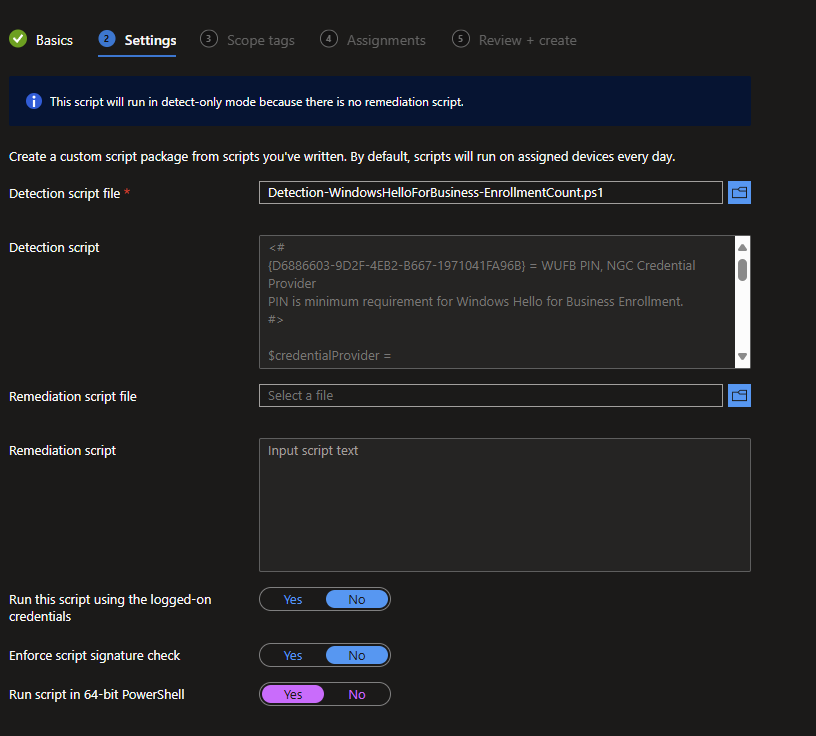
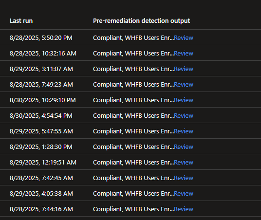

# Finding how many users are enrolled in Windows Hello For Business

## Introduction

It's been a minute since my last post. Since then, we've still been rolling out Windows Hello for Business at work as a project, along with many other tasks, projects, etc. Employee review season is upon us, so I need to start figuring out what all I did in the last year, and what I want to achieve in the upcoming year. It's one of those exercises I'm not the biggest fan of, mainly because I feel that I have to talk about myself more than I ever want to.

On the home front, we've been gearing up for the new school year and the end of the summer. I'm hoping to take my daughter camping next weekend, maybe some place up north in Minnesota. Anything is up north for us in Minnesota, as we live in one of the bordering counties of Iowa. What I really mean by up north is past the Twin Cities. I've also started yet another project, trying to finish the drywall mudding in my office/loft above the garage. The previous owners finished the mudding about 40% of the way. I'm now three years into living at this house, and just attempting to get it done. By the time I do get it done, we'll probably/hopefully be moving again.

From the blog side of things, I did a little thinking and reading and decided to do away with the ChatGPT generated images. I found them interesting, yes, but also felt that it sort of cheapens everything that I am trying to do. If I am willing to put in the work and write, why should I just use AI generated images? Seems silly to me. Unfortuantely, I am not a graphic artist. I tried that route when I was about 19 and found out quickly that it wasn't for me (aka I sucked at it) at Ivy Tech Community College. So I am playing around with the idea of templated cover images instead. Let me know what you think!

One of the asks in this project, as we've been rolling out Windows Hello to internal pilot testers, was gathering how many users/devices have actually enrolled in Windows Hello for Business on their device.

## The Entra Way

Before I dive into the detection script I have, I want to point out that this data is available in Microsoft Entra natively under the Authentication Methods blade. If you work in an enterprise environment, you might not have the proper roles to access that data. From what I have seen also, this data is more "user-centric" rather than device based. I was looking for the data from the device side of things.

## Intune Detection Scripts

At the same time I was trying to piece everything together, Johanne's dropped a timely blog post that gave me the starting point of my script. Check it out [here](https://johannesblog.com/2025/08/07/last-authentication-used/). His blog goes into finding the last authentication method used.

Using that script, I now know that D6886603-9D2F-4EB2-B667-1971041FA96B = 'WHFB PIN, NGC Credential Provider'.

```powershell
    HKLM:\SOFTWARE\Microsoft\Windows\CurrentVersion\Authentication\Credential Providers\{D6886603-9D2F-4EB2-B667-1971041FA96B}
```

You can find the script [here](https://github.com/Pacers31Colts18/Intune/blob/main/RemediationScripts/Detection-WindowsHelloForBusiness-EnrollmentCount.ps1). Now, create a new Detection Script in Microsoft Intune under Scripts and Remediations.

## Detection Script Setup





Once the data is gathered, under the Column settings, turn on the **Pre-remediation detection output** under Device Status, this will give you the output of how many users are enrolled.



Clicking on review, will then give you the total number of users enrolled. Of course, I would recommend exporting the data instead, and then provide that data to whoever would need it.