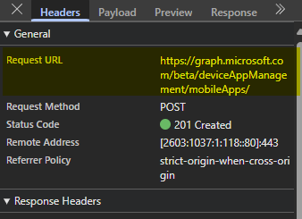

# Getting Started with Microsoft Graph

Good morning everyone! I've been struggling lately with things to write, and also struggling with making time to write. I feel like this summer we've been slammed at work with different projects, I've been slammed at home with different projects, and have generally just been a little tired. I'm attempting to launch a consulting company, so I've been working through trying to get that off the ground (design a website first), so that has been eating into my time. While weed eating our wooded trail yesterday, I was thinking of different posts to make. One that I've been wanting to write about is my thoughts on Microsoft Graph and all the pain points I've experienced myself as a general noobie to Graph. I've been using Microsoft Graph the last three years in different capacities. This would be either through the SDK, native API calls, or using Invoke-MgGraphRequest.

Last week, we had an incident pop-up where our Apple VPP apps had their assignments removed when we put in the new VPP cert. So, I wrote a Powershell script that called the Graph API to retrieve the application assignments after we went through and re-assigned everything. Unfortunately, I did not have this data beforehand. But, for this post, I'm going to use the script I developed as an example for configuration. The main script can be found here [Export-IntuneApplicationAssignments](https://github.com/Pacers31Colts18/Intune/blob/main/Export-IntuneApplicationAssignments.ps1)

## Common Terms and Painpoints

Before starting, I want to list out some common terms and some common painpoints I've ran into. A lot of this will be dependent on what your environment looks like and what you are doing with Microsoft Graph.

### Common Terms

To use the Microsoft Graph API, you need access. Typically, Microsoft Graph is not going to be wide open for you to just connect to and run commands against. Thinking to the Active Directory world, you would have permissions delegated to your privileged account (hopefully) and then you would perform actions. Instead, in the Azure world, you will grant permissions to an App Registration. Microsoft has provided all the permissions to configure, allowing you to get very granular and use the principal of least privilege.

[Permissions Consent Overview](https://learn.microsoft.com/en-us/entra/identity-platform/permissions-consent-overview)

- Types of Access
  - Delegated
    - Connecting to a resource on behalf of the signed in user.
    - Used for running scripts on demand with no automation tied to it.
    - I use this most commonly in my day to day work over Application permissions.
  - Application
    - Connecting to a resource as itself.
    - User is not needed to authenticate
    - I use this with automation (Azure Runbooks, Github Actions, etc)

Going back to the Active Directory scenario. With Delegated, I'd equate that to me running a script with my privileged account whenever necessary. Where if I then wanted any sort of automation (Scheduled Task maybe?), I'd probably have a Service Account with the permissions needed to then run the task.

- Pagination
  - Because you're now working in this huge environment, that has multiple customers, we need to be more efficient. On some of the data requests, Microsoft "pages" the data. Meaning, you will only get back chunks of results at a time. If wanting to return ALL the data (because who doesn't), you then have to use pagination to keep going through the results.

[Paging Microsoft Graph data in your app](https://learn.microsoft.com/en-us/graph/paging?tabs=http)
[Practical Graph: All About Pagination and Fetching Data](https://practical365.com/pagination-graph-sdk/)
[How To Handle Microsoft Graph Paging in PowerShell](https://medium.com/@mozzeph/how-to-handle-microsoft-graph-paging-in-powershell-354663d4b32a)

- Beta vs. v1.0
  - While Beta is just that, Beta. I've yet to really see anything go from Beta to 1.0, where much of the functionality needed is in Beta. For that reason, I tend to default to Beta, and only fall back to v1.0 if I absolutely have to.

## Getting Started - App Registration


1. Open Azure (portal.azure.com), and go to App Registrations
2. Click *New Registration*
3. Fill in the details, making note of the Redirect URI
   - This will prompt the user for authentication using the Microsoft authentication.


4. Once created, click on API Permissions.
   - By default, the application will have User.Read permissions


5. Click Add a Permission
6. Click Microsoft Graph
7. Choose Permissions
  - Application
  - Delegated (I'm choosing Delegated in this walk through)
8. Scroll down to DeviceManagementApps, then choose **DeviceManagementApps.Read.All**
   - We're trying to use the principle of least privilege here, so we're only choosing Read permissions.
9.  Now that the permission is added, we still aren't done. Somebody has to sign off on the permissions being added, that's why the Status is "Not granted"


1.  We'll need someone with the proper permissions to Grant Admin Consent.
    - [Grant tenant-wide admin consent to an application](https://learn.microsoft.com/en-us/entra/identity/enterprise-apps/grant-admin-consent?pivots=portal)
2.  Thankfully, this is my Lab tenant, and I have Global Admin.


3. One last step, go to Authentication, and add http://localhost into the Mobile and Desktop applications Redirect URIs section


We've now configured our Delegated App Registration that will allow us to connect, we can then restrict who can access the application.

1. Back in the Azure portal, go to Enterprise Applications.
2. Find your newly created application and go to Users and Groups.
3. Add any user who should have permissions here.


So with this configuration we have:

User (with permissions) ---------> Connects to Application ---------> Application has permissions ------------> Application makes requests to Microsoft Graph

#### That's fantastic, but how do I know what permissions I need?

Knowing what permissions you need can be challenging. Fortunately, there are many tools provided to do such a job. I'm not going to go into great detail about how to use each one of them, those can be other posts. 

[Graph Explorer](https://developer.microsoft.com/en-us/graph/graph-explorer)
[Graph X-Ray](https://graphxray.merill.net/)
[PostMan](https://desktop.postman.com/?desktopVersion=10.6.0)
[Graph API Documentation](https://learn.microsoft.com/en-us/graph/api/overview?view=graph-rest-beta)

Above are either tools from Microsoft or third party tools to get started. Personally, I like to just look at the network calls being made in Microsoft Edge to findout what the calls are, and then I can typically find the right permissions based off that. The Graph API documentation is also a great starting place, you just have to know how to navigate and know what you are looking for.

So in this example scenario, we're wanting to get application assignments.

1. Go to [Microsoft Intune](https://intune.microsoft.com)
2. Click Apps
3. Using Edge, hit F12 and open Developer Tools.
4. Make sure the Network tab is selected.
5. In this case (probably a bad example to be honest) I'm going to create a new app with the Network tab open
6. Make the application available to All Users

You should then start seeing a bunch of calls being made


Most of this looks like garbage to me, anything with .js is worthless to me. 



But, I then see this mobileapps. This is my starting point for configuring the permissions (and when I go to write my PowerShell script)

https://graph.microsoft.com/beta/**deviceAppManagement**/mobileApps/

- DeviceAppManagement (Intune) = DeviceManagementApps (Azure)
  - Microsoft is never consistent with naming!

## Authentication

Okay, now we have the App Registration configured, how do we connect to it?

We have two scenarios for connection, native Rest API connection(Get-MSALToken), or connecting with Microsoft Graph.

### Invoke-RestMethod/Get-MSALToken

I find this to be the most difficult to connect to, but let's give it a shot and see if I can explain it and figure it out myself.

1. Install Get-MSALToken

```powershell
Install-Module -Name MSAL.PS -Scope CurrentUser
```

Now that we have the module installed, we need to configure our parameters.

On the Overview page of your App Registration, you'll find the details needed. You can use either your domain name or actual tenant ID for the below portion. I'm using my tenant domain name.


```powershell
$token = Get-MsalToken -clientid "CLIENTIDHERE" -tenantid "joeloveless.com" -Interactive
$header = @{'Authorization' = $token.createauthorizationHeader();'ConsistencyLevel' = 'eventual'}
```

In this example (Delegated), I am looking to connect interactively. If I wanted this in an automated scenario, I'd be looking at using Client Secrets, Federation, or Certificates to pass the authentication.

### Connect-MgGraph

The next option (and simpler IMO) is to connect using **Connect-MGGraph**

[Connect-MgGraph](https://learn.microsoft.com/en-us/powershell/module/microsoft.graph.authentication/connect-mggraph?view=graph-powershell-1.0)

We'll need the Microsoft.Graph.Authentication module.

```powershell
Install-Module -Name Microsoft.graph.authentication -Scope CurrentUser
```

From here, we just need to run a one liner to then connect:

```powershell
connect-MgGraph -ClientId "ClientIDHere" -TenantId "joeloveless.com"
```

Neither are overly difficult to configure, but Connect-MgGraph is just a tad simpler. Personally, I go with Connect-MgGraph, based off this paragraph from the PowerShell Gallery

*The MSAL.PS PowerShell module wraps MSAL.NET functionality into PowerShell-friendly cmdlets and is not supported by Microsoft. Microsoft support does not extend beyond the underlying MSAL.NET library. For any inquiries regarding the PowerShell module itself, you may contact the author on GitHub or PowerShell Gallery.*

Microsoft doesn't officially support MSAL, where they do officially support the Graph SDK.

## Option 1: Scripting natively with Invoke-RestMethod

[Full Script Here](https://github.com/Pacers31Colts18/Intune/blob/main/Export-IntuneApplicationAssignments-Invoke-RestMethod.ps1)

In this scenario, we've already connected using the Invoke-RestMethod/Get-MSALToken method from above, connecting to our delegated application and are ready to start writing PowerShell scripts.

I've added the full script [here](https://github.com/Pacers31Colts18/Intune/blob/main/Export-IntuneApplicationAssignments%20-%20Invoke-RestMethod), but I want to highlight the key differences in each script. The guts of the script are the same, just a little different for each one.

```powershell
# Check Graph connection
    if ($null -eq ($header)) {
        Write-Error "Authentication needed. Please call connect to Microsoft Graph."
        return
    }
```

Here we are checking for the $header not to be null, as that is the variable we're using from above to store the authorization.

```powershell
#region Get application details
    $uri = "https://graph.microsoft.com/$graphApiVersion/deviceAppManagement/mobileApps?`$expand=assignments"
    $resultCheck = @()
    do {
        $response = Invoke-RestMethod -Uri $Uri -Method Get -Headers $Header
        $resultCheck += $response.value
        $uri = $response.'@odata.nextLink'
    } while ($uri)
    #endregion
```
The key difference here is the $response variable. We need an extra parameter, Headers to achieve the desired results. The above code is what I use for the **pagination** scenario from the Common Terms section. I'm looking for repeatable code, and this is what I have found to work perfectly, without overcomplicating things.

```powershell
"#microsoft.graph.groupAssignmentTarget" {
                        try {
                            $uri = "https://graph.microsoft.com/$graphApiVersion/groups/$($assignment.target.groupid)"
                            $group = Invoke-RestMethod -Uri $Uri -Method Get -Headers $Header
                        }
                        catch {
                            Write-Error "Unable to get group details: $_"
```
Similar to above

```powershell
#region Filter Details
                $filterId = $assignment.target.deviceAndAppManagementAssignmentFilterId
                $filterType = $assignment.target.deviceAndAppManagementAssignmentFilterType
                if ($filterId -and $filterId.Length -eq 36) {
                    try {
                        $uri = "https://graph.microsoft.com/$graphApiVersion/devicemanagement/assignmentFilters/$filterId"
                        $filterResponse = Invoke-RestMethod -Uri $Uri -Method Get -Headers $Header
                        $filterName = $filterResponse.displayName
                    }
                    catch {
                        Write-Warning "Failed to get filter details for ID $filterId"
                    }
                }
                #endregion
```
Again, pointing out the difference with the Headers variable.

#Option 2: Using MgGraph

[Full Script Here](https://github.com/Pacers31Colts18/Intune/blob/main/Export-IntuneApplicationAssignments%20-%20MgGraph.ps1)

In this scenario, we've connected to Graph using **Connect-MgGraph**, using my preferred way of connecting.

```powershell
# Check Graph connection
    if ($null -eq (Get-MgContext)) {
        Write-Error "Authentication needed. Please call connect to Microsoft Graph."
        return
    }
```
This is using Get-MgContext to do the connection check, running this will give you more information on how you are connected, what scopes you have, etc.

```powershell
#region Get application details
    $uri = "https://graph.microsoft.com/$graphApiVersion/deviceAppManagement/mobileApps?`$expand=assignments"
    $resultCheck = @()
    do {
        $response = Invoke-MgGraphRequest -Method GET -Uri $uri
        $resultCheck += $response.value
        $uri = $response.'@odata.nextLink'
    } while ($uri)
    #endregion
```

One less parameter to worry about

```powershell
"#microsoft.graph.groupAssignmentTarget" {
                        try {
                            $uri = "https://graph.microsoft.com/$graphApiVersion/groups/$($assignment.target.groupid)"
                            $group = Invoke-MgGraphRequest -Uri $uri -Method GET
                        }
                        catch {
                            Write-Error "Unable to get group details: $_"
```

```powershell
if ($filterId -and $filterId.Length -eq 36) {
                    try {
                        $uri = "https://graph.microsoft.com/$graphApiVersion/devicemanagement/assignmentFilters/$filterId"
                        $filterResponse = Invoke-MgGraphRequest -Uri $uri -Method GET
                        $filterName = $filterResponse.displayName
                    }
                    catch {
                        Write-Warning "Failed to get filter details for ID $filterId"
                    }
                }
```

## Option 3: Using Graph PowerShell Cmdlets

[Full Script Here](https://github.com/Pacers31Colts18/Intune/blob/main/Export-IntuneApplicationAssignments-GraphSDK.ps1)

We had two options to connect to Graph, but now we have three options to run commands against Graph? What the hell? 


Microsoft attempted to make this easier for us. In doing so, what they really did was create confusion. Many of the cmdlets are half baked, have really poor documentation, sometimes work, most of the time don't work, and are just down right confusing. I've struggled finding the right commands to use, and when I do find the right commands to use, nothing really seems to work just the way I expect it to. With the first two options, the code is very repeatable, where with this option, it takes a minute to find the right commands, then you have to hop on one foot and hope they work correctly.

[Get started with the Microsoft Graph PowerShell SDK](https://learn.microsoft.com/en-us/powershell/microsoftgraph/get-started?view=graph-powershell-1.0)

### Find-MgGraphCommand

Where with the first two options, I could go to the API documentation and just find the URLs, I have to do a little bit more digging to find the right commands needed.

1. Navigate to the Graph API documentation, in this case, we're looking for [Corporate Management > App Management](https://learn.microsoft.com/en-us/graph/api/resources/intune-app-conceptual?view=graph-rest-beta), which in turn points us to the URL of

```powershell
/deviceAppManagement/mobileApps
```
2. Now that we have the URL, we can run Find-MgGraphCommand

```powershell
Find-MgGraphCommand -Uri '/deviceAppManagement/mobileapps'
```

This will then return us the available cmdlets to use.


3. Going down even further, we can run the following:

```powershell
Find-MgGraphCommand -Command Get-MgbetaDeviceAppManagementMobileApp
```


#### Building the script

First thing I noticed, I have another module to install.

So to build this script, I'll need the following:

- Microsoft.Graph.Authentication
- Microsoft.Graph.Beta.Devices.CorporateManagement

This is just for this example script. If I had a script that was peicing together multiple parts of Intune, I'd have a whole lot of dependencies and hoping there aren't issues at any point. Where with the previous two, I'm relying on exactly one module to install.

```powershell
#region Get application details
    $resultCheck = @()
    do {
        $response = Get-MgBetaDeviceAppManagementMobileApp -All -ExpandProperty Assignments 
        $resultCheck += $response
        $uri = $response.'@odata.nextLink'
    } while ($uri)
    #endregion
```

This is a little bit less code, but did I really save any time by having to research this and peice it all together?

Now I'm down to the Groups portion of the script.

```powershell
"#microsoft.graph.groupAssignmentTarget" {
                        try {
                            $uri = "https://graph.microsoft.com/$graphApiVersion/groups/$($assignment.target.groupid)"
                            $group = Invoke-MgGraphRequest -Uri $uri -Method GET
                        }
                        catch {
                            Write-Error "Unable to get group details: $_"
                        }
```

Previously I had this in Option 2. Now I need to find the commands again.

```powershell
Find-MgGraphCommand -Uri '/groups'
```


```powershell
Find-MgGraphCommand -Command get-mggroup
```


Now I have another module to install, the Groups module. If you're following along, now I need three modules:

- Microsoft.Graph.Authentication
- Microsoft.Graph.Beta.Devices.CorporateManagement
- Microsoft.Graph.Beta.Groups

```powershell
if ($filterId -and $filterId.Length -eq 36) {
                    try {
                        $filterresponse = Get-MgBetaDeviceManagementAssignmentFilter -DeviceAndAppManagementAssignmentFilterId $filterId
                        $filterName = $filterResponse.displayName
                    }
                    catch {
                        Write-Warning "Failed to get filter details for ID $filterId"
                    }
                }
```

This one didn't take another module to be installed.

### Comparing the Data

Now that I have the script built, lets compare the results:

Option 1 and 2 CSV Results:


Cool! Look at all that data it returned. This is my test lab, so I'm expecting some blank results as I don't have a VPP account actually setup.


Where's Platform? This is just an example of the inconsistency that I talked about earlier. For whatever reason, Platform results aren't returned in this example. This was a totally random script I built last week for work and one I thought would be a good use case to show. I literally had no idea that the data would be inconsistent until I built this while writing the article. What are the odds?

## Conclusion

**Hopefully** this was a good explainer on the different options for getting started with Microsoft Graph. Going forward, I hope this explained the differences, and why I prefer using Invoke-MgGraphRequest over the others.

In my next post, I want to look at using some automation and create an Application App Registration vs. Delegated, and see how we can pump this data elsewhere (PowerBI) and take a look at that. Have a great day


