# Setting up an Active Directory, ConfigMgr, Intune Lab in 2025

For the first time in what seems like forever, I've gone through the process of setting up a lab environment to test and write about features in Intune. Along with my Intune lab environment, I also configured Active Directory and a ConfigMgr lab server. I thought it would be a good idea to write this down, as I want to be able to rebuild this lab when needed. I'll go into more details below, but I plan on utilizing Enterprise Evaluation licenses, which expire every 180 days. My goal is to rebuild the lab every 6 months for a few reasons:

- Cost: I don't want to purchase licenses if I do not need to. Once the license expires, certain features will be shut off at the OS level. To avoid that, I'll just rebuild.
- Process: I want the process to be repeatable. I don't want to question what I did every 6 months. If I do that, either I just won't rebuild, or I'll sit there scratching my head trying to figure out what I previously did.
- Tech Debt: We all have tech debt at our work environment. I don't want tech debt in my lab, so 6 months of testing features will give me a chance to start fresh.

[Deployment Research Hydration Kit](https://www.deploymentresearch.com/hydration-kit-for-windows-server-2022-sql-server-2019-and-configmgr-current-branch/)
[Recast Software - Building a ConfigMgr Lab from Scratch](https://www.recastsoftware.com/resources/building-a-cm-lab-configuration-settings-ad-gpo/)

## Intial Details

### Hardware

I have a Dell Optiplex 7070 SFF that I will be using, almost soley to run this lab environment. I believe these came out in 2020, and can be found fairly cheap on eBay as of this writing. These are business grade desktops, that were probably all quickly replaced due to Covid-19. My desktop is running 32gb ram (can go up to 64gb) and a 2Tb M.2 drive. This will give me plenty of horsepower to run multiple VM's simultaneously. The host operating system is running Windows 11 Pro.

### Software

- [Hyper-V](https://learn.microsoft.com/en-us/windows-server/virtualization/hyper-v/get-started/install-hyper-v?pivots=windows)
    - I'm using Hyper-V for this lab. My main reasoning being it's free, I don't want to rely on Broadcom/VMWare or any other 3rd party vendor for this and possibly have to buy a license. It's an easy feature to turn on, making it simpler for me and less to worry about.

- [Hydration Kit](https://www.deploymentresearch.com/hydration-kit-for-windows-server-2022-sql-server-2019-and-configmgr-current-branch/)
    - There are really three options to configure the lab. 
        1. I chose the Hydration Kit from [Deployment Reasearch](https://www.deploymentresearch.com) because it's well known in the ConfigMgr/Intune community, and it allows me to have some customization to configure the lab.
    - Other Options
        2. [Windows 11 and Office 365 Lab Kit](https://learn.microsoft.com/en-us/microsoft-365/enterprise/modern-desktop-deployment-and-management-lab?view=o365-worldwide). I did not choose this one, mainly because it did not give me the customization I was looking for, as I view this as a long term lab that I will want setup a certain way. If I was quickly spinning up a lab for a month or two, this would be a great option to use, as it's very simple to setup.
        3. Manual Setup. While this is a great option, and will teach you a lot about your lab, it's also time consuming.

    - Other Details
        - As I've explained, this lab is a combination of Active Directory, ConfigMgr, and Intune (Co-Management). I'll provide my notes and thoughts for all, but if looking to only run an Intune lab, this is doable also and parts can be skipped.

### Networking

I'm not running anything crazy in my homelab that anyone else can't run. When I look on Reddit (r/homelab), it can be very overwhelming to see the networking configurations people are running. I live in rural Minnesota with Starlink as my internet provider (until this summer when fiber comes!), with an Eero router and a couple of mesh access points. If I can run a lab with this simple setup, anyone can. I'll go into more details with the networking configuration below.

## Hydration Kit (Active Directory/ConfigMgr Setup)

For the most part, I stuck with the basics from [Deployment Research](https://www.deploymentresearch.com/hydration-kit-for-windows-server-2022-sql-server-2019-and-configmgr-current-branch/). For time and resources, my lab looks like this for the setup.

- Active Directory Domain Controller (DC01)
- Configuration Manager Site Server (CM01)
- File Server (FS01)
    - This to me is optional, and I'm debating how much I will actually use this.

What I am not configuring from the Hydration Kit:
- DP01
    - I am planning on labbing the most with Intune, so I am skipping this server. I'll just use CM01 as the primary distribution point if need be.
- MDT01
    - MDT is now end of life, so I am skipping this also. I will be building the VMs either with a CM Task Sequence or through AutoPilot.
        - PC0001-PC0004
            - I intially built PC0004, but then found that this does not install the ConfigMgr agent. Rather than fiddle around with installing the agent, I decided to shift this to build a VM through OSD (ConfigMgr).

### Customization

As I explained earlier, I want to be able to tear down this lab and rebuild to my liking every six months. I also want this to be using my domain name, so I have done tweaks to the cusomtization files to do that. I have published all this on my [GitHub repository](https://github.com/Pacers31Colts18/HydrationKitCustomization2025)

- [HyperV_CreateNetwork.ps1](https://github.com/Pacers31Colts18/HydrationKitCustomization2025/blob/master/HyperV_CreateNetwork.ps1)
    - I followed this [post](https://www.deploymentresearch.com/setting-up-new-networking-features-in-server-2016/) for setting up the networking, and have just tweaked this to be the network name that I saw fit.
- [Configure - Create AD Structure](https://github.com/Pacers31Colts18/HydrationKitCustomization2025/tree/master/DS/Applications/Configure%20-%20Create%20AD%20Structure)
    - Minor tweaks to this include:
        - Adding ADGroupList.csv and adding a section to Create-ADStructure to create the Active Directory Groups that I want initially configured.
        - Modifying the users and OUs to be created. This will configure the lab how I want, along with all the admin accounts, regular user accounts, and groups.
-[Custom Settings](https://github.com/Pacers31Colts18/HydrationKitCustomization2025/tree/master/ISO/Content/Deploy/Control)
    - I tweaked the .ini files for the custom settings to target my lab environment, targeting specific OUs for the servers to join to, and what domain to join to are the main differences.
    - If adding other servers or workstation VMs, make sure you modify those for your environment.
- [Install - ConfigMgr](https://github.com/Pacers31Colts18/HydrationKitCustomization2025/tree/master/DS/Applications/Install%20-%20ConfigMgr)
    - This is just changing the following lines to be what I want in my lab environment, the rest of the .ini file is left as is:
```powershell
SiteCode=JL1
SiteName=JoeLoveless
SDKServer=CM01.joeloveless.com
ManagementPoint=CM01.joeloveless.com
DistributionPoint=CM01.joeloveless.com
SQLServerName=CM01.joeloveless.com
DatabaseName=CM_JL1
CloudConnectorServer=CM01.joeloveless.com
```
Once your customization files are setup properly, go through the guide for the Hydration Kit. Make sure you copy your customization files into the proper structure. In my case I have a C:\CMLab_2025 folder structure. If cloning my GitHub customizations, make sure they are moved into the proper folders where you are housing the files. Do all of this before **Step 4 – Create the bootable Hydration Kit ISO (MDT offline media item)**.

## Building the Virtual Machines

Once all is configured, we're now to the process of building the virtual machines. The most time consuming part of all this for myself was downloading the software (Starlink download speeds) and then customizing everything. If you don't have crappy internet, it should be a faster process for you. If you're not customizing anything, even smoother. But what fun is that?

### DC01 Build

The domain controller is the first VM to build. Make sure you boot from the .iso file, and then go through the MDT build process for DC01. The build process will look like this, and shouldn't take all that long to build.

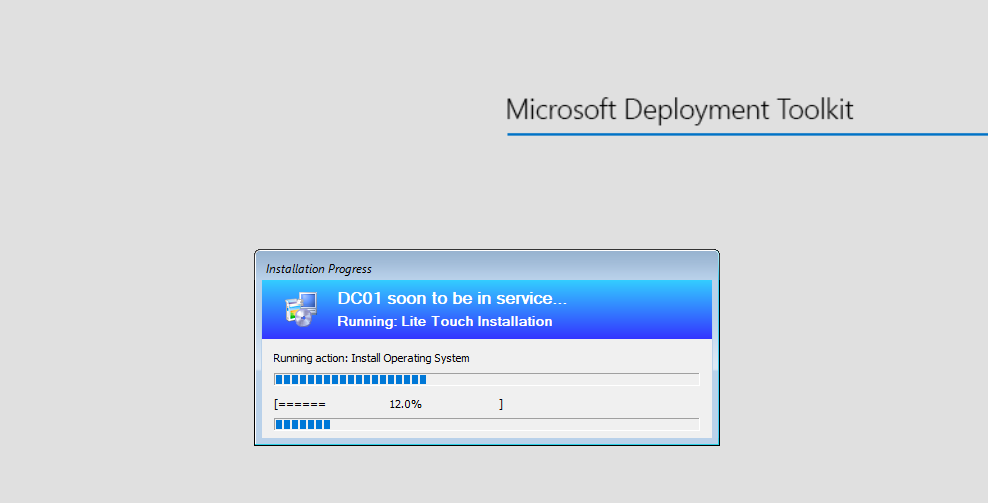

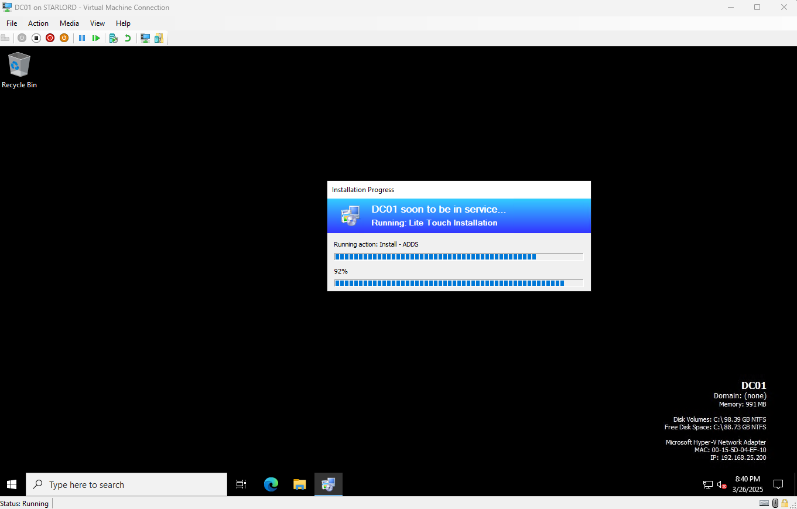

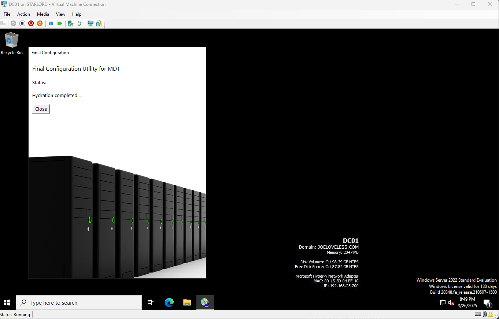

### DC01 Configuration

I used the [Recast Software documentation](https://www.recastsoftware.com/resources/building-a-cm-lab-configuration-settings-ad-gpo/) to help configure this portion, with some items taken out.

After setup, open dsa.msc from Search and look to ensure your groups, users, and organizational units were created properly. If they were not, you can create them manually to match what your Custom Settings call for with the OU structure.

#### User Accounts

- CM_Admin (Both Admin in ConfigMgr & on ConfigMgr Servers)
    - Admin account
- CM_JD (Domain Join Account, I followed these instructions to create it.
    - It drove me crazy that this was named CM_JD rather than CM_DJ (Domain Join), so I modified this :)
- ~~CM_NA (Network Access Account, depending on your setup, you might not need this. I’m hoping to leverage Enhanced HTTP)~~
- ~~CM_CP_Workstations & CM_CP_Servers (Client Push Accounts, added to the groups below to be local admins on respective devices)~~
    - I don't think I'll need this, but can configure later.
- ~~CM_SSRS (add to SQL_Admins, used for the Reporting Services Role)~~
    - I'm not planning on doing much with Reporting Services.

#### AD Groups

These should already be created for you based on the customization file. If not, here are the groups I created. In a real world scenario the Workstation Admins and Server Admins would be different groups (maybe? hopefully?)

- JoeLoveless - ServerAdministrators
- JoeLoveless - WorkstationAdministrators

#### Group Policies

From the article, I found many of these to be optional. I created the following:

- Default Domain Policy
    - Left this blank for now.
- JoeLoveless - WIN - Workstation - Restricted Groups
- JoeLoveless - WIN - Server - Restricted Groups

For the Restricted Groups, I setup my group policy to look like this (adding the Server group to the Server GPO)

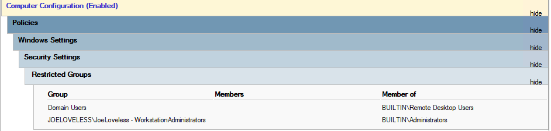

The rest of the policies outlined, I found to be optional. Because I am running this all from a Hyper-V host, I'm not necessarily remoting into the VMs so I did not need RDP firewall rules opened up. I did need to add to the Remote Desktop Users group though to be able to login properly.

### CM01 Build

After everything is setup properly, go through the same MDT build process for CM01, only difference being to choose CM01 for the build.

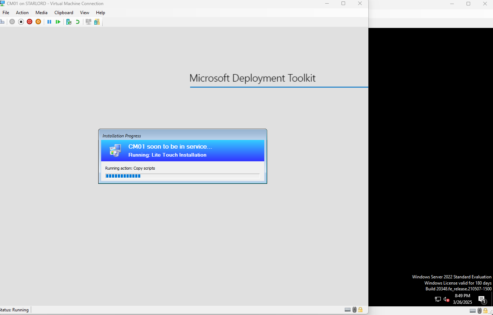

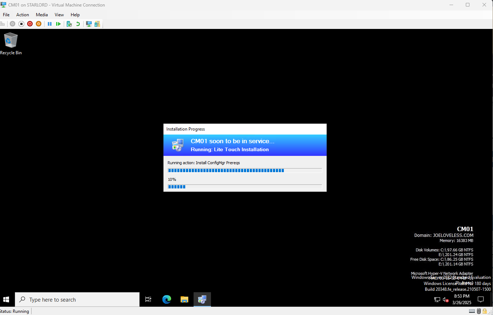

### CM01 Configuration

#### Source Folder

Using [Recast Software documentation](https://www.recastsoftware.com/resources/building-a-cm-lab-configmgr-source-share/) as a guide, I then configured a Source shared folder. This will be used to house any files needed for deployments, boot media, etc. Because of the work Deployment Research already did for us, it's a fairly simple process.

1. From CM01, go to the E drive and create a folder named "Source"
2. Right click Properties > Sharing > Share
3. Give **Domain Users** read permissions.
    - Normally you would probably give this a different group rather than all of Domain Users, but since this is a lab, it doesn't matter all that much as I'll be using all the accounts myself.

4. From there, create the folder structure you want. Mine looks like this:


#### Basic Setup

Continuing on with [Recasts setup](https://www.recastsoftware.com/resources/building-a-cm-lab-configmgr-settings-setup/), I followed this almost exactly, the only difference being on the Boundary setup, I plugged in my network configuration rather than what they have:

- Network: 192.168.25.0
- Subnet: 255.255.255.0

#### Client Settings

This part is optional, but I want to have a good experience on this when possible. I modified the PowerShell Script Execution Policy to be **Bypass** and then modified the customization in Software Center. Now when opening Software Center, you're presented with this beautiful branding:

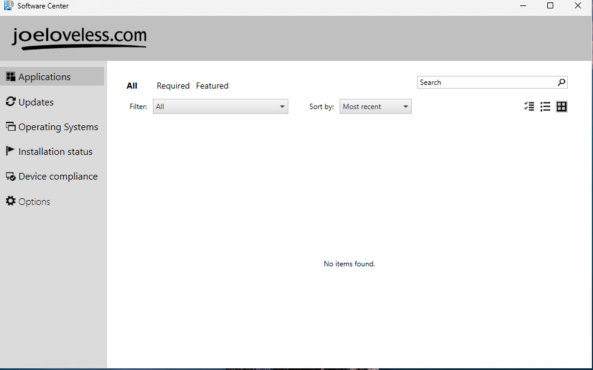

#### Collections

I didn't bother too much with configuring a bunch of collections. I only created a few collections to start for my OSD deployment in the next section:

The two All Workstations/All Servers have a Limiting Collection of **All Systems** and are query based collections:

- Collection Name: All Workstations
```powershell
select SMS_R_SYSTEM.ResourceID,SMS_R_SYSTEM.ResourceType,SMS_R_SYSTEM.Name,SMS_R_SYSTEM.SMSUniqueIdentifier,SMS_R_SYSTEM.ResourceDomainORWorkgroup,SMS_R_SYSTEM.Client from SMS_R_System where SMS_R_System.OperatingSystemNameandVersion like "Microsoft Windows NT Workstation%"
```
- Collection Name: All Servers
```powershell
select SMS_R_SYSTEM.ResourceID,SMS_R_SYSTEM.ResourceType,SMS_R_SYSTEM.Name,SMS_R_SYSTEM.SMSUniqueIdentifier,SMS_R_SYSTEM.ResourceDomainORWorkgroup,SMS_R_SYSTEM.Client from SMS_R_System where SMS_R_System.OperatingSystemNameandVersion like "Microsoft Windows NT Server%"  OR SMS_R_System.OperatingSystemNameandVersion like "Microsoft Windows NT Advanced Server%"
```

This collection is an Include collection of All Unknown Computers with a limiting collection of **All Workstations**:

- Collection Name: OSD Bare Metal
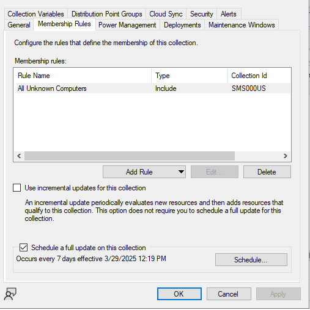

#### Operating System Deployment

The last and final step I've done in my ConfigMgr portion of the lab is configuring and OSD Task Sequence, in my case, Windows 11 22H2 Enterprise Evaluation Edition. I followed [Recast's Guide](https://www.recastsoftware.com/resources/building-a-cm-lab-operating-system-deployment/) step by step, and then built a Windows 11 virtual machine, making sure I booted from the .iso file I created in this process. To boot from the .iso, you will need to copy the file down to your host and then boot from that.

The deployment process will look like this:

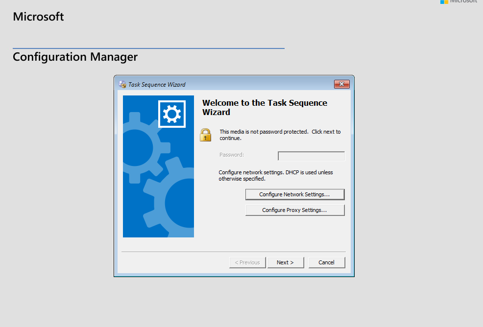

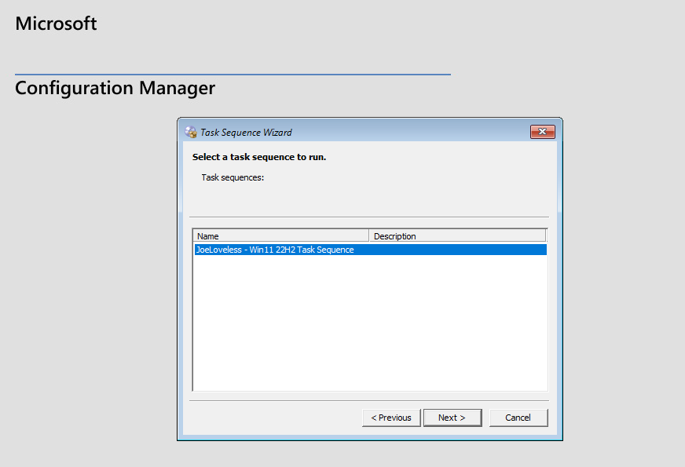

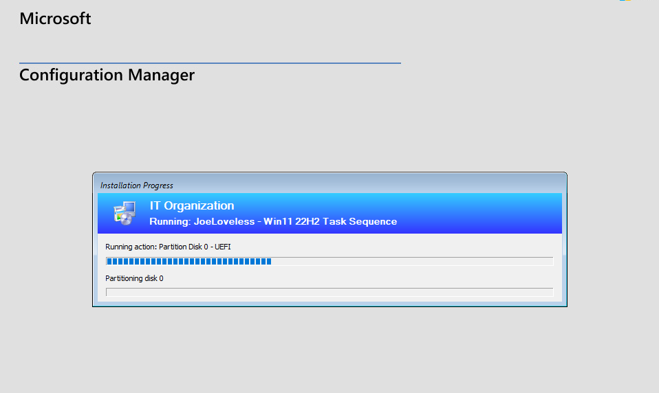

## Azure/Intune/Co-Management/Entra ID Configuration

Alright, now we have an Active Directory domain controller, a ConfigMgr site, and a Windows 11 virtual machine. Now how the hell do we tie that all together with Azure, Intune, and Entra ID? Follow along!

### Azure

First thing we need to do is create an Azure tenant if we do not already have one. Thankfully (and sometimes) Microsoft has good up to date documentation (not always).

- [Create New Tenant](https://learn.microsoft.com/en-us/entra/fundamentals/create-new-tenant)

Once your tenant is up and running, depending on what all you want to configure, we have some options.

- Custom Domain Names:

1. From the Azure Portal, search for Domain Names, here you can add a custom domain name. You will then need to setup the proper TXT or MX record with your hosting provider. Details are probably available from them.

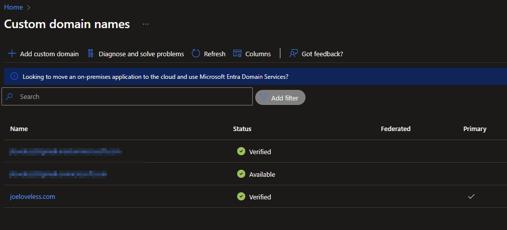

- Domain names can take up to 48 hours to process once the records are added.

- Tenant ID/Tenant Name:

    - Now that we have the domain name configured, it's probably best to make note of our Tenant ID and Tenant Name.
        1. From the Azure Portal, click **Microsoft Entra ID**
        2. Under Basic Information, copy the **Tenant Name** and **Tenant ID**.

- Licensing:

    This is the bad part. I don't like bad parts. Microsoft used to have a license that allowed for home lab use. Unfortunately, that was abused and taken away. So now we have very little options.

    - Option 1: [Microsoft 365 Developer Program](https://learn.microsoft.com/en-us/office/developer-program/microsoft-365-developer-program-faq#who-qualifies-for-a-microsoft-365-e5-developer-subscription-)
        - Note: I don't qualify for this, or haven't asked my work about a Visual Studio license yet. I don't really have a need in my day to day for a Visual Studio license, so I haven't brought up the topic.
    - Option 2: [License](https://www.microsoft.com/en-us/microsoft-365/microsoft-365-trials?msockid=11ab0ae17f91669f2c121f517e176760#tabs-pill-bar-oc0336_tab1)
        - Note: I'm not a licensing expert.
        - The best option I found is to sign up for a trial run of Microsoft 365 Business Premium, and extend it out as much as possible. The trial gives you 25 licenses.
        - Once that runs out, go down to as little licenses as you want to pay for. In my case, I'm using a single license for a single user. This costs $22.00 a month. This is the worst part of the lab. I'm sorry.

        - Option 2 Setup:
            1. Go through the link above for Option 2, select Business and then Microsoft 365 Business Premium.
            2. Follow the steps to run the trial (I don't think you need a credit card, but I can't remember)
            3. Congrats, you now have trial licenses for 25 users, or however many licenses you actually purchased.

- Permissions:

    The account you are logged in with that you have configured everything with so far is a Global Administrator. It's not the greatest practice in the world to use that account for all the configuration. My recommendation would be to create a second user account, and then assign that user the Intune Administrator Role. Since this is a lab environment, and it's only myself, I am just going to assign the permissions directly. In a real world scenario, you would probably have a Security Group to assign permissions to.

    1. Go to Microsoft Entra ID > Users > Select the user you want to assign the role to
    2. Click Assigned Roles
    3. Click Add Assignments
    4. Add Intune Administrator

    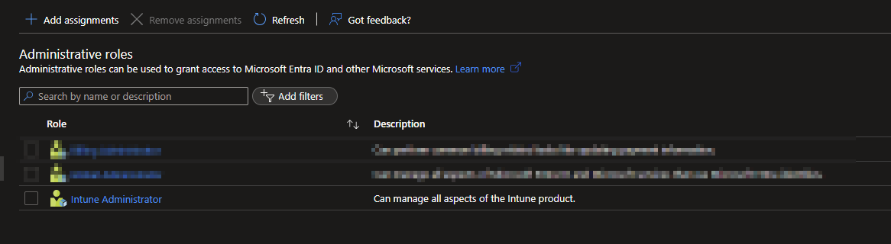

### Intune

Now that we have our licensing squared away, we can go to the [Intune Portal](https://intune.microsoft.com). From the initial configuration, I did not change a ton, more I am sure will be changed later. A few things I did change:

- Administrator Licensing
    1. Go to Tenant Administration > Roles > Administrator Licensing
        - Turn on the option to allow All unlicensed admins to have access to Microsoft Intune.
        - This ensures you don't need two licenses necessarily, but can run with a single user license.

### Microsoft Entra ID

So, we have Azure configured, we have Intune configured. Now we need to tie together Active Directory, Configuration Manager, Intune, and Azure all together.

#### Microsoft Entra ID Connect

We are going to go back to the DC01 domain controller, and we will want to download and install [Microsoft Entra ID Connect](https://www.microsoft.com/en-ie/download/detail). Microsoft Entra ID Connect will allow us to synchronize what from Active Directory to Microsoft Entra ID. This is [Hybrid Join](https://learn.microsoft.com/en-us/entra/identity/devices/how-to-hybrid-join). Note: *These are my notes after the fact, so I hope everything lines up properly.*

- Once installed, let's open **Azure AD Connect** from the Start Menu. Yes, Microsoft refers to this as Azure AD Connect in the start menu, EntraID Connect in the application itself, and Entra ID Connect on the download page, not confusing one bit.

1. Click through the options, when trying to connect to Entra ID, I was presented with the following error:
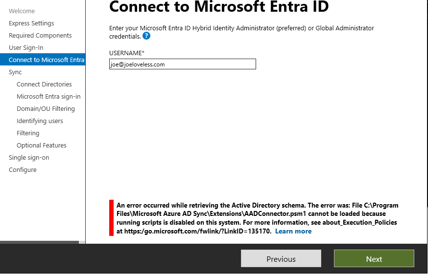

- To fix this, run the following in an elevated Powershell session:

```powershell
Set-ExecutionPolicy -ExecutionPolicy Bypass
```

2. Make sure we choose the following when presented:
    - Password hash synchronization
    - Enable single sign on
2. When presented with the option of whether to sync the entire directory, or to sync certain OUs I decided to sync certain OUs rather than everything. In my case, I only want to sycnc Users and Workstations

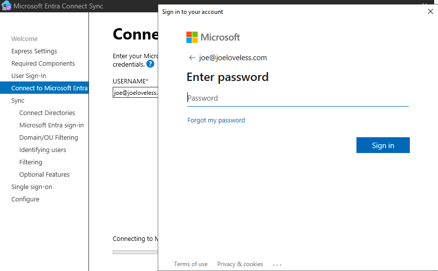

3. Continue on through the setup, and finishing.
4. Once finished, re-open Azure AD Connect and click Configure.
5. Go to Configure Device Options
    - We are going to select Hybrid Join

    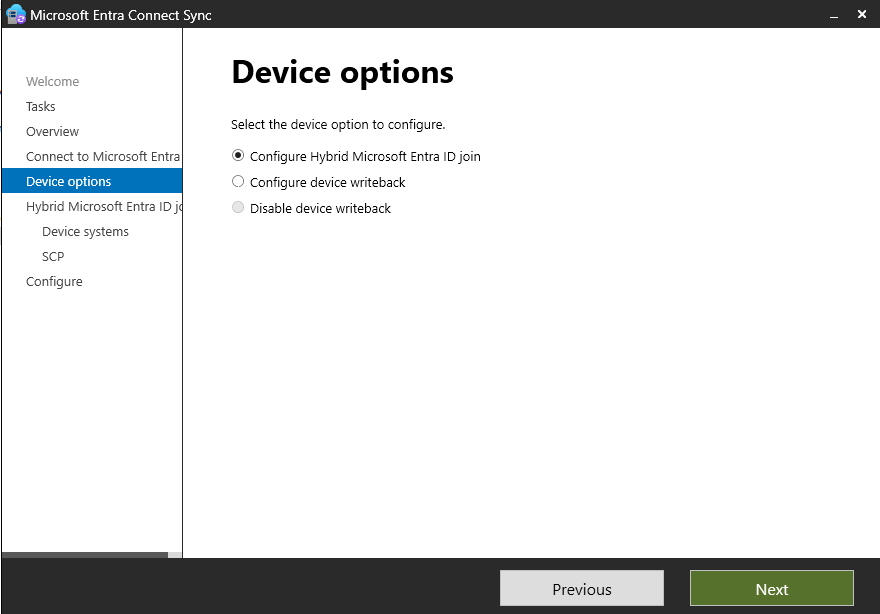

    - Select Windows 10 or later

    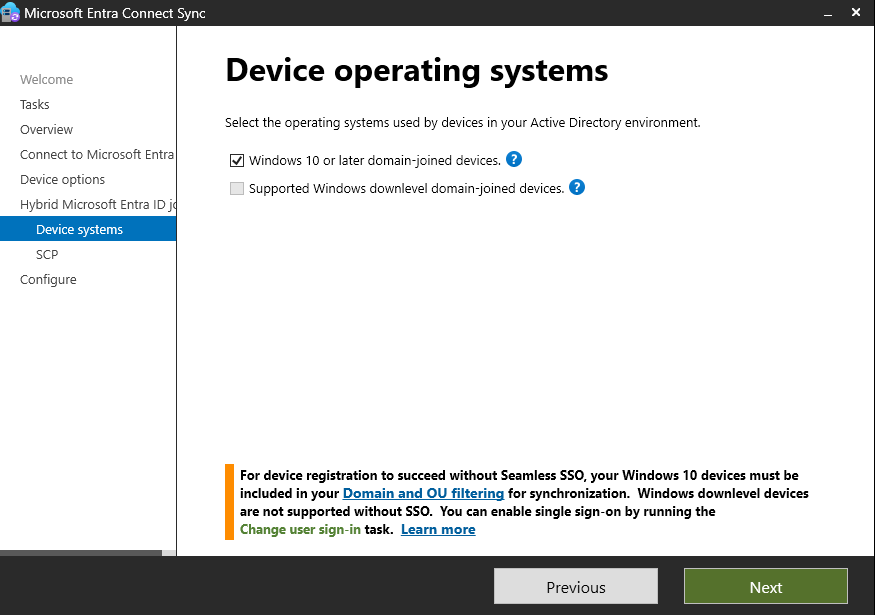

    - Finally, you will need to login with an **Enterprise Administrator** account to finish this.

    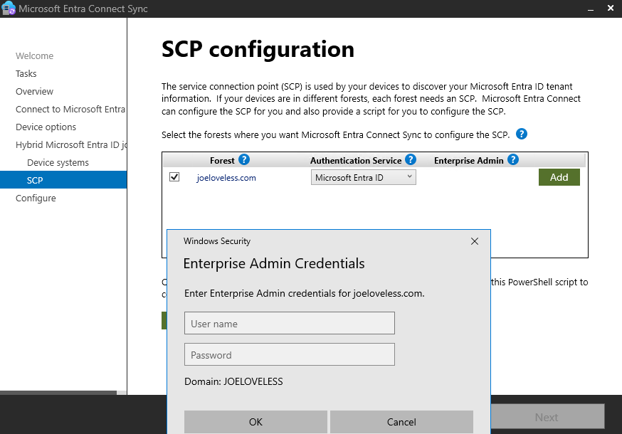

**Verifying Hybrid Join (from the device)**

Hybrid Join is now configured. Let's open up our new Windows 11 virtual machine and see what happens?

1. Wait 5-10 minutes, and then login to the VM with a user account that we think is syncd.
2. Open a command prompt.
3. Type **dsregcmd /status**
4. We should see something that looks similar to this in the output:

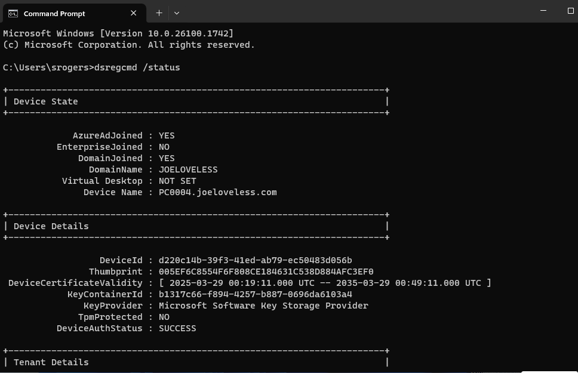

- AzureADJoined: YES

**Verifying Hybrid Join (from the portal)**

1. Go to the Azure portal (portal.azure.com) and search for Microsoft Entra ID
2. Click on Devices
3. You should see your device listed.


### ConfigMgr Co-Management

Ok, now we have devices syncing to Entra ID through Hybrid Join. But how do we manage them in Intune? That is where [Co-Management](https://learn.microsoft.com/en-us/intune/configmgr/comanage/overview) comes into play. Co-Management will allow us to upload our devices from ConfigMgr into Intune, and then once the sliders are configured properly, allow us to manage the configuration through Intune.

Note: *You cannot do Co-Management without Hybrid Join. You can do Hybrid Join without Co-Management, you're just limited on what you can manage without Intune.*

We are now going to open the console on CM01 and configure Co-Management.

From Windows:

1. Click Start > Configuration Manager Console
2. Go to Administration > Cloud Attach
3. Right click CoMgmtSettingsProd and go to Properties
4. Ensure Automatic Enrollment in Intune is set to All (this is a lab environment, who needs piloting?)
5. Under the Workloads tab, move everything to Intune.

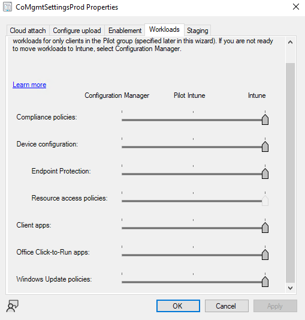

From our Windows 11 VM, we should see this configuration come down through Configuration Manager in the Control Panel:

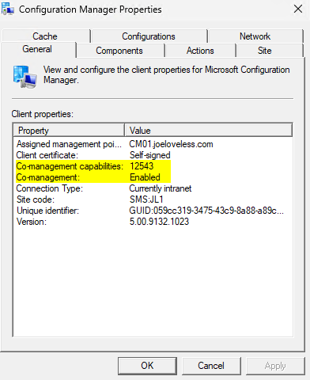

#### Verifying Co-Management in Intune

Now we have everything configured, let's go into Intune and take a look at the configuration on the device.

1. From a browser, go to [Intune](https://intune.microsoft.com)
2. Go to Devices > All Devices, and look for the name of your VM.
3. Click on the VM, and we should see an output similar to this:

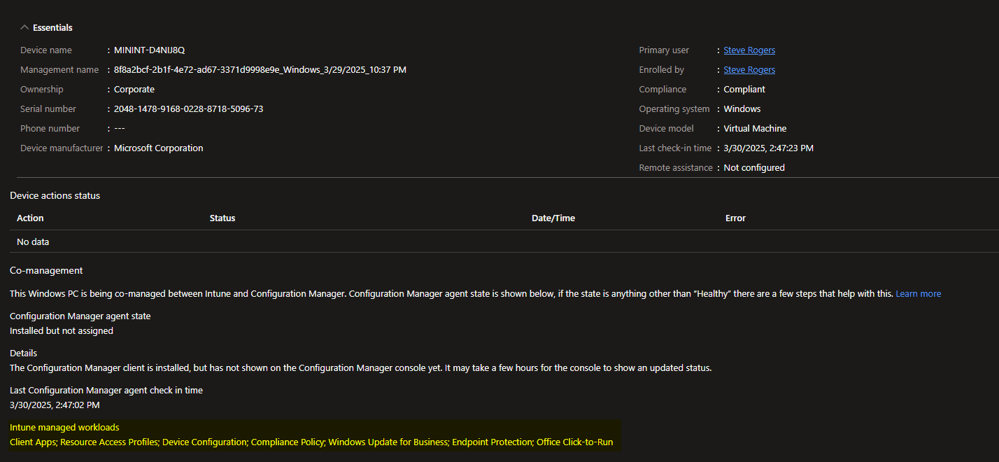

## Wrapping Up

So now we have a nice, new shiny lab thanks to Deployment Research, Recast, and others that allows us to manage Active Directory, Azure, Entra ID, Configuration Manager, and Intune. I am hopeful that this is a helpful blog post, as I've seen questions out there on the best way to setup a lab in 2025. If you have any questions, please feel free to reach out to me.

- Joe Loveless


    


