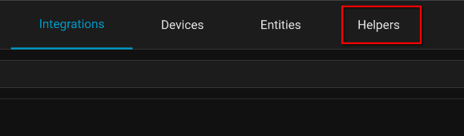

# Tracking Chores with Home Assistant

## Introduction

I've been slammed. I keep trying to set a schedule and stay organized, but with everything at work and home life, I've just not had the time or motivation to really write all that much. The kids are back in school, and that has been eating up most of my time. Work has been really busy the past few months, and hopefully with the holiday season upon us, things will start to slow down a little bit.

Since the last post, I've purchased a new UGreen NAS, which I am deeply enjoying. I'm going down the Docker route currently, and setting up my Plex server on that. I've transferred everything over, and am just working out the kinks. I think I'll do a post on the setup here shortly. Windows 10 End of Life happened, and my trusty Lenovo laptop (2018ish?) isn't spec'd for Windows 11. I decided to try something new, and put Fedora on it. Typically when I go the Linux route, I go for a Ubuntu flavor (Mint or Ubuntu), but I decided to try Fedora this time. I've never really had any issues with Linux, but I'm not a heavy user either. This laptop is basically a dedicated web browser for Discord, PocketCasts, and Spotify. For labbing and other tasks, I have my Dell Optiplex I got off eBay earlier in the year, and do most of my browsing of blogs and such on my Samsung tablet.

I didn't want to go too long without posting though, this post is about how I am trying to get some organization going in my life. One of my constant struggles is staying organized. I'm usually a little all over the place, and have tried different methods. Currently, I use the following:

- Field Notes
  - Personal notebook to write down things to do each day.
- Microsoft ToDo
  - I use this for work to try to flag e-mails, setup daily reminders of what I should actually be working on.
- Azure DevOps
  - Our team uses this as a sprint planner to try to stay organized. It's a little overkill for our team, but I enjoy it and it does help keep me on track.

It has come to my attention that I need to do more around the house. Fair enough, I'd agree with that 100%. The problem is, I'm a very checklist oriented person. Rather than ask for a list, which adds one more thing to my wife's plate, I've decided to try to tackle this with [Home Assistant](https://home-assistant.io)

## Goals

With this configuration, I'm looking to achieve the following:

- I want a dashboard that contains both weekly and monthly tasks that I can toggle on (finished) and off (todo)
- On Sunday, the weekly tasks should revert back to "off".
- On the first of the month, the monthly tasks should revert back to "off".

## Creating Helpers

- In Home Assistant, go to Settings > Devices & Services > Automations

- Click on **Create Helper**
- Create a **Toggle** helper
  - I put a prefix of **Chores** on each one of mine.
  - Do this for each chore you want to add.
- Once finished naming, I then went in and edited each entityid to look like this:

I added _monthly_ or _weekly_ to each chore that I added, I'll be using this later to help with organization. I also added tags to each one, to help me try to keep this in check.

## Creating a Dashboard

The next step is to create a dashboard, or if you want, add cards to your already created dashboard.

I've added my .yaml file on my [GitHub](https://github.com/Pacers31Colts18/HomeAssistant/blob/main/Dashboards/chores_dashboard.yaml)

To get started, the dashboard is the following:

- Single pane dashboard
- Horizontal stack card
- Auto Entities HACS integration must be installed.
  - [Repository](https://github.com/thomasloven/lovelace-auto-entities)

Because of how we named the entities with **chores_weekly** and **chores_monthly** we can now configure this in the yaml file:

We should now have a fully configured dashboard. When toggled to "on" (done), the toggle will go from ToDo to Finished.

## Resetting the Dashboard with Automations

The final thing I wanted to accomplish was to reset the chores either weekly or monthly. Why would I want to untoggle it myself? Craziness. Both of my automations are on my Github:

[Chores - Reset Weekly Toggle](https://github.com/Pacers31Colts18/HomeAssistant/blob/main/Automations/Chores%20-%20Reset%20Weekly%20Toggle.yaml)
[Chores - Reset Monthly Toggle](https://github.com/Pacers31Colts18/HomeAssistant/blob/main/Automations/Chores%20-%20Reset%20Monthly%20Toggle.yaml)

- Go back into Settings > Automations & Scenes
- Click **Create Automation**
- Choose **Create New Automation**
- Click on the three dots in the top right corner and choose **Edit in YAML**
- Paste the code from my GitHub.

### Automation Notes:
- You'll want to change the entity_id list to match the chores you have added.
- The weekly dashboard is easier, as you can choose the day you want the toggles to reset weekly.
- The monthly dashboard, I chose to use a template. You could also create a calendar event if you have an integration for that to trigger off of.
  - If using the template route, I have mine resetting on the first of each month. Adjust to how you see fit.
  
## Wrapping Up

So that's it, now I have a dashboard where I can keep track of either my chores, or start tracking the chores for the kids also. We could also setup actionable reminders, but for now, I think this will do. The next step in the process is to actually stick with it and do the chores consistently. We'll see if that happens or not.

